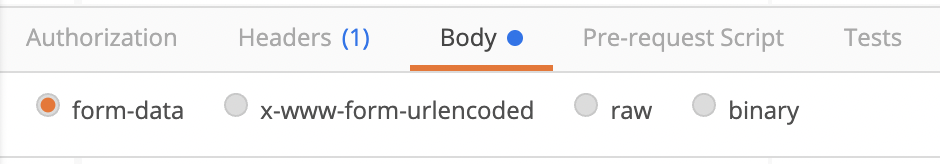

# 백엔드 참조 지식

​        

## Java에서의 한글 깨짐


* Servlet 이름으로 Webcontent 안에 폴더를 생성하지 않도록 한다.
  * Servlet을 내부적으로 사용하기 때문

​        

* 네이버에서 `한글검색`을 치고 URL 주소를 가져오면 다음과 같다.

```
https://search.naver.com/search.naver?where=nexearch&sm=top_hty&fbm=1&ie=utf8&query=%ED%95%9C%EA%B8%80%EA%B2%80%EC%83%89
```

​        

#### - ASCII 

* A →> 65 → 64 + 1 →  0100 0001 → 41 → %41%
* 이 4개의 비트를 니블이라고 부른다.
* %80% → 1000 0000 → 128
* %B0% → 1011 0000 → 128 + 32 + 16

​         

#### - iso-8859-1

> 2 바이트 표현

```java
char ch = '\u0041';
```

* A: %00%41

* B: %00%42

* 영어는 위처럼 자바 코드가 변환되어도 상관이 없지만 한글은 `%00%B0` 로 나타나며 이런 코드는 자바에서 호환되지 않기에 자바에서는 깨짐 현상으로 나타난다.

  ```java
  AB12가
  ```

* 그래서 80보다 작으면 00을 붙여주어 2비트로 만들어준다

  * 41 → %00%41

* 80보다 크면 그 숫자들을 합쳐서 보여준다

  * %EA%B0%80

```JAVA
@WebServlet("/hangul")
public class HangulServlet extends HttpServlet {
	private static final long serialVersionUID = 1L;

	protected void doPost(HttpServletRequest request, HttpServletResponse response) throws ServletException, IOException {
		String data = request.getParameter("data");
		System.out.println(data);
		
		byte[] arr = data.getBytes("iso-8859-1"); // data를 "iso-8859-1" 형식으로 받는다.
		System.out.println("arr : "+Arrays.toString(arr)); 
		String newData = new String(arr,"utf-8"); // 받아준 arr를 UTF-8로 변환한다.
		System.out.println("newData : "+newData);
		response.getWriter().println("test");
	}
}
```

​          

​          

## getParameter

> Get 방식은 URL 주소에 파라미터가 붙어서 온다.
> Post 방식은 어떻게 전달되는지 알아본다.

### post

> IO Stream을 만들어서 주고 받는다.

```java
	protected void doPost(HttpServletRequest request, HttpServletResponse response) throws ServletException, IOException {
		BufferedReader reader = new BufferedReader(new InputStreamReader(request.getInputStream())); //request에 InputStream을 연결하고
		
		String data = "";
		while((data = reader.readLine())!= null) {
			System.out.println(data); // 그 문자들을 가져온다.
		}
		//data=AB12%EA%B0%80&addr=gumi 처럼 get 방식과 똑같은 모습으로 전달된다.
		response.getWriter().println("data");
	}
```

​            

### form-data



> form-data 형식으로 보내면 getParameter를 사용할 수 없다.
> 내부적으로 값들이 변환되서 보내지기 때문이다.

```html
<form action="" method="" enctype="multipart/form-data">
  <input type="text" name="">
  <input type="file">
</form>
```

```java
AB12가

------WebKitFormBoundaryyM6U43rvdQ3jWczB  //내부적으로 변환되는 내용: getParameter로 받기 불가
Content-Disposition: form-data; name="addr"

gumi
------WebKitFormBoundaryyM6U43rvdQ3jWczB--
```

