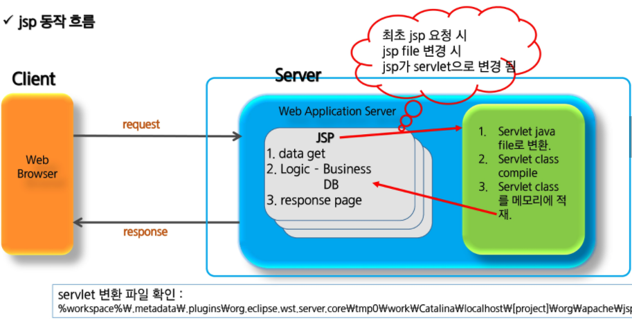
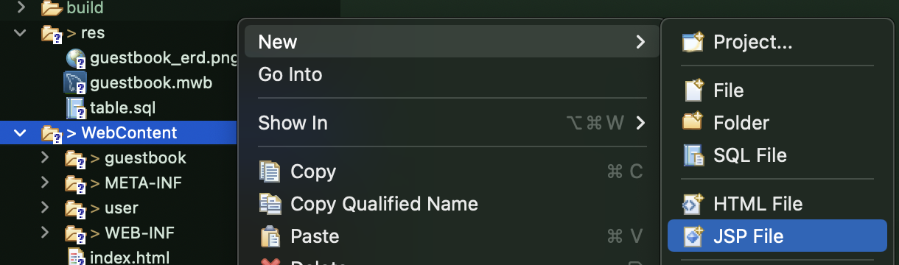

# JSP

> Java Server Page는 HTML 내에 자바 코드를 삽입해 웹 서버에서 동적으로 웹 페이지를 생성하여 웹 브라우저를 돌려주는 언어이다. Java EE 스펙 중 일부로 웹 애플리케이션 서버에서 동작한다. **JSP는 실행시에 Servlet으로 변환된 후 실행**되므로 Servlet과 거의 유사하다.
>
> ​        
>
> JSP 와 Servlet의 속도차이?
>
> 컴파일하는 첫 JSP 실행 이후 JSP는 결국 Servlet으로 변환되고 이후에는 변환된 파일을 사용하기 때문에 처음 실행을 제외하고 속도 차이는 없다.
>
> Java 코드가 HTML, CSS, Javascript보다 먼저 실행되므로 코드상 짜더라도 Java가 먼저 실행되어 오류 발생할 수 있음을 주의한다.



​        

### 이클립스 JSP 파일

* WebContent에서 New - JSP



*  코드 작성

  ```jsp
  <%@ page language="java" contentType="text/html; charset=UTF-8"
      pageEncoding="UTF-8"%> <!--
  <%
  String name = "홍길동";
  %>
  
  <!DOCTYPE html>
  <html>
  <head>
  <meta charset="UTF-8">
  <title>Insert title here</title>
  </head>
  <body>
  안녕하세요 <%= name %> </br>
  이름: <% out.println(name); %>
  </body>
  </html>
  ```

* 잘 실행된다면 위 JSP 파일이 Servlet으로 컴파일되는 파일 경로도 한 번 찾아보도록 한다.

  * project 우클릭 `Properties` - `Resources` 로 파일 위치를 찾고 `.metadata`를 따라 쭉 들어감

    * `파일명.class` 로 생성된 파일 발견 = jsp 디버깅할 때 열수도 있다.
    * **class 파일을 수정한다고 원문이 변경되는 것은 아니므로** 무조건 jsp 안에서 오류를 다시 찾아낸다.

    ```java
    // Servlet Life Cycle의 JSP에서의 형태
    _jspInit()
    _jspService()
    _jspDestroy()
    ```

    

  * 결론: Servlet 문법 = JSP 문법

  * JSP는 내부적으로 **기본 객체**를 포함하고 있어서 불러낼 수 있다.

​         

​           

## Declaration

> 멤버변수 선언이나 메소드를 선언하는 영역

* JSP 스트립팅 요소(Scripting Element)

```jsp
<%! 멤버변수와 method 작성 %>
```

```jsp
<!-- 느낌표(!)로 선언 -->
<%! 
String name;

public void init() {
	name = "홍길동";
}
%>
```

​             

## Scriptlet

> Client 요청 시 매번 호출 영역으로 Servlet으로 변환시 service() method에 해당되는 영역
> Request, response에 관련된 코드 구현

```jsp
<% java code %>
```

```jsp
<%
for문 등 사용
%>
```

​         

## Expression

> 데이터를 브라우저에 출력할 때 사용
> 내부에 `;`을 안찍도록 주의

```jsp
<%= 문자열%>
```

```jsp
안녕 <%= name %>!!!
<!--
<% out.print(name); %> 
<% out.write(name); %>
-->
```

​            

## 주석(Comment)

> 코드 상에서 부가 설명 작성
> HTML 주석과 마찬가지로 사용자에게 보이지 않지만 서버에서 전송 자체를 하지 않는 데이터이다.

```jsp
<%-- 주석 할 code --%>
```

```jsp
<!-- HTML 주석: 서버 => 클라이언트로 보내줌 -->
<%-- JSP 주석: 서버 => 클라이언트로 보내지 않음 --%>
```

* HTML 주석의 오류 발생

  ```jsp
  <!-- <%= name %> -->  name이 null이면 오류 발생
  ```

* Java 언어는 먼저 실행된다

  ```jsp
  <script>
  if(조건){
  	<% a %>  // a는 맨 처음에 실행되므로 if문에 영향없이 바로 실행
  }
  </script>
  ```

  ​          

## JSP 지시자 (Directive)

​          

### 1. Page Direcitve

* 컨테이너에게 현재 JSP페이지를 어떻게 처리할 것인가에 대한 정보 제공

```jsp
<%@ page attr="val1" attr2="val2" ... %>
```

| 속성         | 기본값                        | 설명                                                         |
| ------------ | ----------------------------- | ------------------------------------------------------------ |
| language     | java                          | 스크립트에서 사용 할 언어 지정                               |
| info         |                               | 현재 JSP 페이지에 대한 설명                                  |
| contentType  | text/html; charset=ISO-8859-1 | 브라우저로 내보내는 내용의 MIME 형식 지정 및 문자 집합 지정  |
| pageEncoding | ISO-8859-1                    | 현재 JSP 페이지 문자집합 지정                                |
| **import**   |                               | 현재 JSP 페이지에서 사용할 Java 패키지나 클래스 지정         |
| **session**  | true                          | 세션의 사용 유무 결정, **기본값이 true임을 명심한다**.       |
| errorPage    |                               | 에러가 발생할 때 처리될 JSP 페이지 지정                      |
| isErroPage   | false                         | 현재 JSP 페이지가 에러 핸드링 하는 페이지인지 지정하는 요소  |
| buffer       | 8KB                           | 버퍼의 크기                                                  |
| autoflash    | true                          | 버퍼의 내용을 자동으로 브라우저로 보낼지 설정                |
| isThreadsafe | true                          | 현재 JSP 페이지가 멀티 쓰레드로 동작해도 안전한지 여부 설정<br />false인 경우 싱글 쓰레드로 서비스 |
| extends      | javax.servlet.jsp.HttpJspPage | 현재 JSP 페이지를 기본적인 클래스가 아닌 다른 클래스로부터 상속하도록 변경 |

​                     

### 2. Include Directive

* 특정 jsp file을 페이지에 포함
* 여러 jsp 페이지에서 반복적으로 사용하는 부분을 jsp file로 만든 후 반복 영역에 include 시켜 반복 코드를 줄일 수 있다.

```jsp
<%@ include file="template/header.jsp" %>
```

​       

### 3. taglib Directive

* JSTL 또는 사용자에 의해 만든 커스텀 태그(custom tag)를 이용할 때 사용되며 JSP 페이지 내 불필요한 자바 코드를 줄일 수 있다.

```jsp
<%@ taglib prefix="c" url="http://java.sun.com/jsp/jstl/core" %>
```

​           

​           

## JSP 기본객체

| 기본 객체명 | 설명                                                         |
| ----------- | ------------------------------------------------------------ |
| request     | HTML 폼 요소의 선택 값 등 사용자 입력 정보를 읽어올 때 사용  |
| response    | 사용자 요청에 대한 응답을 처리하기 위해 사용                 |
| pageContext | 각종 기본 객체를 얻거나 forward 및 include 기능을 활용할 때 사용 |
| session     | 클라이언트에 대한 세션 정보를 처리하기 위해 사용<br />page directive의 session 속성을 false로 하면 내장 객체는 생성이 안된다. |
| application | 웹 서버 애플리케이션 처리와 관련된 정보를 레퍼런스하기 위해 사용 |
| out         | 사용자에게 전달하기 위한 output 스트림을 처리할 때 사용      |
| config      | 현재 JSP에 대한 초기화 환경을 처리하기 위해 사용             |
| page        | 현재 JSP 페이지에 대한 참조 변수에 해당됨                    |
| exception   | Error 처리하는 JSP에서 isErrorPage 속성을 true로 설정하면 exception 내장 객체를 사용할 수 있고 기본은 false로 설정되어 있다. 전달된 오류 정보를 담고 있는 내장 객체 |

​              

### JSP 기본객체의 영역(scope)

> 범위: application > session > request > pageContext
>
> * application은 생성시 전체에서 하나 만들어진다. request가 생성될 때 이미 application은 생성되므로 새로 생성하는 것이 아니라 request를 통해 불러오는 것이다.
>
>   ```java
>   ServletContext context = request.getServletContext();
>   ```

| 기본객체    | 설명                                                         |
| ----------- | ------------------------------------------------------------ |
| pageContext | 하나의 JSP 페이지를 처리할 때 사용되는 영역<br />한번의 클라이언트 요청에 대해 하나의 JSP페이지가 호출<br />이때 단 한 개의 page 객체만 대응<br />페이지 영역에 저장한 값은 페이지를 벗어나면 사라진다.<br />* 커스텀 태그에서 새로운 변수를 추가할 때 사용한다. |
| request     | 하나의 HTTP 요청을 처리할 때 사용되는 영역<br />웹 브라우저가 요청을 할 때마다 새로운 request 객체가 생성됨<br />request 영역에 저장한 속성은 그 요청에 대한 응답이 완료되명 사라진다. |
| session     | 하나의 웹 브라우저와 관련된 영역<br />같은 블라우저 내에서 요청된 페이지들은 같은 session 들을 공유하게 됨<br />* 로그인 정보 등을 저장한다 |
| application | 하나의 웹 어플리케이션과 관련된 영역<br />웹 어플리케이션 당 1개의 application 객체 생성<br />같은 웹 어플리케이션에서 요청되는 페이지들은 같은 application 객체를 공유 |

​            

### JSP 기본객체의 영역 - 공통 method

* servlet 과 jsp 페이지 간 특정 정보를 주고 받거나 공유하기 위한 메서드 지원
* 공통 메서드이므로 `request` 뿐 아니라 `session`,` application`, `pageContext`에서도 메서드를 사용할 수 있다.

| method                                          | 설명                                                         |
| ----------------------------------------------- | ------------------------------------------------------------ |
| `void setAttribute (String name, Object value)` | 문자열 name 이름으로 Object형 데이터를 저장한다. Object형이므로 어떤 Java객체도 저장 가능하다. |
| `Object getAttribute(String name)`              | 문자열 name에 해당하는 속성 값이 있다면 Object 형태로 가져오고 없으면 null을 리턴한다. 따라서 리턴 값에 대한 적절한 형 변환이 필요하다. |
| `Enumeration getAttributeNames()`               | 현재 객체에 저장된 속성들의 이름들을 Enumeration 형태로 가져온다. |
| `void removeAttribute(String name)`             | 문자열 name에 해당하는 속성을 삭제한다.                      |

#### - request

* 보내는 쪽: `setAttribute()`를 통해  `request`에 특정 값을 `Object`로 포장해서 묶어 보낸다.

  ```java
  protected void doGet(HttpServletRequest request, HttpServletResponse response) throws ServletException, IOException {
      // 서블릿에서 jsp로 포워딩하기
      // 서블릿에서 직접 출력하는 구문은 없어야 한다.
      String path="d.jsp";
      String sam = "setAttribute 값";
      request.setAttribute("algo", sam);
      RequestDispatcher dispatcher = request.getRequestDispatcher(path);
      dispatcher.forward(request, response);
  }
  ```

* 받는 쪽: 받은 `request` 안에 묶여있는 값을 `getAttribute()`로 빼주고 `Object`로 포장된 값을 형변환해서 가져온다.

  ```jsp
  <%@ page language="java" contentType="text/html; charset=UTF-8"
      pageEncoding="UTF-8"%>
  
  <%
      String sam = null;
  
      if(request.getAttribute("algo") instanceof String){
          sam = (String) request.getAttribute("algo");
      }
  %>
  <!DOCTYPE html>
  
  <html>
  <head>
  <meta charset="UTF-8">
  <title>Insert title here</title>
  </head>
  <body>
  서블릿에서 forward되어 보이는 페이지
  <%= sam %>
  </body>
  </html>
  ```

  ​       

#### - application

* 어느 페이지에서 저장

  ```java
  protected void doGet(HttpServletRequest request, HttpServletResponse response) throws ServletException, IOException {
      // 서블릿에서 jsp로 포워딩하기
      // 서블릿에서 직접 출력하는 구문은 없어야 한다.
      String path="d.jsp";
      
      ServletContext context = request.getServletContext();
      context.setAttribute("app_var", "어플리케이션 변수");
      RequestDispatcher dispatcher = request.getRequestDispatcher(path);
      dispatcher.forward(request, response);
  }
  ```

* 여러 페이지에서 꺼내어 사용 가능

  ```jsp
  <%
      String app_var = null;
      if(application.getAttribute("app_var") instanceof String){
          app_var = (String) application.getAttribute("app_var");
      }
  %>
  ```

  


​                     

### WEB Page 이동

|              | forward(request, response)                                   | sendRedirect(location)                                       |
| ------------ | ------------------------------------------------------------ | ------------------------------------------------------------ |
| 사용 방법    | `RequestDispatcher dispatcher = request.getRequestDispatcher(path);`<br />`dispatcher.forward(request, response);` | `response.sendRedirect(location)`                            |
| 이동 범위    | 동일 서버(project)내 경로                                    | 동일 서버 포함 타 URL 가능                                   |
| location bar | 기존 URL 유지<br />(실제 이동되는 주소 확인 불가)            | 이동하는 page로 변경                                         |
| 객체         | 기존의 request와 response가 그대로 전달                      | 기존의 request와 response는 소멸<br />새로운 request와 response가 생성 |
| 속도         | 비교적 빠름                                                  | forward()에 비해 느림                                        |
| 데이터 유지  | request의 setAttribute(name, value)를 통해 전달              | request로는 data 저장 불가능<br />session이나 cookie를 이용  |

* sendRedirect( 상대경로 ): `b.jsp`와 `c.jsp`를 만들고 `b.jsp`에서 다음을 작성한다.

  ```jsp
  <%
  	//sendRedirect();
  	response.sendRedirect("c.jsp"); //상대주소
  %>      
  ```

* sendRedirect( 타 서버 )

  ```jsp
  <%
  	//sendRedirect();
  	response.sendRedirect("https://www.google.com"); //URL, https를 붙이지 않으면 작동X
  %>      
  ```

* forward(request, response) + setAttribute()

  * **내 URL을 유지**한채 이동한다. 즉 이동한 페이지에서 parameter를 또 사용할 수 있다. 

  ```java
  protected void doGet(HttpServletRequest request, HttpServletResponse response) throws ServletException, IOException {
      // 서블릿에서 jsp로 포워딩하기
      // 서블릿에서 직접 출력하는 구문은 없어야 한다.
      String path="d.jsp";
      RequestDispatcher dispatcher = request.getRequestDispatcher(path);
      dispatcher.forward(request, response);
  }
  ```

  


​          

## JSP 설정 파일

```jsp
<%@ page language="java" contentType="text/html; charset=UTF-8"
    pageEncoding="UTF-8" session = "false" isErrorPage = "false" %>

<!--
	1. meta charset 이랑 contentType은 중복으로 적용된다.
	2. pageEncoding은 Servlet 으로 변환할 때 한글파일이 깨지지 않도록 설정하는 것이다.
	3. session = "true"가 default 이다.
-->
```

​          

​          

## Session

* 프론트엔드의 sessionStorage와 다른 서버의 객체인 것을 명심한다.

* Directive에서 `<%@ session=true %>` 설정이 되어있어야 session 객체를 사용할 수 있으며 default는 true이다.

  ```jsp
  <%@ page language="java" contentType="text/html; charset=UTF-8"
      pageEncoding="UTF-8" session="true" %>
  ```

* 1번 페이지에서 `session` 내부에 `setAttribute()`를 이용해 값을 넣을 수 있다.

  ```jsp
  <%
      String data = request.getParameter("share");
  
      session.setAttribute("data", data); // Directive에서 session이 true이기에 사용할 수 있다.
  %>  
  ```

* 2번 페이지에서 session은 유지되며 내부 속성값 또한 유지된다.

  ```jsp
  <%= (String) session.getAttribute("data") %>
  ```

* 이 때 session을 사용하는 1번, 2번 페이지 모두 `session=true`여야 한다.
