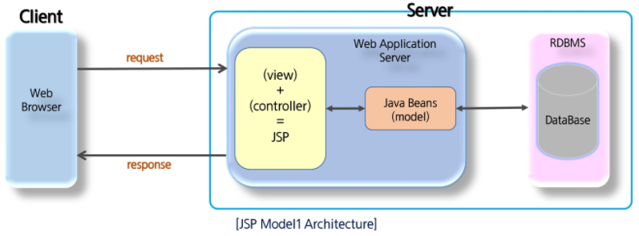
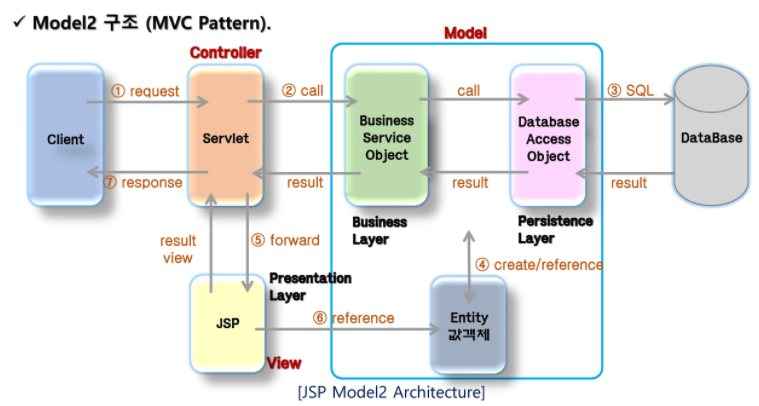

# MVC

​          

## Web Application Architecture

* JSP를 이용해 구성할 수 있는 Web Application Architecture는 크게 model1과 model2로 나뉜다.
  * **Model 1**: "JSP가 client의 요청에 대한 **Logic 처리와 response page(view)에 대한 처리를 모두** 한다.
  * **Model 2**: response page(view)에 대한 처리만 한다.
* Model2구조는 MVC(Model-View-Controller) Pattern을 web 개발에 도입한 구조를 말한다.

​               

### Model1

* view와 logic을 **페이지 하나**에서 처리하는 구조
* client로부터 요청이 오면 JSP 페이지는 java beans나 별도의 service class를 이용해 작업을 처리하고 결과를 client에 출력

* Model 1 구조 장단점

  | 장점                                            | 단점                                                         |
  | ----------------------------------------------- | ------------------------------------------------------------ |
  | 구조가 단순하며 직관적이기 때문에 배우기 쉽다.  | 출력을 위한 view(html) 코드와 로직 처리를 위한 java코드가 섞여 있기 때문에 JSP 코드가 복잡해진다. |
  | 개발 시간이 비교적 짧기 때문에 개발 비용이 감소 | JSP 코드에 Back-End(Developer)와 Front-End(Designer)가 혼재되기 때문에 분업이 힘들어진다. |
  |                                                 | project의 규모가 커지게되면 코드가 복잡해지므로 유지보수 하기가 어려워진다. |
  |                                                 | 확장성(신기술의 도입, framework 등)이 나쁘다.                |

​          

### Model 2: MVC Pattern

* model2는 모든 처리를 JSP에서 하는 것이 아니라, client 요청에 대한 처리는 servlet이, logic처리는 java class(Service, Dao,...), client에게 출력하는 response page를 JSP가 담당한다.
* Model2 구조는 MVC(Model-View-Controller) pattern을 웹 개발에 도입한 구조이며 완전히 같은 형태를 보인다.

| Model2                     | MVC Pattern | 설명                                                         |
| -------------------------- | ----------- | ------------------------------------------------------------ |
| Service, Dao or Java Beans | Model       | Logic(Business & DB)을 처리하는 모든 것. controller로 부터 넘어온 data를 이용해 이를 수행하고 그에 대한 결과를 controller에 return한다. |
|  JSP                  | View        | 모든 화면 처리를 담당. Client의 요청에 대한 결과 뿐 아니라 controller에 요청을 보내는 화면단도 jsp에서 처리한다. Logic처리를 위한 java code는 사라지고 결과 출력을 위한 code만 존재. |
|  Servlet              | Controller  | Client 요청을 분석해 Logic 처리를 위한 Model 단을 호출한다. return 받은 결과 data를 필요에 따라 request, session 등에 저장하고 redirect 또는 forward 방식으로 jsp(view) page를 이용해 출력한다. |

* Model2 구조의 장단점

  * Model2는 Model1의 단점을 보완하기 위해 만들어 졌으나 다루기 어렵다는 단점이 있다.

  | 장점                                                         | 단점                               |
  | ------------------------------------------------------------ | ---------------------------------- |
  | 출력을 위한 view(html)코드와 로직 처리를 위한 java 코드가 분리되었기 때문에 JSP는 Model1에 비해 코드가 복잡하지 않다. | 구조가 복잡해 초기 진입이 어렵다.  |
  | 화면단과 Logic단이 분리되었기에 분업이 용이해졌다.           | 개발 시간의 증가로 개발 비용 증가. |
  | 기능에 따라 code가 분리되었기 때문에 유지 보수가 쉬워졌다.   |                                    |
  | 확장성이 뛰어나다.                                           |                                    |

  