# WebArchi(MVC), Servlet

> Servlet(자바 서블릿)은 자바를 사용하여 웹페이지를 동적으로 생성하는 서버측 프로그램 혹은 그 사양을 말한다.
>
> 자바 서블릿은 웹 서버의 기능을 향상하기 위해 사용되는 자바 클래스의 일종이다. 서블릿은 JSP와 비슷한 점이 있지만
>
> JSP가 HTML 문서 안에 Java 코드를 포함하고 있는 반면, 서블릿은 자바 코드 안에 HTML을 포함하고 있다는 차이점이 있다.

​                            

## Web Architecture

> client-server model
>
> 1. client: request → 
> 2. response: response
>
> ​       
>
> WAS: 최근 Web Server와 Application 기능을 모두 가진 Server가 등장
>
> * WebLogic
> * Jeus
> * Tomcat

* ML(Markup Language), CSS, JS
* Web Server
  1. client의 data(parameter)를 받는다.
  2. Application은 data를 바탕으로 Logic을 처리해준다.
     1. Bussiness Logic
     2. Persistence Logic
     3. 응답: data(HTML)


​        

## Servlet 이클립스 기본 설정

> servlet은 java 파일 안에 HTML을 넣는 형식이다.

### eclipse encoding 설정

* window 메뉴의 preferences에서 encoding 검색 후 CS
* CSS / HTML / JSP의 Encoding을 `UTF-8`로 변경한다.

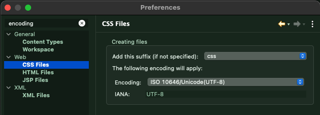

​      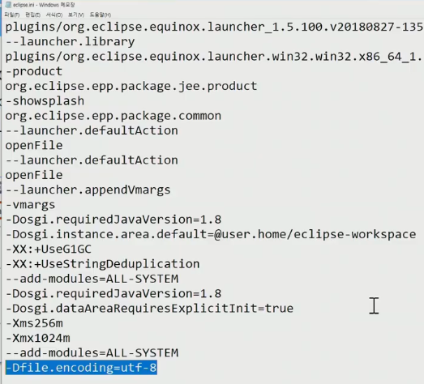

​       

### Java EE 환경 설정(기업용)

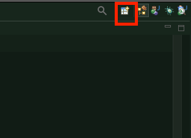

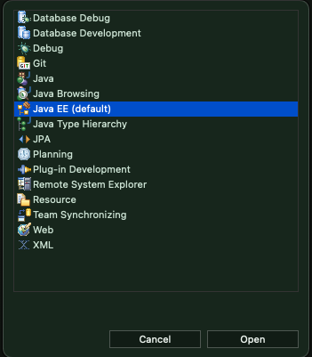

​         

### helloservlet project 생성

* New - Dynamic Web Project - 버전을 선택 후 Tomcat 파일 경로를 넣기

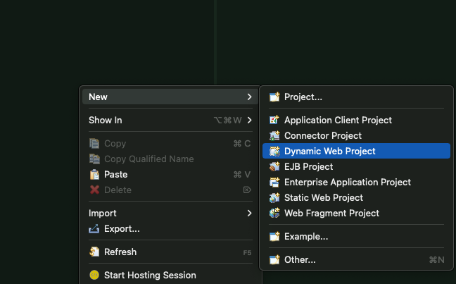

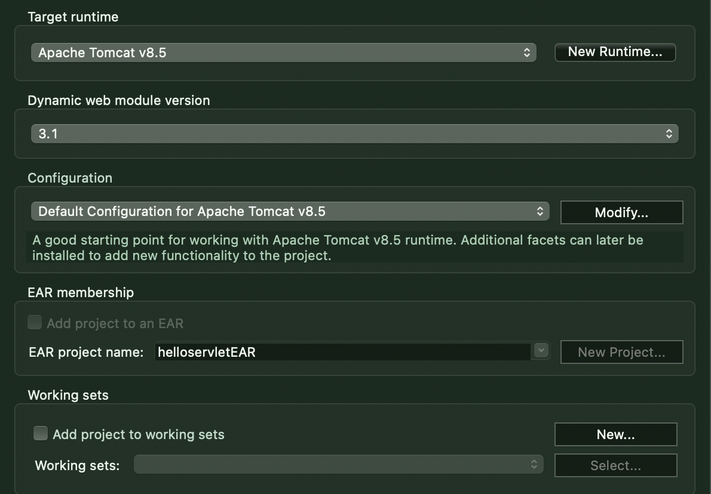

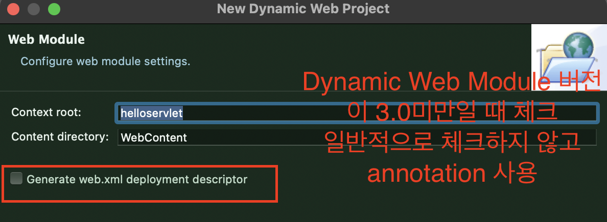

​         

### project

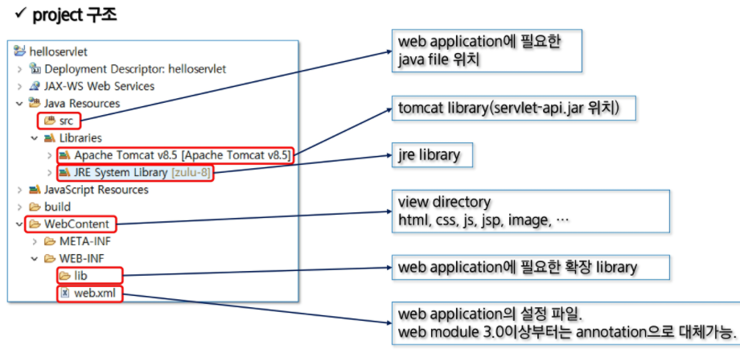

​          

### Servlet 구현

* Java Resources - src - New - **Servlet** - `com.hello.java` 패키지 생성
* 클래스명: HelloServlet

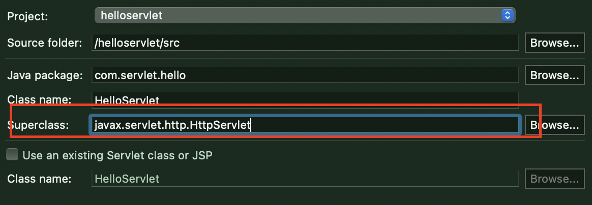

* 상위 클래스 형식: Http

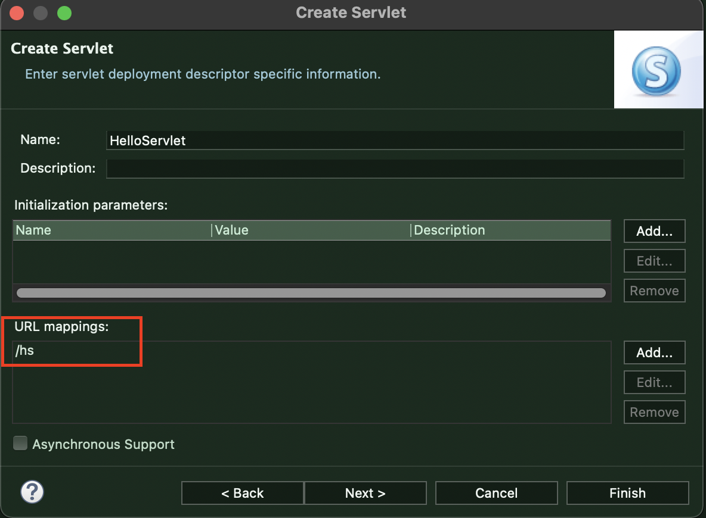

* Mapping: `/hs`

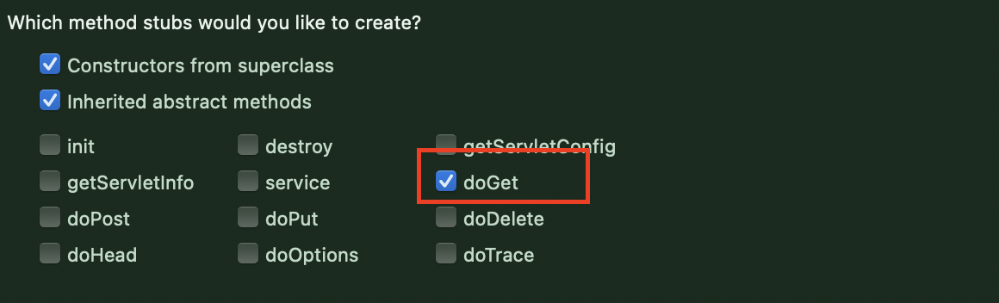

* get방식만 사용

​           

### Servlet 코드

```java
package com.servlet.hello;

import java.io.IOException;
import javax.servlet.ServletException;
import javax.servlet.annotation.WebServlet;
import javax.servlet.http.HttpServlet;
import javax.servlet.http.HttpServletRequest;
import javax.servlet.http.HttpServletResponse;

@WebServlet("/hs")
public class HelloServlet extends HttpServlet {
	private static final long serialVersionUID = 1L;
       
    public HelloServlet() {
        super();
    }

	protected void doGet(HttpServletRequest request, HttpServletResponse response) throws ServletException, IOException {
		response.getWriter().append("Served at: ").append(request.getContextPath());
	}

}
```

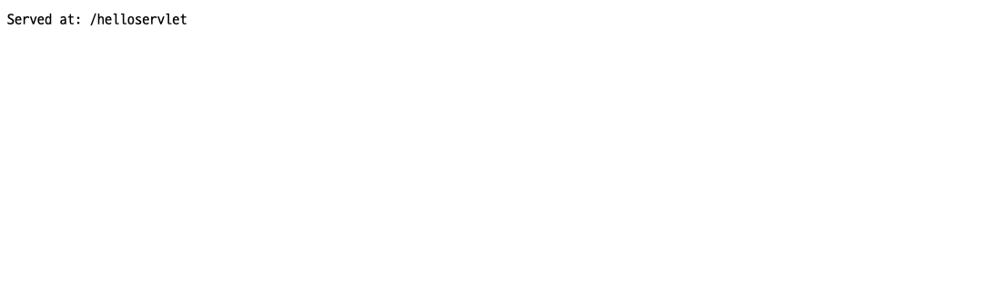

* 실행시 위와 같은 화면 완성

​          

#### - PrinterWriter

```java
package com.servlet.hello;

import java.io.IOException;
import java.io.PrintWriter;

import javax.servlet.*;
import javax.servlet.annotation.WebServlet;
import javax.servlet.http.*;

@WebServlet("/hs")
public class HelloServlet extends HttpServlet {
	private static final long serialVersionUID = 1L;
       
    public HelloServlet() {
        super();
    }

	protected void doGet(HttpServletRequest request, HttpServletResponse response) throws ServletException, IOException {
		response.setContentType("text/html;charset=utf-8"); // 관을 연결하기 전 문자열 세팅(깨짐 방지)
		PrintWriter out = response.getWriter(); // 관을 연결
		out.println("");
		out.println("<html>");
		out.println("<body> HELLO 안녕");
		out.println("</body>");
		out.println("</html>");
		
	}
}
```

​            

### Servlet 동작 흐름

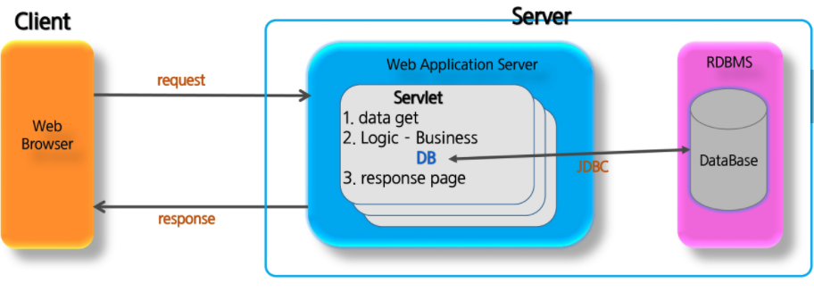

​         

### Servlet's Life-Cycle

> Container가 인스턴스의 Life Cycle을 관리한다. (Web/WAS => Tomcat)

* servlet class는 javaSE에서 SE와 다르게 main method가 없다. 즉 객체의 생성부터 사용(method call)의 주체가 사용자가 아닌 Servlet Container에게 있다.
* Client가 요청(request)을 하게 되면 Servlet Container는 Servlet 객체를 생성(**한번만**)하고 초기화(**한번**)하며 요청에 대한 처리(요청마다 반복)를 하게된다. 또한 Servlet 객체가 필요없게되면 **제거까지** Container가 담당한다.

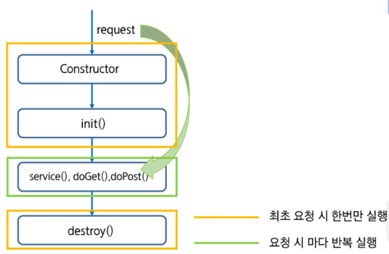

| method      | description                                         |
| ----------- | --------------------------------------------------- |
| `init()`    | 서블릿이 메모리에 로드될 때 한 번 호출              |
| `doGet()`   | Get 방식으로 data 전송 시 호출                      |
| `doPost()`  | POST 방식으로 data 전송 시 호출                     |
| `service()` | 모든 요청은 service()를 통해서 doXXX()메소드로 이동 |
| `destroy()` | 서블릿이 메모리에서 해제되면 호출                   |

*  순서: init() => service() => doGet() / doPost() => destroy()
* 동시 접속: service 메서드가 여러개 호출되어 thread 로 관리 = **servlet의 멤버 변수가 공유**
  * Thread safe 는 문서상으로만 있고 실제로는 존재하지 않는다.

​                

## Servlet Parameter

> 공백 뒤는 버리므로 공백이 없도록 주의한다.
> 무조건 **null 검사를 진행**한다.

```
http://www.google.com/good.jsp?parameter1=value1&parameter2=value2
```

* http: 프로토콜 + `:` 구분자
* `//`: 원격
* www.google.com: URL
* ?: **Query String** Begin
* parameter1:  파라미터 이름
* value1: 파라미터 값
* &: Query String Separator(구분자)
* `/ abc / dsad`: semantic url (?대신 사용) 

​        

### 한글 깨짐 방지

```java
// 클라이언트에서 넘어오는 한글깨짐 방지 => POST에서만 설정하면 된다.
request.setCharacterEncoding("utf-f");

// 보낼 때 html 데이터임을 알려주고 글자 형식이 UTF-8임을 명시한다.
response.setContentType("text/html;charset=utf-8");
```

