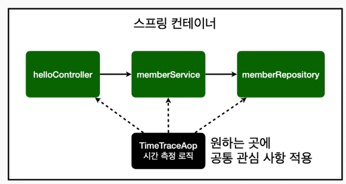
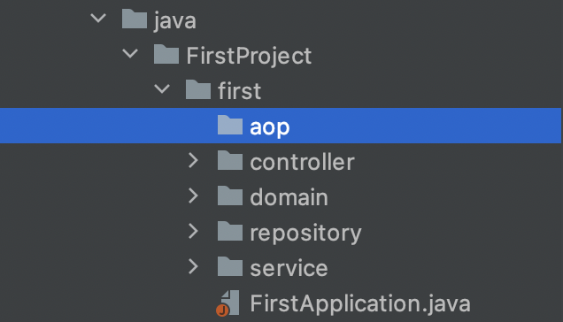
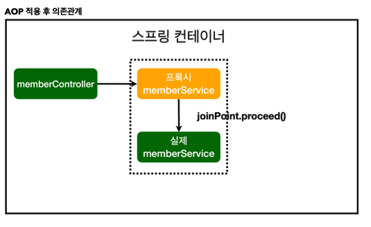

# AOP

> Aspect Oriented Programming(관점지향 프로그래밍)
>
> 공통 관심 사항(cross-cutting concern)과 핵심 관심 사항(core concern)을 분리
>
> 순수 로직만 남기기 위해 AOP를 사용한다.

* 모든 메소드의 호출 시간을 측정하고 싶다면?

  * 일일히 수천개의 메소드에 코드를 찍기에는 시간이 너무 부족하다.

    ```java
    long start = System.currentTimeMillis(); //메소드 처음의 시간 측정
    long finish = memberRepository.save(member); //메소드 끝 부분에 시간 측정
    System.out.println("timeMs =" + (finish-start)); // 차이를 호출
    ```

  * 또한 메인 로직이 아닌 공통 관심 사항이다.

  * 메소드마다 이렇게 작성하면 유지보수가 어렵다.



* 시간 측정 로직을 만들고 **내가 원하는 곳마다 적용**한다.
* 어떤 조건에 걸리면 intercept 해주는 용도 등으로도 사용 가능

​          

## Spring에서의 AOP 적용

> `@Aspect`로 인식시키고 `public Object execute(ProceedingJoinPoint joinPoint)` 로 외부 메소드를 가져옴
>
> (생성자 위치에서 불러오기) 그리고 어느 메소드에 적용할지 `Around()`를 이용해 타게팅한다.

1. `aop` 패키지를 생성하고 `TimeTraceAop` 클래스 생성



```java
@Aspect //AOP는 Aspect Annotation 사용
// 컨트롤러에 인식시키기 위해 @Component를 써도 되지만 SpringConfig에 @Bean 등록
public class TimeTraceAop{

    public Object execute(ProceedingJoinPoint joinPoint) throws Throwable{
        long start = System.currentTimeMillis();
        System.out.println("START: " + joinPoint.toString()); //어떤 메서드가 호출된지 알려줌
        try{
            Object result = joinPoint.proceed();
        } finally {
            long finish = System.currentTimeMillis();
            long timeMs = finish - start;
            System.out.println("END: " + joinPoint.toString()+" "+ timeMs + "ms"); //어떤 메서드가 호출된지 알려줌
        }
    }
}
```

​       

2. `@Bean`등록

```java
    @Bean //SpringConfig에서 등록
    public TimeTraceAop timeTraceAop(){
        return new TimeTraceAop();
    }
```

​       

3. `Around()` 로 메소드를 정해준다.
   * `..` : **하위 모든**의 뜻

```java
@Aspect
public class TimeTraceAop{
    
    @Around("execution(* FirstProject..*(..))") //FirstProject 패키지 하위 전체 적용
    public Object execute(ProceedingJoinPoint joinPoint) throws Throwable{
        long start = System.currentTimeMillis();
        System.out.println("START: " + joinPoint.toString());
        try{
            Object result = joinPoint.proceed();
        } finally {
            long finish = System.currentTimeMillis();
            long timeMs = finish - start;
            System.out.println("END: " + joinPoint.toString()+" "+ timeMs + "ms");
        }
    }
}
```

​           

## 프록시

> 원래는 컨트롤러에서 실제 메서드로 바로 신호를 보내지만 **AOP를 사용하면 프록시**(가상의 메서드)를 실행하고 joinPoint.proceed()가 실행되는 순간 진짜 메서드가 호출된다.



* AOP를 설정한 메소드의 인스턴스를 호출하면 프록시 객체가 반환되는 것을 확인할 수 있다.