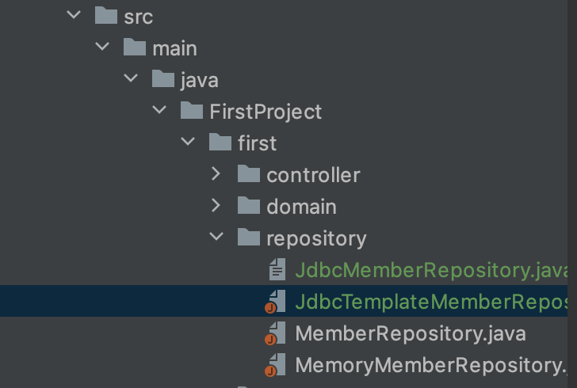

# 스프링 통합 테스트

> 스프링 컨테이너를 직접 띄운다음 데이터베이스와 연동해 테스트를 진행한다. = `@SpringBootTest`
>
> 이를 스프링 통합 테스트라고 한다.


* src - test - java - service에 `MemoryMemberRepositoryintegrationTest.java`를 생성

```java
@SpringBootTest // 스프링 컨테이너와 테스트를 함께 실행한다.
@Transactional // 트랜잭션 롤백: 다음 테스트에 영향을 주지 않는다.
public class MemoryMemberRepositoryTest {

    @Autowired MemberService memberService;
    @Autowired MemberRepository repository;
    
/*    @AfterEach : 각 테스트 메소드가 실행된 이후 실행하는 메소드
    public void afterEach(){
        repository.clearStore();
    }  @Transactional의 존재로 인해 매번 비워줄 필요가 없다
*/
  @Test
  void 회원가입(){
    //.....
  }
```

* Annotation : `@SpringBootTest`, `@Transactional` 을 클래스 위에 적어준다. 

  * 테스트용으로 데이터를 DB 안에 집어넣은 상태에서 다른 테스트를 실행하면 이미 있는 값으로 오류가 발생할 수 있다.
    * 이것은 이전에는 `@AfterEach`를 이용해 만들었지만 DB에서는 `@Transactional`로 해결할 수 있다.

* `@Transaction`: 메소드를 시작하기 전의 상황을 기억한 다음(트랜잭션을 남김) 메소드를 마친 후 그 상황으로 트랜잭션 롤백을 함

  ​        

  ​      

​                

# 스프링 JdbcTemplate

> 위에서는 스프링을 직접 띄워서 테스트를 해보았다. 하지만 스프링 컨테이너 없이 테스트하는 방법 또한 익혀야 한다.

### 설정

* 순수 Jdbc와 동일한 환경설정을 하면 된다.



​           

### 테스트 코드 작성

* src - main - java - repository - `JdbcTemplateMemberRepository`

```java
public class JdbcTemplateMemberRepository implements MemberRepository{
  
  private final JdbcTemplate jdbcTemplate;
  
  //생성자 주입식(인젝션:Injection)으로 제공할 수 없음 = DataSource 사용
  
  @Autowired //생략 가능: 생성자가 딱 하나 있어서 자동 인식
  public JdbcTemplateMemberRepository(DataSource dataSource){
    	jdbcTemplate = new JdbcTemplate(dataSource); // 디자인패턴 중에 Template 메서드 패턴이 존재
  }
  
 @Override
      public Member save(Member member) {
          SimpleJdbcInsert jdbcInsert = new SimpleJdbcInsert(jdbcTemplate);
          jdbcInsert.withTableName("member").usingGeneratedKeyColumns("id");
        
       		Map<Sting , Object> parameters = new HashMap<>();
    			parameters.put("name", member.getName());
        	Number key = jdbcInsert.executeAndReturnKey(new MapSqlParameterSource(parameters));
        	member.setId(key.longValue());
        	return member;
    }
  
@Override
    public Optional<Member> findById(Long id) {
        List<Member> result = jdbcTemplate.query("select * from member where name = ?", memberRowMapper(), id); //리스트로 나오기에 리스트로 받는다
        return result.stream().findAny();
    }  
  
@Override
    public Optional<Member> findByName(String name) {
        List<Member> result = jdbcTemplate.query("select * from member where name = ?", memberRowMapper(), name); //리스트로 나오기에 리스트로 받는다
        return result.stream().findAny();
    }
  
  
  @Override
  public List<Member> findAll(){
    	return jdbcTemplate.query("select * from member", memberRowMapper());
  }
  
  private RowMapper<Member> memberRowMapper(){
    	return new RowMapper<Member>(){ // lambda 스타일로 변경 가능
        @Override
        public Member mapRow(ResultSet rs, int rowNum) throws SQLException{
          	Member member = new Member();
          	member.setId(rs.getLong("id"));
          	member.setName(rs.getString("name"));
          	return member;
        }
      }
  }
  
}
```

​          

### 컨트롤러 추가

* 본래 있던 `@Bean`에서 수정한다.
* service - SpringConfig

```java
@Configuration
public class SpringConfig{

    @Autowired
    public SpringConfig(DataSource dataSource){
        this.dataSource = dataSource;
    }

    @Bean
    public MemberService memberService(){
        return new MemberService(memberRepository());
    }

    @Bean
    public MemberRepository memberRepository(){
        //return new MemoryMemberRepository();
        return new JdbcTemplateMemberRepository(dataSouce);
      //이 부분만 Jdbc 레파지토리로 변경
    }
}
```


