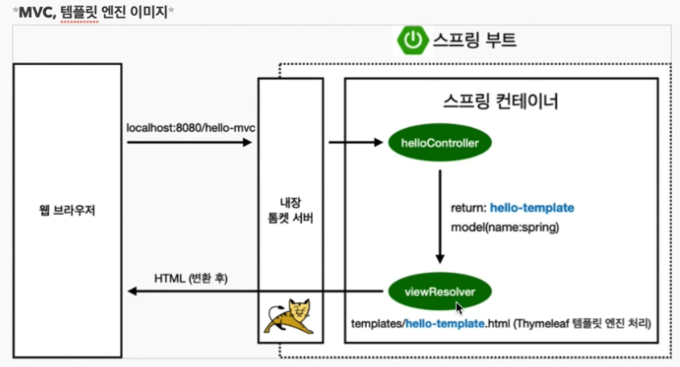
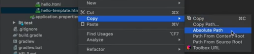
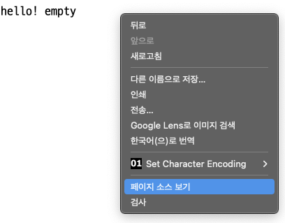

# 스프링 웹 개발 기초

* 정적 컨텐츠 : 파일을 그대로 올리는 것
* MVC와 템플릿 : 서버에서 변형에서 내려주는 방식
* API : JSON 데이터 포맷으로 클라이언트에게 데이터 전달

​        

> 파라미터 정보 : Cmd + P
>
> 당연한 입력 완성(자동완성): Cmd + Shift + Enter

​         

## 정적 컨텐츠

> resources 폴더 안에 html 파일을 집어넣어주면 손쉽게 접근이 가능하다.
>
> 그러나 특정 프로그램을 할 수 있는 것은 아니다.

`http://localhost:8080/hello-static.html` 와 같이 바로 `local 호스트/` + `html 파일명`으로 접근 가능



​          

### 정적 컨텐츠 작동 원리

1. 웹 브라우저가 주소를 요청하면 내장 톰켓 서버가 먼저 받는다.
2. 톰캣이 스프링 컨테이너에 **먼저 컨트롤러**를 요청
3. 컨트롤러가 없다면 **resources**에 찾아서 반환해준다.

​               

​              

## MVC와 템플릿 엔진

> MVC : Model, View, Controller

​             

### Controller

```java
@Controller
public class HelloController {

  	// 컨트롤러 내부에 GetMapping으로 여러 개를 추가할 수 있다
    // 톰 캣은 먼저 컨트롤러를 찾아보는데 컨트롤러는 반환값으로 이름을 준다
  	// 그 이름으로 resources의 templates를 내부를 찾아본다.
  
    @GetMapping("hello-mvc")
    public String helloMVC(@RequestParam("name") String name, Model model){
      	//RequestParam = html 파라미터 방식으로 접근할 수 있게 해줌
        // http://localhost:8080/hello-mvc?name=모델에 넘겨줄 값
      
        model.addAttribute(attibuteName:"name", name); // 왼쪽이 key, 오른쪽이 넘겨줄 값
        return "hello-template"; // resources/templates/hello-template 를 찾음
    }
}   
```

* 로컬 호스트를 열고

  `http://localhost:8080/` + `hello-mvc`+ `?name=` + `모델에 넘겨줄 값`

* 컨트롤러가 모델에 값을 넘기고 **viewResolver**가 View를 찾는 것을 도와줌

  ​    

  ​          

### View

*  화면을 그리는데 모든 역량을 집중하는 곳

```html
<html xmlns:th="http://www.thymeleaf.org">
  <body>
  <p th:text="'hello ' + ${name}">hello! empty</p>
    <!-- ${}는 (controller)모델에서 값을 꺼내고 치환해주는 코드 -->
  </body>
</html>
```

view 파일(resouces/templates 내부)의 장점은 절대경로를 가져와 바로 실행해볼 수 있다는 것

 

실행화면과 소스를 한 번에 볼 수 있다.



​           

​              

## API 방식

* MVC 와 마찬가지로 컨트롤러에 추가

​      

#### 차이점

```java
@GetMapping() 외에 @ResponseBody 를 추가한다
```

```java
@GetMapping("hello-string")
@ResponseBody // HTTP 통신 프로토콜 Body부에 직접 넣어주겠다는 뜻(HTML의 body 태그X)
public String helloString(@RequestParam("name") String name){
  
  return "hello" + name; //모델로 값을 넘기는 것이 아니라 그대로 데이터를 서버에 올려줌
}
```

​        

#### <응용>

```java
@GetMapping("hello-api")
@ResponseBody
public Hello helloApi(@RequestParam("name") String name){ 
  Hello hello = new Hello();  //객체 인스턴스 만들고
  hello.setName(name);  //setter 사용
  return hello; // 가져오기
}


static class Hello{ // 객체 생성
  private String name;

  public String getName() { // 마우스 우클릭 - generate - getter/setter 열기
    return name;
  }

  public void setName(String name) {
    this.name = name;
  }
}
```

