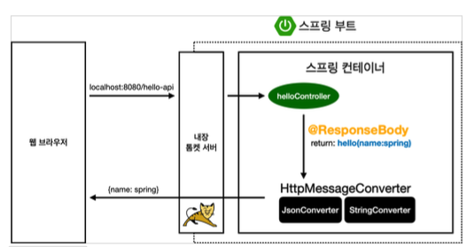

# 스프링 웹 개발 기초

* 정적 컨텐츠 : 파일을 그대로 올리는 것
* MVC와 템플릿 : 서버에서 변형에서 내려주는 방식
* API : JSON 데이터 포맷으로 클라이언트에게 데이터 전달

​        

> 파라미터 정보 : Cmd + P
>
> 당연한 입력 완성(자동완성): Cmd + Shift + Enter
>
> Getter-Setter: Ctrl + Enter

# 🍭요약

## \- 처리 순서

> ### 웹 브라우저 → 내장 톰 켓 서버 → [   1 /   2  /  3    ]
>
> 1. 해당 주소가 Controller에 등록되어 있는가?
>
>    * 없다면 **정적 컨텐츠**  →  resources/static 에서 주소이름과 같은 html 파일을 반환
>
> 2. Controller에 등록되어있다면 @ResponseBody가 있는가?
>
>    * 없다면 **MVC** → Controller 가 던지는 값을 모델에 넘기고 view에서 사용
>
>      ​	\- [ ViewResolver ]
>
> 3. 있다면 **API** → Controller가 던지는 값을 바로 받아주는데 객체인 경우 Json형식으로 해석 후 반환
>
>    ​	\- [ HttpMessageConverter → JsonConverter / StringConverter ]

​               

​                    

## 정적 컨텐츠

> resources 폴더 안에 html 파일을 집어넣어주면 손쉽게 접근이 가능하다.
>
> 그러나 특정 프로그램을 할 수 있는 것은 아니다.

`http://localhost:8080/hello-static.html` 와 같이 바로 `local 호스트/` + `html 파일명`으로 접근 가능


​          

### 정적 컨텐츠 작동 원리

1. 웹 브라우저가 주소를 요청하면 내장 톰켓 서버가 먼저 받는다.
2. 톰캣이 스프링 컨테이너에 **먼저 컨트롤러**를 요청
3. 컨트롤러가 없다면 **resources**에 찾아서 반환해준다.

​               

​              

## MVC와 템플릿 엔진

> MVC : Model, View, Controller

​                           

### Controller

```java
@Controller
public class HelloController {

  	// 컨트롤러 내부에 GetMapping으로 여러 개를 추가할 수 있다
    // 톰 캣은 먼저 컨트롤러를 찾아보는데 컨트롤러는 반환값으로 이름을 준다
  	// 그 이름으로 resources의 templates를 내부를 찾아본다.
  
    @GetMapping("hello-mvc")
    public String helloMVC(@RequestParam("name") String name, Model model){
      	//RequestParam = html 파라미터 방식으로 접근할 수 있게 해줌
        // http://localhost:8080/hello-mvc?name=모델에 넘겨줄 값
      
        model.addAttribute(attibuteName:"name", name); // 왼쪽이 key, 오른쪽이 넘겨줄 값
        return "hello-template"; // resources/templates/hello-template 를 찾음
    }
}   
```

* 로컬 호스트를 열고

  `http://localhost:8080/` + `hello-mvc`+ `?name=` + `모델에 넘겨줄 값`

* 컨트롤러가 모델에 값을 넘기고 **viewResolver**가 View를 찾는 것을 도와줌

  ​    

  ​          

### View

*  화면을 그리는데 모든 역량을 집중하는 곳

```html
<html xmlns:th="http://www.thymeleaf.org">
  <body>
  <p th:text="'hello ' + ${name}">hello! empty</p>
    <!-- ${}는 (controller)모델에서 값을 꺼내고 치환해주는 코드 -->
  </body>
</html>
```

view 파일(resouces/templates 내부)의 장점은 절대경로를 가져와 바로 실행해볼 수 있다는 것

 

실행화면과 소스를 한 번에 볼 수 있다.


​           

​              

## API 방식

* MVC 와 마찬가지로 컨트롤러에 추가

​      

> 웹브라우저 - 내장 톰 켓 서버 - 컨트롤러까지는 MVC와 같다.
>
> `@ResponseBody`가 없다면 viewResolver 한테 보내고 있다면 `HttpMessageConverter`에게 보냄
>
> 문자를 보낸다면 그냥 서버에 바로 올려주면 된다. (HttpMessageConverter → **StringConverter**)
>
> 여기서 **객체를 보내기 위해서는 먼저 객체를 정의하고 인스턴스로 만든 다음 보내줘야 하는데**
>
> 객체는 **JsonConverter**가 기본적으로 담당하기 때문에 **Json 스타일**로 변형하고 보내준다.
>
> 이 때 대표적인 라이브러리 : MappingJackson2HttpMessageConverter

​             

​            

#### 차이점

```java
@GetMapping() 외에 @ResponseBody 를 추가한다
```

```java
@GetMapping("hello-string")
@ResponseBody // HTTP 통신 프로토콜 Body부에 직접 넣어주겠다는 뜻(HTML의 body 태그X)
public String helloString(@RequestParam("name") String name){
  
  return "hello" + name; //모델로 값을 넘기는 것이 아니라 그대로 데이터를 서버에 올려줌
}
```

​        

#### <응용>

```java
@GetMapping("hello-api")
@ResponseBody
public Hello helloApi(@RequestParam("name") String name){ 
  Hello hello = new Hello();  //객체 인스턴스 만들고
  hello.setName(name);  //setter 사용
  return hello; // 가져오기
}


static class Hello{ // 객체 생성
  private String name;

  public String getName() { // 마우스 우클릭 - generate - getter/setter 열기
    return name;
  }

  public void setName(String name) {
    this.name = name;
  }
}
```

​            

​              

​             

