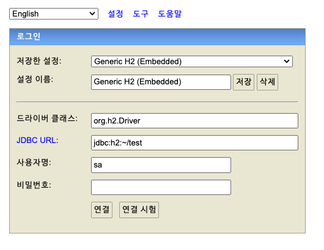
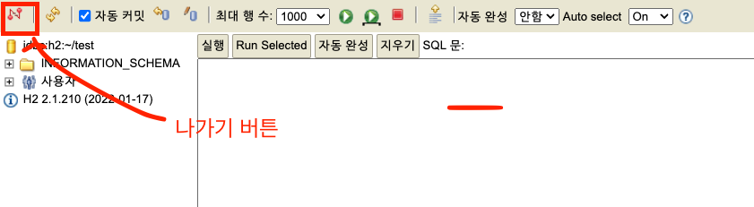
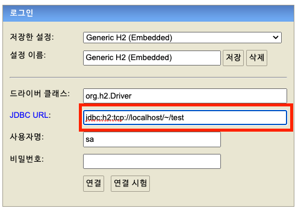

# 스프링 DB 접근 기술

> 서버에서 받은 정보를 데이터베이스로 연결해 저장해주어야한다.

​              

## H2 데이터베이스 설치

* 개발이나 테스트 용도로 가볍고 편리한 DB, 웹 화면 제공(교육용으로 좋음)

* H2 데이터베이스는 스프링부트 버전과 맞춘다.

* H2 메인 페이지에서 다운 받은 후(8MB) bin 폴더에서 `h2.sh` 파일을 찾는다.

  * MAC의 경우 실행 권한을 부여해준다.

  ```bash
  chmod 755 h2.sh
  ```

  * 실행법

  ```bash
  ./h2.sh
  # 윈도우 사용자는 h2.bat
  ```

  

  * 연결 클릭 : 데이터베이스 생성

    

  * ```bash
    $ cd ~
    ## home 으로 간 다음 파일 목록 검색
    $ ll
    ## test.mv.db 파일이 있는지 확인
    ```

    

  * 파일을 확인했다면 더 이상 파일 접근이 아니라 `localhost`로 접근해주어야 한다.

  ```bash
  jdbc:h2:tcp://localhost/~/test
  ```

  

  * **서버(톰캣)로 접근해야 여러 곳에서 접근 가능**하며 파일로 접근하면 오류가 발생할 수 있다.

​            

## 테이블 만들기

* CREATE TABLE

```mysql
create table member
(
  id   bigint generated by default as identity, /*값을 설정하지 않으면 자동으로 값을 넣어줌*/
  name varchar(255),
  primary key (id)
);
```

* 조회

```mysql
select * from member;
```

* 테이블에 값 넣기

```java
 insert into member(name) values('spring')
```


​           

### spring 내부 폴더 생성

* 프로젝트 메인 폴더 내부에 `sql` 디렉토리 생성
* `sql` 내부에 `ddl.sql` 파일 생성


* 코드 입력

```mysql
 drop table if exists member CASCADE;
    create table member
    (
        id   bigint generated by default as identity,
        name varchar(255),
        primary key (id)
);
```

