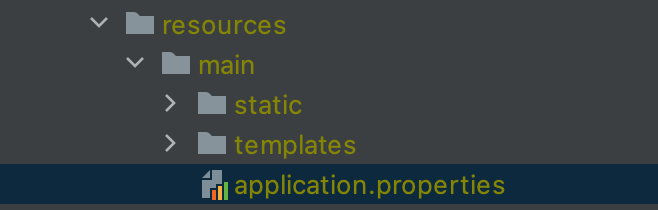
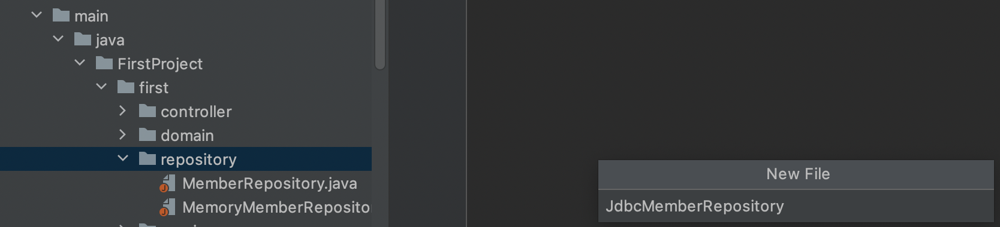
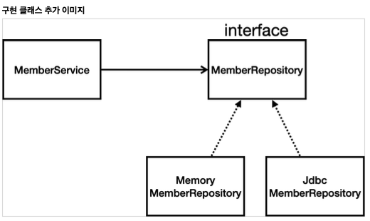
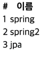

# 순수 JDBC

> 서버에서 데이터베이스의 자료를 직접 insert 하고 delete하는 것을 배운다.
>
> 가장 오래된 방식으로 진행해서 원리를 파악함을 목적으로 한다.

* `build.gradle`파일에 jdbc, h2 데이터베이스 관련 라이브러리 추가 (dependencies{} 내부)

```java
implementation 'org.springframework.boot:spring-boot-starter-jdbc' //jdbc 드라이버
runtimeOnly 'com.h2database:h2' // 클라이언트
```

* **java는 기본적으로 DB과 연동하기 위해 jdbc Driver가 필수**이다.
* DB의 경로를 넣어주어야 한다. (resources - main - templates - application.properties)

​	

```java
spring.datasource.url=jdbc:h2:tcp://localhost/~/test
spring.datasource.driver-class-name=org.h2.Driver
spring.datasource.username=sa
```

* `jdbc:h2:tcp://localhost/~/test`는 H2를 실행할 때 사용한 주소임
* 만약 `h2.Driver`부분이 빨간색이 뜬다면 `build.gradle`로 가서 코끼리를 눌러주면 `import`되어 정상적으로 작동

* **기본세팅** : jdbc 라이브러리 추가, h2 클라이언트 추가, DB 경로 넣기, h2 드라이버 지정
  * 기본 세팅만 해주면 나머지 작업들은 spring이 해준다.

  

​              

## 레파지토리 생성



* main - java - 프로젝트명 - 메인폴더 - repository - `JdbcMemberRepository` 생성

* 이전에 만들어 놓았던 interface를 `implements`해서 가져온다.

* DB에 붙기 위해서는 `DataSource`가 필요하다(생성자 초기화시 값을 넣어준다).

* **쿼리문을 짜서 넣어주어야 한다**.

* `dataSource`와 `setString()` `ResultSet` 그리고 `executeUpdate()`를 이용한다.

  * `ResultSet` : 쿼리에서 불러온 여러 개의 값을 끊어서 저장해줌 = Java의 StringTokenizer 같은 역할

    * `while(rs.next()){}` 이용 가능

    ​      

### 기본 틀

```java
package FirstProject.first.repository;

public class JdbcMemberRepository implements MemberRepository {

    private final DataSource dataSource; //DB에 붙기 위해 DataSource 인스턴스 생성
  	
  	public JdbcMemberRepository(DataSource dataSource){ // 생성자로 주입받는다.
      this.dataSource = dataSource; // 스프링이 초기 생성시 주입해준다 = 이후 수정이 불가능하도록
      // dataSource.getConnection(); 을 이용해 쿼리문을 보낼 수 있다.
    }
  
  
    @Override
    public Member save(Member member) {
      	String sql = "insert into member(name) values(?)"; //파라미터 binding을 위해 ?표기
      	
       	// Connection을 일일히 생성할 수 있지만 보통 메서드를 이용해 DataSourceUtils로 가져온다.
      	Connection connection = dataSource.getConnection(); // dataSource를 이용해 가져온다
      	// 가져오는 데이터형은 Connection
      
      	PrepareStatement pstmt = connection.prepareStatement(sql);
      	pstmt.setString(1, member.getName()); // 첫번째 파라미터로 getName()의 값을 넣어줌
      
      	pstmt.executeUpdate(); // 변경내용을 업데이트
        return member;
    }
}
```

* **빨간줄**이 뜨는데 그 이유는 exeption을 catch 해주어야 하기 때문이다.

​       

### 실제 코드

```java
package hello.hellospring.repository;
    import hello.hellospring.domain.Member;
    import org.springframework.jdbc.datasource.DataSourceUtils;
    import javax.sql.DataSource;
    import java.sql.*;
    import java.util.ArrayList;
    import java.util.List;
    import java.util.Optional;

public class JdbcMemberRepository implements MemberRepository {
  private final DataSource dataSource;
  public JdbcMemberRepository(DataSource dataSource) {
    this.dataSource = dataSource;
  }
  
  //데이터 베이스 리소는 연결하고 사용을 다 했다면 꼭 끊어주어야한다.
	@Override
    public Member save(Member member) {
        String sql = "insert into member(name) values(?)";
        Connection conn = null;
        PreparedStatement pstmt = null;
        ResultSet rs = null; // 결과를 받아줌
      	
      	// exeption을 매우 많이 던지기 때문에 try - catch로 받음
        try {
            conn = getConnection();
            pstmt = conn.prepareStatement(sql,Statement.RETURN_GENERATED_KEYS);
          	// Statement.RETURN_GENERATED_KEYS : 옵션값 - id값을 받아옴
          	// 반환은 ResultSet으로 받아준다.
          
            pstmt.setString(1, member.getName()); // ? 랑 매칭됨 (setString)
          
            pstmt.executeUpdate(); //실제 쿼리로 날라감
          
            rs = pstmt.getGeneratedKeys();
          	// 위 옵셥값에서 던져준 Statement.RETURN_GENERATED_KEYS를 받아줌
          
            if (rs.next()) { // rs가 null이 아니면
              member.setId(rs.getLong(1)); // 그 값에 id부여(이전에 만든 메서드)
            } else {
            	throw new SQLException("id 조회 실패");
            }
            return member;
        } catch (Exception e) {
            throw new IllegalStateException(e);
        } finally {
            close(conn, pstmt, rs);
          	// 리소스들을 끊어주는 부분 : 이것도 구현해야함 = 아래 Close 메서드 참고
          	// 내용: conn, pstmt, rs가 null이 아니면 하나씩 .close() 로 닫아준다
          	// 주의: try catch로 각각 실행해야한다.
        }
		}
  
  @Override
    public Optional<Member> findById(Long id) { //조회 쿼리
        String sql = "select * from member where id = ?";
        Connection conn = null;
        PreparedStatement pstmt = null;
      	ResultSet rs = null;
       
      try {
        conn = getConnection();
        pstmt = conn.prepareStatement(sql);
        pstmt.setLong(1, id);
        
        rs = pstmt.executeQuery();
        //조회는 executeUpdate() 가 아닌 executeQuery() 이다.
        
        if(rs.next()) { // 만약 값이 있으면
            Member member = new Member(); //멤버 클래스 형식으로 만들어주고
            member.setId(rs.getLong("id")); // DB에서 불러온 값으로 세팅
            member.setName(rs.getString("name"));
            return Optional.of(member); //반환
        } else {
            return Optional.empty();
        }
            } catch (Exception e) {
                throw new IllegalStateException(e);
            } finally {
                close(conn, pstmt, rs);
        } }
  
  @Override
  public List<Member> findAll() {
      String sql = "select * from member"; //전체조회라 더 단순
      Connection conn = null;
      PreparedStatement pstmt = null;
      ResultSet rs = null;
      try {
          conn = getConnection();
          pstmt = conn.prepareStatement(sql);
        
        	rs = pstmt.executeQuery(); //StringTokenizer 느낌
        	
        	List<Member> members = new ArrayList<>();
        	
        	while(rs.next()) { //while을 사용해 계속 받아줌
            Member member = new Member();
            member.setId(rs.getLong("id"));
            member.setName(rs.getString("name"));
            members.add(member);
      }
              return members;
          } catch (Exception e) {
              throw new IllegalStateException(e);
          } finally {
              close(conn, pstmt, rs);
          }
      }
  @Override
  public Optional<Member> findByName(String name) {
      String sql = "select * from member where name = ?";
      Connection conn = null;
      PreparedStatement pstmt = null;
      ResultSet rs = null;
      try {
          conn = getConnection();
          pstmt = conn.prepareStatement(sql);
          pstmt.setString(1, name);
          rs = pstmt.executeQuery();
          if(rs.next()) {
              Member member = new Member();
              member.setId(rs.getLong("id"));
              member.setName(rs.getString("name"));
              return Optional.of(member);
  }
        
        return Optional.empty();
 } catch (Exception e) {
            throw new IllegalStateException(e);
        } finally {
            close(conn, pstmt, rs);
        }
}
  // Connection을 인스턴스로 생성하기보다 DataSourceUtils 를 이용해 가져오기
  // database 트랜젝션에 걸릴 수 있는데 연결을 계속 유지해주는 역할을 한다.
  // 가져올 때 꼭 이렇게 가져온다. 닫을 때 역시 DataSourceUtils로 닫는다.
    private Connection getConnection() {
        return DataSourceUtils.getConnection(dataSource);
		}
  
  	//close 메서드 시작부
    private void close(Connection conn, PreparedStatement pstmt, ResultSet rs){
        try {
            if (rs != null) {
                rs.close();
            }
        } catch (SQLException e) {
            e.printStackTrace();
			} try {
            if (pstmt != null) {
                pstmt.close();
            }
        } catch (SQLException e) {
            e.printStackTrace();
        }
        try {
            if (conn != null) {
                close(conn);
            }
        } catch (SQLException e) {
            e.printStackTrace();
		} }
  
  // Connection을 닫을 때 또한 DataSourceUtils 이용
    private void close(Connection conn) throws SQLException {
        DataSourceUtils.releaseConnection(conn, dataSource);
    }}
```

​         

### Annotation

* 이제 사용자가 원하는 값을 DB에서 꺼내서 보여줘야한다.
* 이전에 `@Bean`을 통해 memberRepository를 컨트롤러에 인식하게 했는데 다시 그곳으로 가서 리턴값을 바꿔준다.

```java
private DataSource dataSource;

@Autowired
public SpringConfig(DataSource dataSource){
	this.dataSource = dataSource;
}

@Bean
public MemberRepository memberRepository(){
		//return new MemoryMemberRepository();
		return new JdbcMemberRepository(dataSource); // Jdbc를 사용하기 위해 넣어주어야 했는데
  	// 위에서 생성자를 통해 넣어주고 @Autowired로 처리해주어야 한다.
  
 		//MemberRepository memberRepository()의 형식으로 받았는데
  	//JdbcMemberRepository(dataSource)로 리턴할 수 있는 이유는 다형성 때문이다.
}
```

​      

* 두 `Repository`모두 `MemberRepository`를 구현한 상태에서 값을 `MemoryMemberRepository`가 아닌 `JdbcMemberRepository`로 리턴할 수 있다.
* 개방-폐쇄 원칙(OCP, Open-Closed Principle)
  * 확장에는 열려있고 수정에는 닫혀있다.
* 스프링의 **DI(Dependencies Injection)**을 사용하면 **기존 코드를 전혀 손대지 않고 구현 클래스를 변경**할 수 있다.

​                   

### 실행

* h2 데이터베이스가 터미널에서 구동된 상태에서 실행해야한다.

  

* 서버에서 DB 테이블에 값을 넣고 불러와 확인할 수도 있다.

​      