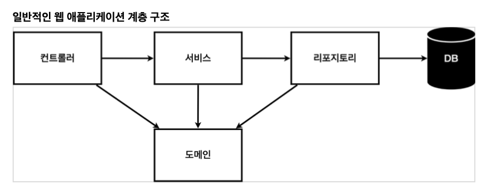
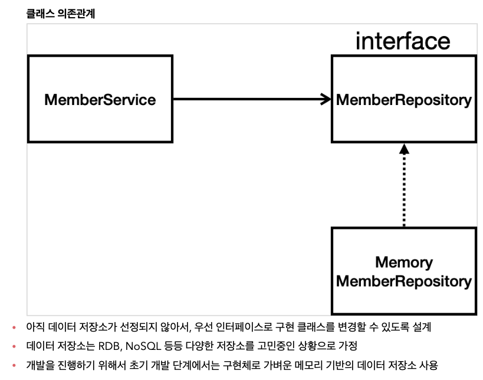
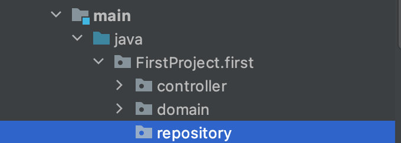
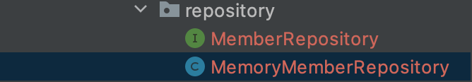

# 회원 관리 예제

##                       

#### \- given / when / then 기법 사용

> Cmd + shift + enter : 커서 줄바꿈
>
> Cmd + opt + v : Optional 자동생성
>
> 클래스에서 드래그 후 - Cmd + Shift + T = Create New Test
>
> 클래스에 마우스를 올리고 cmd + 좌클릭 = 바로 이동

### 비즈니스 요구사항 정리

* 데이터 : 회원 ID, 이름
* 기능 : 회원 등록, 조회
* 아직 데이터 저장소가 선정되지 않음(가상의 시나리오)

​             



* 서비스 : 회원은 중복 가입이 안된다 등 서비스에 필요한 로직들이 존재 [ 핵심 비즈니스 로직 ]
* 도메인 : 회원, 주 쿠폰 등등 데이터베이스에서 관리하는 [ 비즈니스 도메인 객체 ]
* 리포지토리 : 데이터베이스에 접근, 도메인 객체를 DB에 저장하고 관리

​           

### < 실습 내용 >



​              

​               

### 회원 도메인과 리포지토리 만들기

#### 1. domain 패키지 생성

* main - java - 프로젝트 파일에서 `domain` 패키지를 생성


* 그리고 `Member` 클래스를 생성

  

* Member class 를 이용해 회원 정보를 관리하도록 코드 작성

  ```java
  package FirstProject.first.domain;
  
  public class Member {
      private Long id;
      private String name;
  
      public Long getId() {
          return id;
      }
  
      public void setId(Long id) {
          this.id = id;
      }
  
      public String getName() {
          return name;
      }
  
      public void setName(String name) {
          this.name = name;
      }
  }
  ```

  ​                   

#### 2. Repository 생성

* main - java - 프로젝트 파일에서 `repository` 패키지 생성



* `MemberRepository` 이름으로 Interface 객체 생성

  ```java
  package FirstProject.first.repository;
  
  import FirstProject.first.domain.Member;
  
  import java.util.List;
  import java.util.Optional;
  
  public interface MemberRepository {
      Member save(Member member); // 인터페이스이므로 { } 블럭 X
      Optional<Member> findById(Long id); // java 8의 기능
      Optional<Member> findByName(String name); // 찾았을 때 null이면 Option으로 감싸서 반환
      List<Member> findAll();
  }
  ```

     

#### 3. 인터페이스 구현체 만들기

* main - java - `repository` - MemoryMemberRepository 클래스 생성



```java
package FirstProject.first.repository;

public class MemoryMemberRepository implements MemberRepository { //이 상태에서 option + Enter
}
```

​            

* 메서드 구현

```java
package FirstProject.first.repository;

import FirstProject.first.domain.Member;

import java.util.*;

public class MemoryMemberRepository implements MemberRepository {

    private static Map<Long, Member> store = new HashMap<>();
    private static long sequence = 0L; // 실무에서는 동시성 문제로 어텀 롱을 해야함

    @Override
    public Member save(Member member) {
        member.setId(++sequence); // save 할 때마다 squence 증가시킨 후 넣어서 id 저장
        store.put(member.getId(), member);
        return member;
    }

    @Override
    public Optional<Member> findById(Long id) {
        return Optional.ofNullable(store.get(id)); // Optional을 이용하면 null이어도 감쌀 수 있다.
        //return store.get(id); // Map에서 찾아서 반환하는데 없으면 null 이 반환된다.
    }

    @Override
    public Optional<Member> findByName(String name) {
        return store.values().stream()  // values() 를 통해 키의 value 들 순회하면서
                 .filter(member -> member.getName().equals(name)) // 람다식
                    /// 멤버를 넣고 멤버의 이름을 반환해 같은지 확인 (equals 는 true, false)
                 .findAny(); //하나라도 찾는다
    }

    @Override
    public List<Member> findAll() {
        return new ArrayList<>(store.values()); // 실무에서는 ArrayList로 주로 반환
    }
}
```

​                       

​                      

## 회원 레파지토리 테스트 케이스 작성

* test - java - 프로젝트 패키지 - repository 로 패키지 생성
* 패키지 안에 `MemoryMemberRepositoryTest`로 생성 (Memo치고 자동완성으로 가져오기)
* 테스트가 여러 개인 경우: 하나의 테스트가 다른 테스트의 값에 영향을 준다 = 초기화 작업이 필요
  * 하나의 테스트가 끝날 때마다 초기화해주어야 하는데 **인스턴스 내부의 값을 초기화하기 위해선 테스트 클래스가 아닌 원래 클래스 내부에 초기화 코드를 넣어주어야 한다.**

```java
package FirstProject.first.repository;

import FirstProject.first.domain.Member;
import org.junit.jupiter.api.AfterEach;
import org.junit.jupiter.api.Assertions;
import org.junit.jupiter.api.Test;

import java.util.List;
import java.util.Optional;

import static org.junit.jupiter.api.Assertions.*;

public class MemoryMemberRepositoryTest {
    MemoryMemberRepository repository = new MemoryMemberRepository();
    // 테스트의 값들이 서로에게 영향을 줄 수 있기 때문에 값을 초기화해야함
    // 그 내용은 여기서가 아니라 테스트 하는 클래스 내부에(메소드들이 정의된 곳) 만들어준다.
    //     public void clearStore(){
    //        store.clear();
    //    }

    @AfterEach // 각 테스트 메소드가 실행된 이후 실행하는 메소드
    public void afterEach(){
        repository.clearStore();
    }

    @Test
    public void save(){
        Member member = new Member();
        member.setName("spring");

        repository.save(member);
        Member result = repository.findById(member.getId()).get();
       // System.out.println("result = "+ (result == member)); // 계속 볼 수는 없으므로
        //Assertions.assertEquals(member,result); //Assertion을 이용해 비교
        // Assertions.assertEquals(member,null); //Assertion 만약 다른 값이 튀어나오면 오류
        assertEquals(member,result); // Assertions 를 드래그한 상태로 opt+Enter 한다음 static import
    }

    @Test
    public void findByName(){
        Member member1 = new Member();
        member1.setName("spring1");
        repository.save(member1);

        Member member2 = new Member();
        member2.setName("spring2");
        repository.save(member2);

        Member result = repository.findByName("spring1").get();

        assertEquals(result,member1);

        List<Member> result2 = repository.findAll(); //이 메소드도 검사
        assertEquals(result2.size(),2); // 총 2개가 나와야함
    }

}
```

​                    

​                       

## 회원 서비스 개발

* main - java - 프로젝트패키지 - service 패키지 생성 - Member Service 클래스 생성

> 클래스에서 Cmd + Shift + T = Create New Test 하면 자동 완성

```java
package FirstProject.first.service;

import org.junit.jupiter.api.Test;

import static org.junit.jupiter.api.Assertions.*;

class MemberServiceTest {

    @Test
    void join() {
    }

    @Test
    void findOne() {
    }
}
```


### Test 수행

```java
package FirstProject.first.service;

import FirstProject.first.domain.Member;
import FirstProject.first.repository.MemoryMemberRepository;
import org.assertj.core.api.Assertions;
import org.junit.jupiter.api.AfterEach;
import org.junit.jupiter.api.BeforeEach;
import org.junit.jupiter.api.Test;

import java.util.Optional;

import static org.assertj.core.api.Assertions.*; //static import 한 모습 = option enter
import static org.junit.jupiter.api.Assertions.*;

class MemberServiceTest {

    //MemberService memberService = new MemberService();
    //MemoryMemberRepository memberRepository = new MemoryMemberRepository();
    MemberService memberService;
    MemoryMemberRepository memberRepository;

    @BeforeEach //동작하기 전에 넣어주기: 위 Member리포지로티하고 Member 서비스의 데이터가 일치하지 않는 문제 발생
    public void beforeEach(){
        memberRepository = new MemoryMemberRepository();
        memberService = new MemberService(memberRepository);
    }

    @AfterEach // 끝날 때마다 DB값을 날려주기
    public void afterEach(){
        memberRepository.clearStore();
    }

    @Test
    void 회원가입() { //테스트 코드는 그냥 메소드 이름을 한글로 해도 상관없다
        //given
        Member member = new Member();
        member.setName(("hello"));

        //when
        Long saveId = memberService.join(member);

        //then
        Member result = memberService.findOne(saveId).get(); // cmd+opt+v
        assertThat(member.getName()).isEqualTo(result.getName());
    }

    @Test
    public void 중복_회원_예외(){
        //given
        Member member1 = new Member();
        member1.setName("spring");

        Member member2 = new Member();
        member2.setName("spring");

        //when
        memberService.join(member1);

/*  try-catch가 애매할 때가 있다. 이 때 assertThrows를 사용한다.
        try{
            memberService.join(member2);
            fail(); //예외가 발생해야하는데 발생하지 않는 경우 fail() 구문이 실행된다
        }catch(IllegalStateException e){
            assertThat(e.getMessage()).isEqualTo("이미 존재하는 회원입니다.");
        }
*/
        IllegalStateException e = assertThrows(IllegalStateException.class, () -> memberService.join(member2));
        assertThat(e.getMessage()).isEqualTo("이미 존재하는 회원입니다.");
        //then
    }


    @Test
    void findOne() {
    }
}
```

​     

### 주의점

* Test를 하려다보니 각각의 클래스에서 인스턴스를 받아서 테스트하는데 둘의 정보가 일치하지 않을 때 문제가 발생할 수 있다.

```java
MemberService memberService = new MemberService();  // 둘다 new 라서 서로의 연관성X
MemoryMemberRepository memberRepository = new MemoryMemberRepository();
```

* 해결: **한 쪽 클래스의 생성자 단계에서 다른 클래스의 인스턴스를 집어넣을 수 있도록 수정한다** 

```java
private final MemberRepository memberRepository;

public MemberService(MemberRepository memberRepository) { //control+enter: 생성자
	this.memberRepository = memberRepository; //외부 데이터에서 넣어주도록 바꾸기
}
```

* try catch 보단 assert 시리즈를 잘 활용할 것

```java
assertThat(e.getMessage()).isEqualTo("이미 존재하는 회원입니다.");
```

