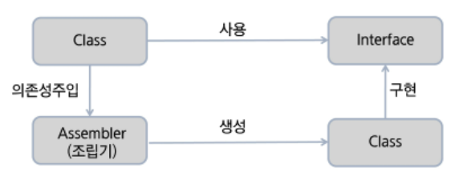

# IoC

> Inversion of Control, 제어의 역행
>
> Ioc 유형으로 Dependency Lookup / Injection이 존재

* IoC/DI
* 객체지향 언어에서 Object간의 연결관게를 런타임에 결정
* 객체 간의 관계가 느슨하게 연결됨(loose coupling)
* IoC의 구현 방법 중 하나가 DI(Dependency Injection)

​                    

### Dependency Lookup

* 컨테이너가 lookup context를 통해서 필요한 Resource나 Object를 얻는 방식
* JNDI 이외의 방법을 사용한다명 JNDI 관련 코드를 오브젝트 내에서 하나씩 변경해 주어야 함
* Lookup한 Object를 필요한 타입으로 Casting 해주어야 함
* Naming Exception을 처리하기 위한 로직이 필요

​          

### Dependency Injection

* Object에 lookup 코드를 사용하지 않고 컨테이너가 직접 의존 구조를 Object에 설정할 수 있도록 지정해주는 방식
* Object가 컨테이너의 존재 여부를 알 필요가 없음
* Lookup 관련된 코드들이 Object 내에서 사라짐
* Setter Injection과 Constructor Inject

​             

​         

## Container

* 객체의 생성, 사용, 소멸에 해당하는 라이프사이클을 담당
* 라이프사이클을 기본으로 어플리케이션 사용에 필요한 주요 기능을 제공

​         

### Container 기능

* 라이프사이클 관리
* Dependency 객체 제공
* Thread 관리
* 기타 어플리케이션 실행에 필요한 환경

​          

### Container 필요성

* 비즈니스 로직 외에 부가적인 기능들에 대해서는 독립적으로 관리되도록 하기 위함
* 서비스 look up이나 Configuration 에 대한 일관성을 갖기 위함
* 서비스 객체를 사용하기 위해 각각 Factory 또는 Singleton 패턴을 직접 구현하지 않아도 됨

​           

#### IoC Container

* 오브젝트의 생성과 관계설정, 사용, 제거 등의 작업을 어플리케이션 코드 대신 독립된 컨테이너가 담당
* 컨테이너가 코드 대신 오브젝트에 대한 제어권을 갖고 있어 IoC라고 부름
* 이런 이유로 스프링 컨테이너를 IoC 컨테이너라고 부르기도 함
* 스프링에서 IoC를 담당하는 컨테이너에는 BeanFactory, ApplicationContect가 있음

​            

### Spring DI Controller

* Spring DI Container가 관리하는 객체를 빈(Bean)이라 하고, 이들의 생명주기(Life-Cycle)를 관리하는 의미로 빈 팩토리(BeanFactory)라 한다.
* Bean Factory에 여러가지 컨테이너 기능을 추가하여 ApplicationContext라 한다.

>**<<interface>> BeanFactory**
>
>* Bean을 등록, 생성, 조회, 반환 관리 (단일 유형이 아닌 여러 유형의 빈을 제공)
>  * 객체 간 연관관계를 설정, 클라이언트 요청 시 빈을 생성
>  * 빈의 라이프 사이클 관리
>* 일반적으로 BeanFactory보다는 이를 확장한 ApplicationContext를 사용
>* getBean() method가 정의되어 있음
>
>​          
>
>**<<interface>> Application**
>
>* Bean을 등록, 생성, 조회 반환 관리 기능은 BeanFactory와 같음
>* Spring의 각종 부가 서비스를 추가로 제공
>  * I18N, 리소스 로딩, 이벤트 발생 및  통지
>* Spring이 제공하는 ApplicationContext 구현 클래스는 여러가지 종류가 있음
>
>​         
>
>**<<interface>> WebApplicationContext**
>
>* 웹 환경에서 사용할 때 필요한 기능이 추가된 어플리케이션 컨텍스트
>* 가장 많이 사용하며 특히 XmlWebApplicationContext를 가장 많이 사용
>
>​          

​             

### IoC 개념

* 객체 제어 방식

  * 기존: 필요한 위치에서 개발자가 필요한 객체 생성 로직 구현
  * IoC: 객체 생성을 Container에게 위임하여 처리

* IoC 사용에 따른 장점

  * 객체 간의 결합도를 떨어뜨릴 수 있음(loose coupling)

* 객체간 결합도가 높으면?

  * 해당 클래스가 유지보수될 때 그 클래스와 결합된 다른 클래스도 같이 유지보수 되어야 할 가능성이 높음
  * 인터페이스 등을 이용해 결합도를 떨어뜨린다.

  ​          

### 객체간 강한 결합

​          

#### 1. 클래스 호출 방식

* MemberService 구현체와 AdminService 구현체를 HomeController에서 직접 생성해 사용
* MemberService 또는 AdminService가 교체되거나 내부 코드가 변경되면 HomeController까지 수정해야할 가능성이 있음
* 클래스 내에 선언과 구현이 모두 되어 있기 때문에 다양한 형태 변화가 불가능

​        

#### 2. 객체 간의 강한 결합을 다형성을 통해 결합도를 낮춤

* 인터페이스 호출 방식

* 구현 클래스 교체가 용이하여 다양한 형태로 변화가능

* 하지만 인터페이스 교체 시 호출 클래스도 수정해야함

  

​            

#### 3. 객체 간의 강한 결합을 Factory를 통해 결합도를 낮춤

* 팩토리 호출 방식
* 팩토리 방식은 팩토리가 구현 클래스를 생성하므로 클래스는 팩토리를 호출
* 인터페이스 변경 시 팩토리만 수정하면 됨. 호출 클래스에는 영향을 미치지 않음
* 하지만 클래스에 팩토리를 호출하는 소스가 들어가야하므로 그 자체가 팩토리에 의존함을 의미한다.
  * 각 Service를 생성하여 반환하는 Factory 사용
  * Service를 이용하는 쪽에서는 Interface만 알고 있으면 어떤 구현체가 어떻게 생성되는지에 대해서 알 필요가 없음
  * 이 Factory 패턴이 적용된 것이 Container의 기능이며 이 Container의 기능을 제공해 주고자 하는 것이 IoC 모듈

​        

#### 4. 객체 간의 강한 결합을 Assembler를 통해 결합도를 낮춤

* IoC 호출 방식
* 팩토리 패턴의 장점을 더하여 어떠한 것에도 의존하지 않는 형태가 됨
* 실행시점(Runtime)에 클래스 간의 관계가 형성됨
  * 각 Service의 LifeCycle을 관리하는 Assembler를 사용
  * Spring Container가 외부 조립기(Assembler)역할을 함

​    

​               

## Spring DI 용어 정리

* 빈(Bean)
  * 스프링이 IoC 방식으로 관리하는 오브젝트
  * 스프링이 직접 그 생성과 제어를 담당하는 오브젝트만을 Bean이라고 부른다.
* 빈 팩토리(BeanFactory)
  * 스프링이 IoC를 담당하는 핵심 컨테이너
  * Bean을 등록, 생성, 조회, 반환하는 기능을 담당
  * 일반적으로 BeanFactory를 바로 사용하지 않고 이를 확장한 ApplicationContext를 이용한다.
* 어플리케이션 컨텍스트(ApplicationContext)
  * BeanFactory를 확장한 IoC 컨테이너
  * Bean을 등록하고 관리하는 기본적인 기능이 동일
  * 스프링이 제공하는 각종 부가 서비스를 추가 제공
  * BeanFactory라고 부를 때는 주로 빈의 생성과 제어의 관점에서 얘기하는 것이고 어플리케이션 텍스트로 부를 때는 스프링이 제공하는 어플리케이션 지원기능을 모두 포함한 개념이라고 이해한다.
* 설정정보/설정 메타정보(configuration metadate)
  * 스프링의 설정정보란 ApplicationContext 또는 BeanFactory가 IoC를 적용하기 위해 사용하는 메타정보를 말한다.
  * 설정정보는 IoC 컨테이너에 의해 관리되는 Bean 객체를 생성하고 구성할 때 사용됨
* 스프링 프레임워크
  * 스프링 프레임워크는 IoC컨테이너, ApplicationContext를 포함해서 스프링이 제공하는 모든 기능을 통틀어 말할 때 주로 사용된다.

