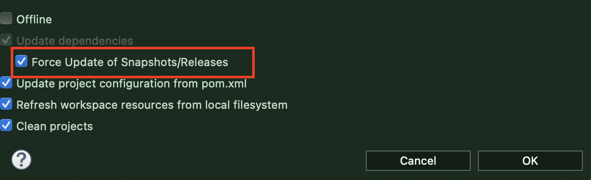

## Spring MVC 설정 / 실행순서 / 구현

1. web.xml에 DispatcherServlet 등록
   * 원래 Servlet 등록 방식은 xml에서 등록하고 mapping을 수동으로 설정하는 것이다.
     * 이것에서 더 발전한 모습: Servlet에서의 `@WebServlet("/hs")`같은 annotation 형태이다.
   
2. Spring 설정파일 등록
   * DI, AOP와 같은 설정
   * web / non-web
     * web: controller
     * non - web: service, dao
   
3. web.xml: 최상위 Root ContextLoader 설정(**이 때문에 아래 순서 주의한다 - xml 실행 순서**)
   * Context 설정 파일들을 로드하기 위해 web.xml 파일에 리스너 설정(ContextLoaderListener)
   
     ```xml
     <listener>
       	<listener-class>org.springframework.web.context.ContextLoaderListener</listener-class>
     </listener>
     ```
   
     
   
   * **WEB-INF 내부dml xml 파일에 연결**하기 위해서는 절대 경로로 이동
   
     ````xml
     <context-param>
       <param-name>contextConfigLocation</param-name>
       <param-value>
       /WEB-INF/spring/root-context.xml    <!-- 이렇게 WEB-INF 에 접근-->
       classpath: com/test/web/application.xml <!--이렇게 java src에 접근>
       </param-value>
     </context-param>
     ````
   
     * **java src**에 접근하기 위해선 `classpath:`로 접근한다.
   
     * 그 외 다른 컨텍스트 파일들을 최상위 어플리케이션 컨텍스트에 로드하도록 해보자.
   
     * **여러 개의 xml 파일에 접근 가능**: 자주 사용되지는 않는다!
   
       ```xml
       <param-value>
       	/WEB-INF/spring/root-*.xml <!--예전 방식 중 하나 -->
       </param-value>
       ```
   
       * board-security/servlet/service/dao . xml 등으로 구분해서 사용했던 때가 있었음(**=Layer 분리**)

​               

### 1) Controller Class 작성

* POJO: Annotation + 순수 Java class 파일이다.

```java
@Controller
public class HomeController {   // extends 로 Servlet을 상속할 필요가 없다, 인자도 받지 않는다.

  	private static final Logger logger = LoggerFactory.getLogger(HomeController.class);
		
  	@RequestMapping(value ="/", method = RequestMethod.GET)
		public String home(Locale locale, Model model) {
      logger.info("Welcome home! The client locale is {}.", locale);
      
      //MODEL: service, dao가 존재
      model.addAttribute("message", "안녕하세요 스프링!!"); //request.setAttribute와 비슷
      
      return "index";  //VIEW: 대략 / --- /index.jsp 이런 곳으로 이동할 것임을 예측할 수 있다.
    }


}
```

* Context 설정 파일에 Controller 등록. (Servlet-context.xml)

  * 하지만 Annotation 방식을 사용할 것이므로 아래 설정은 지양한다. (= **component-scan** 을 사용)

  ```xml
  <beans:bean class="com.test.web.HomeController"/>
  ```

​                            

### 2) Controller와 response page 연결을 위한 ViewResolver 설정

```xml
<beans:bean class="com.test.web.HomeController"/>

<beans:bean class="org.springframework.web.servlet.view.InternalResourceViewResolver">
	<beans:property name="prefix" value="/WEB-INF/views/"/>
  <beans:property name="suffix" value=".jsp"/>
</beans:bean>
```

* 위에서 "index"의 문자열을 받은 다음 주소(**prefix**)뒤에 붙이고 .jsp로 확장자(**suffix**)를 붙여줌

​               

  ### * Spring MVC 폴더 구조


* main: java
* test: junit(s.t)
* src - main - webapp 내부에 WEB-INF 존재

​           

### STS MVC 프로젝트 생성시 초기 생성과 설정

> 자잘하게 버전을 다 바꾸어야 하지만 스프링/자바/메이븐 버전만 일단 바꾸고 나머지는 일률변환

* `pom.xml`에 보면 스프링 버전과 자바 버전이 낮은데 이클립스 출시일을 잘 계산해서 버전을 맞춰준다.
  * 이클립스 2020.06 기준
    * spring: 5.3.18
    * java: 1.8 (2020.09 부터 java11)

```xml
<properties>
		<java-version>1.8</java-version>
		<org.springframework-version>5.3.18</org.springframework-version>
		<org.aspectj-version>1.6.10</org.aspectj-version>
		<org.slf4j-version>1.6.6</org.slf4j-version>
	</properties>
```

* 이하 maven 플러그인 등 버전들을 바꾼 다음 

```xml
<plugin>
  <groupId>org.apache.maven.plugins</groupId>
  <artifactId>maven-compiler-plugin</artifactId>
  <version>2.5.1</version>
  <configuration>
    <source>1.8</source> <!--1.6 에서 변경-->
    <target>1.8</target> <!--1.6 에서 변경-->
    <compilerArgument>-Xlint:all</compilerArgument>
    <showWarnings>true</showWarnings>
    <showDeprecation>true</showDeprecation>
  </configuration>
</plugin>
```

* Maven 플러그인 설정을 바꾼 후 **[ 프로젝트 우클릭 -  Maven - Update Project ]** 로 업데이트한다.

  

  * force update에 체크함을 유의한다.

* JSP 파일은 다음과 같이 webapp 내부 WEB-INF 내부 **view** 폴더에 생성한다.(직접 jsp에 접근할 수 없다.)

  

  * Other - JSP를 검색한 후 생성한다.

#### * xml 읽는 순서에 주의한다

* Dispatcher가 올라가고 그 내부에 web.xml 이 올라가지만 그 내부 <init-param\>의 `servlet-context.xml`이 바로 실행되는 것이 아니다.

  * 그 다음내부에 연결된 root-context.xml 이 읽혀진다. (**ContextLoaderListener에 의해**)
  * 그 다음에 init-param 안에 있는 servlet-context 가 읽혀진다.

  ```xml
  <load-on-startup>1</load-on-startup>
  ```

  * 위 설정을 하면 톰캣이 뜨는 순간에 web.xml 객체가 같이 올라간다.

​             

### Spring Web Application 동작 원리


1. web.xml 의 loading
2. ContextLoaderListener의 생성
3. 2에 의해 root-context.xml의 loading (component-scan에 의해 아래 연속적 호출)
4. ServiceImpl, DAO, VO 의 생성
5. client의 request
6. DispatcherServlet 생성
7. servlet-context.xml(presentation-layer.xml) 로딩
8. Controller 들의 running

​                                 

##  