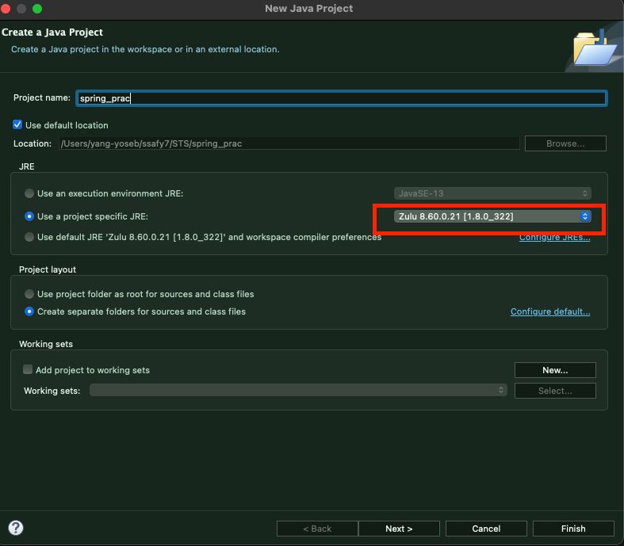
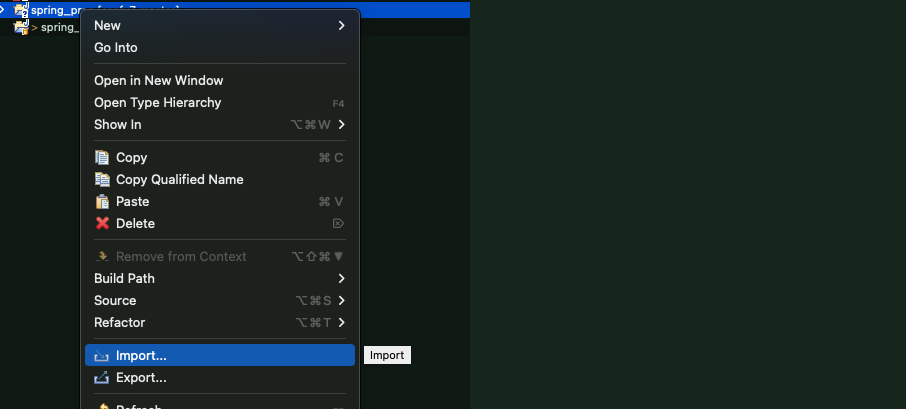
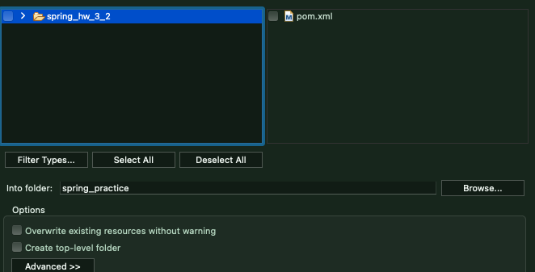
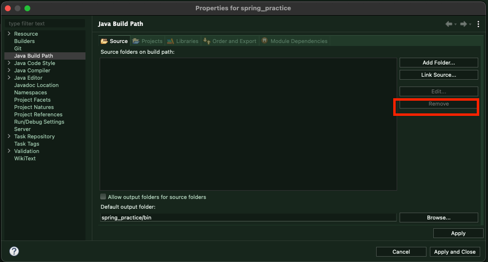
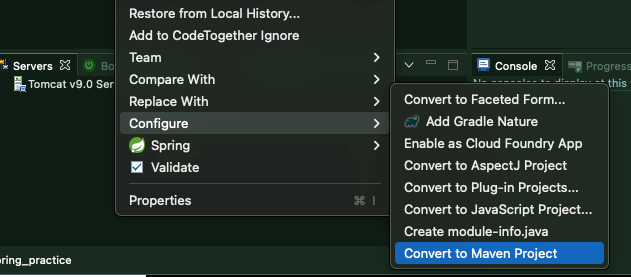
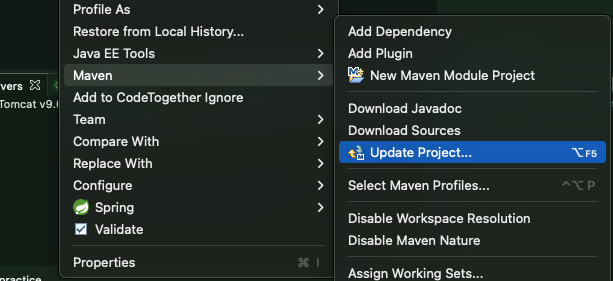

## Java Project에서 Maven Project로 변환하기

> 라이브러리 등 설정 오류로 인해 Java에서 Maven Project로 변환하고 곧바로 실행하면 오류가 발생한다.

​          

### 1. Java project 생성

* open jdk인 zulu 8(현 이클립스 버전에 호환되는 JDK)를 이용해 java project를 생성한다.

​         

### 2. import - file system

* file system을 통해 src 나 xml 설정파일을 로드한다.

​         

### 3. Properties 의 source 비우기

> 충돌 방지를 위해 source를 비워낸다.

​          

### 4. Maven project로 변환

​          

### 5. Maven update

