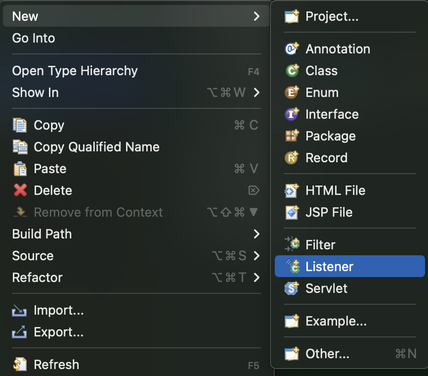
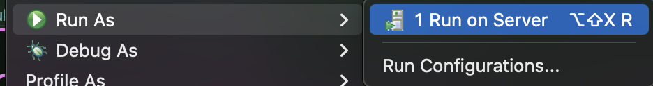
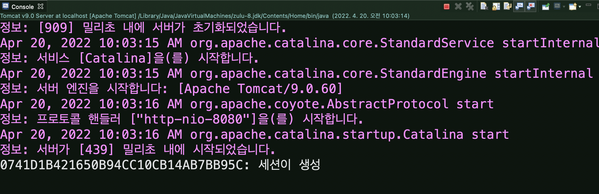
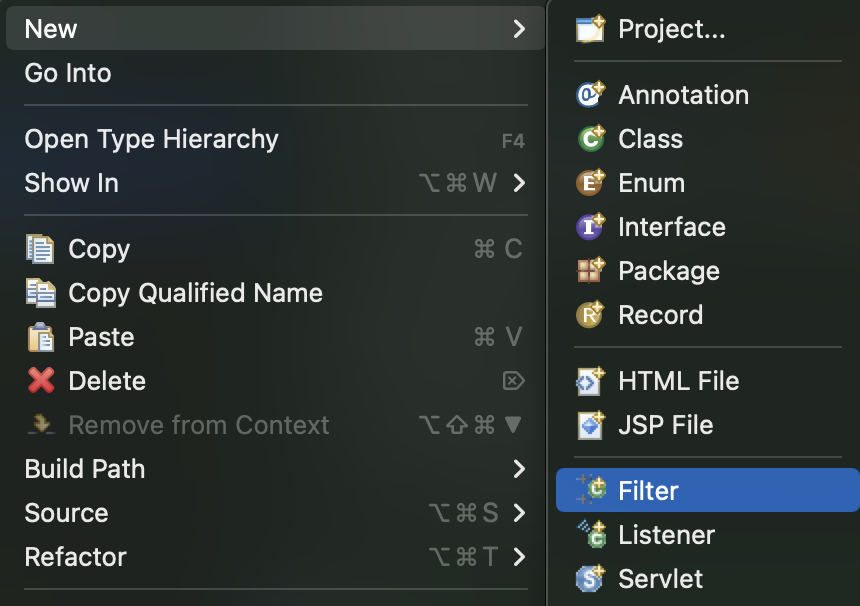
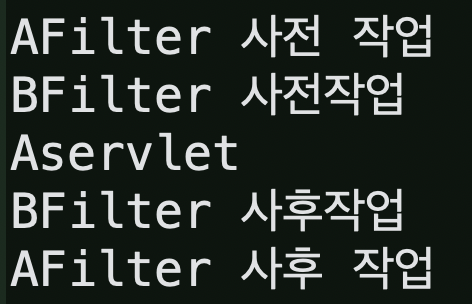
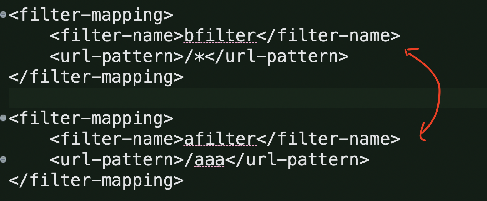
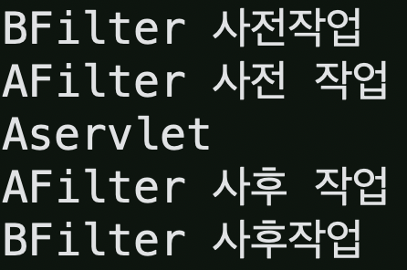

# Listener와 Filter 사용하기

> 면접용: Java 응용 프로그램은 Servlet, Listener, Filter가 있고 Filter를 Interceptor로 대체 가능하다.
>
> Filter: Client가 던진 파라미터를 서블릿으로 들어가기 전에 조정해주거나 등등의 작업을 할 수 있다.

​           

## 실습1: Listener 사용하기

* eclipse - Dynamic Web Project로 생성
  * 생성시 xml 파일 생성에 check 표시

​               

### web.xml

* servlet을 수동 생성 후 매핑: `/`를 안붙이면 오류가 발생하므로 주의
* url-pattern을 여러개 등록해서 사용할 수 있음

```xml
  <servlet>
	  <servlet-name>aaa</servlet-name>
	  <servlet-class>com.sofia.hello.AServlet</servlet-class>
  </servlet>
  
  <servlet-mapping>
  	<servlet-name>aaa</servlet-name>
  	<url-pattern>/aaa</url-pattern>
  	<url-pattern>/bbb</url-pattern>
  	<url-pattern>/ccc</url-pattern>
  </servlet-mapping>
```

​           

### Servlet 여러개 생성

* xml 매핑한 Servlet의 내용

```java
package com.sofia.hello;

import java.io.IOException;
import javax.servlet.ServletException;
import javax.servlet.annotation.WebServlet;
import javax.servlet.http.HttpServlet;
import javax.servlet.http.HttpServletRequest;
import javax.servlet.http.HttpServletResponse;


public class AServlet extends HttpServlet {
	private static final long serialVersionUID = 1L;

	protected void doGet(HttpServletRequest request, HttpServletResponse response) throws ServletException, IOException {
		response.getWriter().append("Served at: ").append(request.getContextPath());
	}

	protected void doPost(HttpServletRequest request, HttpServletResponse response) throws ServletException, IOException {
		request.setCharacterEncoding("utf-8");
		doGet(request, response);
	}

}

```

* 2번째 서블릿 생성: xml 등록하지 않고 `@WebServlet`으로 등록 

```java
package com.sofia.hello;

import java.io.IOException;
import javax.servlet.ServletException;
import javax.servlet.annotation.WebServlet;
import javax.servlet.http.HttpServlet;
import javax.servlet.http.HttpServletRequest;
import javax.servlet.http.HttpServletResponse;

@WebServlet("/ddd")
public class BServlet extends HttpServlet {
	private static final long serialVersionUID = 1L;

	protected void doGet(HttpServletRequest request, HttpServletResponse response) throws ServletException, IOException {
		response.getWriter().append("Served at: ddd").append(request.getContextPath());
	}

	protected void doPost(HttpServletRequest request, HttpServletResponse response) throws ServletException, IOException {
		request.setCharacterEncoding("utf-8");
		doGet(request, response);
	}

}

```

​           

### Listener

> Annotation이 아닌 xml 방식으로 Listener를 사용해본다.
> **request / session / application** Listener가 존재한다.

* Listener를 생성한다.



* Life Cycle, attributes에 대한 변화 등을 리스너로 관리할 수 있다.(예제는 Life Cycle만 다룬다.)

```java
package com.sofia.hello;

import javax.servlet.annotation.WebListener;
import javax.servlet.http.HttpSessionEvent;
import javax.servlet.http.HttpSessionListener;

//@WebListener
public class AListener implements HttpSessionListener {

    public AListener() {
    }

    public void sessionCreated(HttpSessionEvent se)  {
    	System.out.println("세션이 생성");
    }

    public void sessionDestroyed(HttpSessionEvent se)  {
    	System.out.println("세션이 소멸");
    }
	
}

```

* xml 파일에 연결

  ```xml
  <listener>
  	<listener-class>com.sofia.hello.AListener</listener-class>
  </listener>
  
  <!-- 세션 종료를 보기 위해 세션 만료 시간을 1분으로 설정-->
  <session-config>
  	<session-timeout>1</session-timeout>
  </session-config>
  ```

​                        

#### \- 리스너 작동

* 서블릿 소스파일에서 우클릭 - Run on Server



* 정보가 안뜬다면 세션을 자동 생성하도록 jsp 설정

  ```jsp
  <%@ page language="java" contentType="text/html; charset=UTF-8"
      pageEncoding="UTF-8" session="true"%>
  ```

  

​             

​                  

## 실습2: Filter 사용하기

​          

### Filter 생성



```java
package com.sofia.hello;

import java.io.IOException;
import javax.servlet.Filter;
import javax.servlet.FilterChain;
import javax.servlet.FilterConfig;
import javax.servlet.ServletException;
import javax.servlet.ServletRequest;
import javax.servlet.ServletResponse;
import javax.servlet.annotation.WebFilter;
import javax.servlet.http.HttpServletRequest;
import javax.servlet.http.HttpServletResponse;
import javax.servlet.http.HttpSession;

//@WebFilter("/AFilter")
public class AFilter implements Filter {

	public void destroy() {
	}
	
	//자세히보면 인자의 타입이 HttpServletRequest의 부모임을 알 수 있다.
	public void doFilter(ServletRequest request, ServletResponse response, FilterChain chain) throws IOException, ServletException {
		System.out.println("AFilter 사전 작업");
		HttpServletRequest req = (HttpServletRequest)request;
		HttpServletResponse res = (HttpServletResponse) response;
		HttpSession session = req.getSession(false);
		//getSession() 메서드를 적용할 때 default로 세션이 생성됨을 주의
		
		// filter 단계에서 한글 깨짐을 방지할 수 있다.
		res.setContentType("text/html; charset=UTF-8");
		
		if(session == null) {
			res = (HttpServletResponse) response;
			res.sendRedirect("hello.jsp");
			return;
		}
		
		//return; 을 이용해 사전 작업만 가능
		chain.doFilter(request, response);
		System.out.println("AFilter 사후 작업");
	}

	public void init(FilterConfig fConfig) throws ServletException {
	}

}
```

​           

### xml 등록

> servlet 등록 방식과 같다

```xml
<filter>
	<filter-name>afilter</filter-name>
	<filter-class>com.sofia.hello.AFilter</filter-class>
</filter>

<filter-mapping>
	<filter-name>afilter</filter-name>
	<url-pattern>/aaa</url-pattern>
</filter-mapping>
```

​            

### 필터 여러개 적용

* Filter 를 하나 더 생성한다.

```xml
<filter>
	<filter-name>bfilter</filter-name>
	<filter-class>com.sofia.hello.BFilter</filter-class>
</filter>

<filter-mapping>
	<filter-name>bfilter</filter-name>
	<url-pattern>/*</url-pattern>
</filter-mapping>
```

```java
package com.sofia.hello;

import java.io.IOException;
import javax.servlet.Filter;
import javax.servlet.FilterChain;
import javax.servlet.FilterConfig;
import javax.servlet.ServletException;
import javax.servlet.ServletRequest;
import javax.servlet.ServletResponse;
import javax.servlet.annotation.WebFilter;

//@WebFilter("/BFilter")
public class BFilter implements Filter {

	public void destroy() {
	}

	public void doFilter(ServletRequest request, ServletResponse response, FilterChain chain) throws IOException, ServletException {
		System.out.println("BFilter 사전작업");
		chain.doFilter(request, response);
		System.out.println("BFilter 사후작업");
	}

	public void init(FilterConfig fConfig) throws ServletException {
	}

}

```

* 결과

  

* 서블릿 매핑 순서를 바꾸면 filter 동작 순서를 바꿀 수 있다.(서블릿 등록 순서는 상관X)

  

  

  ​                   

### Filter에 MRequestWrapper 클래스 추가

* 다음과 같은 클래스를 Filter class main 안에 만들 수 있다.

```java
class MyRequestWrapper extends HttpServletRequestWrapper{

		private HttpServletRequest request = null;

		public MyRequestWrapper(HttpServletRequest request) {
			super(request);
			this.request  = request; //생성자 단계에서 부모 생성자 사용 및 인스턴스 초기화
		}

		@Override   //getParameter를 재정의해서 특정 URL에 접근하기 전 파라미터 처리를 해줄 수 있음
		public String getParameter(String name) {
      //만약 userid 파라미터가 비어있다면 기본값 설정해주는 작업이 가능
			if("userid".equals(name)) {
				String data = super.getParameter(name);
				if(data == null) {
					return "sofia";
				}else {
					return data;
				}
			}
			return super.getParameter(name);
		}
		
	}
```

* 인스턴스로 생성

  ```java
  	public void doFilter(ServletRequest request, ServletResponse response, FilterChain chain) throws IOException, ServletException {
  		System.out.println("BFilter 사전작업");
      
      //MyRequestWrapper 클래스로 인스턴스 생성
  		MyRequestWrapper requestWrapper = new MyRequestWrapper((HttpServletRequest) request);
      
      //filter에 집어넣음
  		chain.doFilter(requestWrapper, response);
  		System.out.println("BFilter 사후작업");
  	}
  ```

* 전체코드

  ```java
  package com.sofia.hello;
  
  import java.io.IOException;
  import javax.servlet.Filter;
  import javax.servlet.FilterChain;
  import javax.servlet.FilterConfig;
  import javax.servlet.ServletException;
  import javax.servlet.ServletRequest;
  import javax.servlet.ServletResponse;
  import javax.servlet.annotation.WebFilter;
  import javax.servlet.http.HttpServletRequest;
  import javax.servlet.http.HttpServletRequestWrapper;
  
  //@WebFilter("/BFilter")
  public class BFilter implements Filter {
  
  	public void destroy() {
  	}
  
  	public void doFilter(ServletRequest request, ServletResponse response, FilterChain chain) throws IOException, ServletException {
  		System.out.println("BFilter 사전작업");
  		MyRequestWrapper requestWrapper = new MyRequestWrapper((HttpServletRequest) request);
  		chain.doFilter(requestWrapper, response);
  		System.out.println("BFilter 사후작업");
  	}
  	
  	
  	class MyRequestWrapper extends HttpServletRequestWrapper{
  
  		private HttpServletRequest request = null;
  
  		public MyRequestWrapper(HttpServletRequest request) {
  			super(request);
  			this.request  = request;
  		}
  
  		@Override
  		public String getParameter(String name) {
  			if("userid".equals(name)) {
  				String data = super.getParameter(name);
  				if(data == null) {
  					return "sofia";
  				}else {
  					return data;
  				}
  			}
  			return super.getParameter(name);
  		}
  		
  	}
  	
  	
  	public void init(FilterConfig fConfig) throws ServletException {
  	}
  
  }
  
  ```

  

