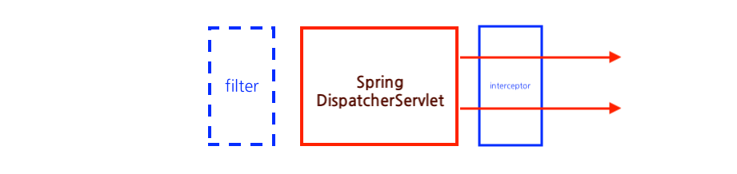
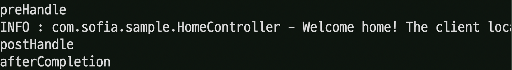
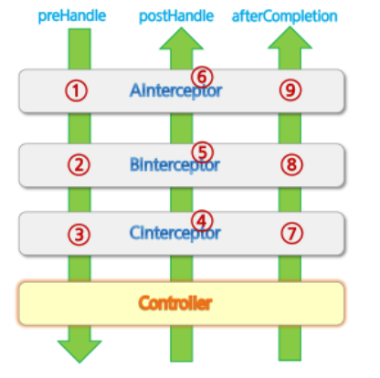
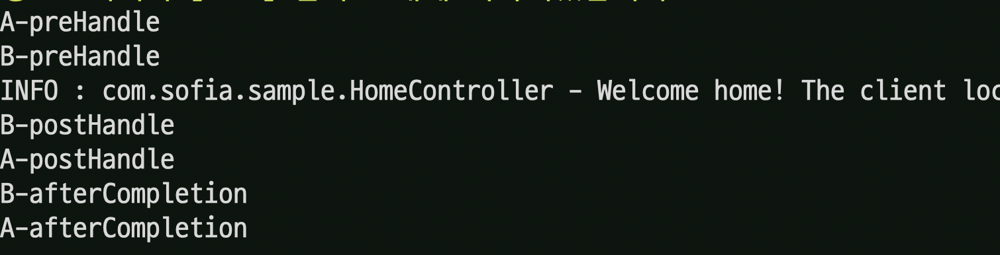

# Interceptor

>컨트롤러가 요청을 처리하기 전/후 처리를 한다.
>로깅, 모니터링 정보 수집, 접근 제어 처리 등의 실제 Bussiness Logic과는 분리되어 처리해야 하는 기능들을 넣고 싶을 때 유용하다.
>Interceptor를 여러 개 설정할 수 있다.

​                

### 1. Spring Legacy Project

* Eclipse Explorer 에서 우클릭 - Spring Legacy project

  * `com.sofia.sample`로 구성

* pom.xml은 자주 쓰던 것으로 갈아준다.

  * Pom.xml 을 그대로 가져오지만 아래 `groupId` 와 `artifactId`(3depth의 패키지명) 등을 바꿔주어야 한다.
  * name은 아무렇게나 작성해도 상관없다.

  ```xml
  <groupId>com.sofia</groupId>
  	<artifactId>sample</artifactId>
  	<name>sample</name>
  	<packaging>war</packaging>
  	<version>1.0.0-BUILD-SNAPSHOT</version>
  	<properties>
  		<java-version>1.8</java-version>
  		<m2eclipse.wtp.contextRoot>sample</m2eclipse.wtp.contextRoot>
  		<maven.compiler.source>${java-version}</maven.compiler.source>
  		<maven.compiler.target>${java-version}</maven.compiler.target>
  ```

* 필수적으로 **Maven Update - force update**를 해주어야한다.

​                   

### 2. XML 파일 설정

```xml
<beans:bean id="interceptor" class="com.sofia.guestbook.AInterceptor" />	

<interceptors>
		<interceptor>
			<mapping path="/guestbook/register"/>
			<mapping path="/guestbook/modify"/>
			<mapping path="/guestbook/delete"/>
			<beans:ref bean="confirm"/>
		</interceptor>
	</interceptors>
```

​                 

### 3. Interceptor 을 제공하는 이유

* 본래 Filter가 Servlet 작동 전에 기능하지만 Spring에서 만들어준 서블릿을 사용하기 때문에 그 전에 사용할 수 없다.

* 그래서 Spring에서 제공하는 interceptor을 사용한다.

  

​                 

### 4. Interceptor 클래스 생성

> HandlerInterceptor 를 implements 해서 만든다.

​           

* 제공하는 메서드

  | 메서드                                                       | 기능                                                         |
  | ------------------------------------------------------------ | ------------------------------------------------------------ |
  | boolean preHandle(HttpServletRequest request, HttpServletResponse response, Object handler) | false를 반환하면 request를 바로 종료                         |
  | void postHandle(HttpServletRequest request, HttpServletResponse response, Object handler, ModelAndView modelAndView) | Controller 수행 후 호출                                      |
  | void afterCompletion(HttpServletRequest request, HttpServletResponse response, Object handler, Exception ex) | view를 통해 클라이언트에 응답을 전송한 뒤 실행<br />예외가 발생해도 실행한다. |

  ​                   

* java class로 생성한다.

```java
package com.sofia.sample;

import org.springframework.web.servlet.HandlerInterceptor;

public class AInterceptor implements HandlerInterceptor{

}

```

* option+Cmd+S 를 눌러서 메소드 자동 생성

```java
package com.sofia.sample;

import javax.servlet.http.HttpServletRequest;
import javax.servlet.http.HttpServletResponse;
import javax.servlet.http.HttpSession;

import org.springframework.web.servlet.HandlerInterceptor;
import org.springframework.web.servlet.ModelAndView;

public class AInterceptor implements HandlerInterceptor{

	@Override
	public boolean preHandle(HttpServletRequest request, HttpServletResponse response, Object handler)
			throws Exception {
		System.out.println("preHandle");
		HttpSession session = request.getSession();
		MemberDto memberDto = (MemberDto) session.getAttribute("userinfo");
		
    //Interceptor를 이용해 만약 로그인 정보가 없으면 홈화면으로 돌아가도록 만든다.
		if(memberDto == null) {
			response.sendRedirect(request.getContextPath());
			return false;
		}
		return true;
	}

	@Override
	public void postHandle(HttpServletRequest request, HttpServletResponse response, Object handler,
			ModelAndView modelAndView) throws Exception {
		System.out.println("postHandle");
	}

	@Override
	public void afterCompletion(HttpServletRequest request, HttpServletResponse response, Object handler, Exception ex)
			throws Exception {
		System.out.println("afterCompletion");
	}
	
}

```

​                

### 5. servlet-context에 등록

* 만들어준 interceptors 클래스를 xml에 등록해준다.

```xml
	<beans:bean id="ainterceptor" class="com.sofia.sample.AInterceptor" />
	
	<interceptors>
		<interceptor>
			<mapping path="/*"/>
			<beans:ref bean="ainterceptor"/>
		</interceptor>
	</interceptors>
```

* 맨 위 빈 생성 안하고 직접 참조할 수 있다.

  ```xml
  <bean class="com.sofia.sample.AInterceptor"/>
  ```

​         

### 6. 서버 실행시

* 인터셉터 순서에 맞게 실행된다: pre - post - aftercompletion



​          

### 7. Interceptor 여러 개일 때 순서



* 실제 결과

  

* xml 등록 예시

  ```xml
  <beans:bean id="ainterceptor" class="com.sofia.sample.AInterceptor" />	
  
  <interceptors>
    <interceptor>
      <mapping path="/*"/>
      <beans:ref bean="ainterceptor"/>
    </interceptor>
    <interceptor>
      <mapping path="/*"/>
      <beans:bean class="com.sofia.sample.BInterceptor"/>
    </interceptor>
  </interceptors>
  ```

  