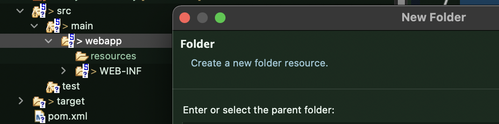

# Spring legacy making 2

>**[백엔드 개발자]**
>
>1. DB 관련 업무
>2. Web 설정
>  * pom.xml: Dependencies
>  * context.xml: 파일에 db 접속 정보관리
>  * web.xml
>    * 한글필터
>  * root-context.xml 파일
>    * MyBatis 설정
>  * servlet-context.xml 파일
>    * resources 이름 변경, Interceptor 등록
>  * Controller, Service, Mapper 클래스 생성
>3. 응용 업무 구현

​        

​                 

### 1. pom.xml

> 완성된 설정파일을 사용한다.

```xml
<?xml version="1.0" encoding="UTF-8"?>
<project xmlns="http://maven.apache.org/POM/4.0.0" xmlns:xsi="http://www.w3.org/2001/XMLSchema-instance"
	xsi:schemaLocation="http://maven.apache.org/POM/4.0.0 https://maven.apache.org/maven-v4_0_0.xsd">
	<modelVersion>4.0.0</modelVersion>
	<groupId>com.sofia</groupId>
	<artifactId>guestbook</artifactId>
	<name>guestbook_mybatis_spring</name>
	<packaging>war</packaging>
	<version>1.0.0-BUILD-SNAPSHOT</version>
	<properties>
		<java-version>1.8</java-version>
		<m2eclipse.wtp.contextRoot>guestbook</m2eclipse.wtp.contextRoot>
		<maven.compiler.source>${java-version}</maven.compiler.source>
		<maven.compiler.target>${java-version}</maven.compiler.target>
		
		<org.springframework-version>5.3.18</org.springframework-version>
		<org.aspectj-version>1.9.9.1</org.aspectj-version>
		<log4j-version>1.2.17</log4j-version>
		<org.slf4j-version>1.7.36</org.slf4j-version>
		
		<mysql-connector-java-version>8.0.28</mysql-connector-java-version>
		<mybatis-version>3.5.9</mybatis-version>
		<mybatis-spring-version>2.0.7</mybatis-spring-version>
		
		<servlet-version>4.0.1</servlet-version>
		<jsp-version>2.3.3</jsp-version>
		<jstl-version>1.2</jstl-version>
		<commons-fileupload-version>1.4</commons-fileupload-version>
		<commons-dbcp-version>1.4</commons-dbcp-version>
		<jackson-databind-version>2.12.3</jackson-databind-version>
		<lombok-version>1.18.20</lombok-version>
		
		<junit-version>4.13.1</junit-version>
	</properties>
	<dependencies>
		<!-- Spring -->
		<dependency>
			<groupId>org.springframework</groupId>
			<artifactId>spring-context</artifactId>
			<version>${org.springframework-version}</version>
			<exclusions>
				<!-- Exclude Commons Logging in favor of SLF4j -->
				<exclusion>
					<groupId>commons-logging</groupId>
					<artifactId>commons-logging</artifactId>
				 </exclusion>
			</exclusions>
		</dependency>
		<dependency>
			<groupId>org.springframework</groupId>
			<artifactId>spring-webmvc</artifactId>
			<version>${org.springframework-version}</version>
		</dependency>
		
		<!-- https://mvnrepository.com/artifact/org.springframework/spring-tx -->
		<dependency>
			<groupId>org.springframework</groupId>
			<artifactId>spring-tx</artifactId>
			<version>${org.springframework-version}</version>
		</dependency>

		<!-- https://mvnrepository.com/artifact/org.springframework/spring-jdbc -->
		<dependency>
			<groupId>org.springframework</groupId>
			<artifactId>spring-jdbc</artifactId>
			<version>${org.springframework-version}</version>
		</dependency>
				
		<!-- AspectJ -->
		<dependency>
			<groupId>org.aspectj</groupId>
			<artifactId>aspectjrt</artifactId>
			<version>${org.aspectj-version}</version>
		</dependency>
		<dependency>
			<groupId>org.aspectj</groupId>
			<artifactId>aspectjweaver</artifactId>
			<version>${org.aspectj-version}</version>
		</dependency>	
		
		<!-- Logging -->
		<dependency>
			<groupId>org.slf4j</groupId>
			<artifactId>slf4j-api</artifactId>
			<version>${org.slf4j-version}</version>
		</dependency>
		<dependency>
			<groupId>org.slf4j</groupId>
			<artifactId>jcl-over-slf4j</artifactId>
			<version>${org.slf4j-version}</version>
			<scope>runtime</scope>
		</dependency>
		<dependency>
			<groupId>org.slf4j</groupId>
			<artifactId>slf4j-log4j12</artifactId>
			<version>${org.slf4j-version}</version>
			<scope>runtime</scope>
		</dependency>
		<dependency>
			<groupId>log4j</groupId>
			<artifactId>log4j</artifactId>
			<version>${log4j-version}</version>
			<exclusions>
				<exclusion>
					<groupId>javax.mail</groupId>
					<artifactId>mail</artifactId>
				</exclusion>
				<exclusion>
					<groupId>javax.jms</groupId>
					<artifactId>jms</artifactId>
				</exclusion>
				<exclusion>
					<groupId>com.sun.jdmk</groupId>
					<artifactId>jmxtools</artifactId>
				</exclusion>
				<exclusion>
					<groupId>com.sun.jmx</groupId>
					<artifactId>jmxri</artifactId>
				</exclusion>
			</exclusions>
			<scope>runtime</scope>
		</dependency>

		<!-- @Inject -->
		<dependency>
			<groupId>javax.inject</groupId>
			<artifactId>javax.inject</artifactId>
			<version>1</version>
		</dependency>
				
		<!-- Servlet -->
		<!-- https://mvnrepository.com/artifact/javax.servlet/javax.servlet-api -->
		<dependency>
		    <groupId>javax.servlet</groupId>
		    <artifactId>javax.servlet-api</artifactId>
		    <version>${servlet-version}</version>
		    <scope>provided</scope>
		</dependency>
		
		<!-- https://mvnrepository.com/artifact/javax.servlet.jsp/javax.servlet.jsp-api -->
		<dependency>
		    <groupId>javax.servlet.jsp</groupId>
		    <artifactId>javax.servlet.jsp-api</artifactId>
		    <version>${jsp-version}</version>
		    <scope>provided</scope>
		</dependency>

		<dependency>
			<groupId>javax.servlet</groupId>
			<artifactId>jstl</artifactId>
			<version>${jstl-version}</version>
		</dependency>
	
		<!-- Test -->
		<dependency>
			<groupId>org.springframework</groupId>
			<artifactId>spring-test</artifactId>
			<version>${org.springframework-version}</version>
		</dependency>

		<!-- https://mvnrepository.com/artifact/junit/junit -->
		<dependency>
			<groupId>junit</groupId>
			<artifactId>junit</artifactId>
			<version>${junit-version}</version>
		</dependency>

		<!-- https://mvnrepository.com/artifact/org.projectlombok/lombok -->
		<dependency>
			<groupId>org.projectlombok</groupId>
			<artifactId>lombok</artifactId>
			<version>${lombok-version}</version>
			<scope>provided</scope>
		</dependency>

		<!-- https://mvnrepository.com/artifact/mysql/mysql-connector-java -->
		<dependency>
			<groupId>mysql</groupId>
			<artifactId>mysql-connector-java</artifactId>
			<version>${mysql-connector-java-version}</version>
		</dependency>
		
		<!-- https://mvnrepository.com/artifact/org.mybatis/mybatis -->
		<dependency>
			<groupId>org.mybatis</groupId>
			<artifactId>mybatis</artifactId>
			<version>${mybatis-version}</version>
		</dependency>
		
		<!-- https://mvnrepository.com/artifact/org.mybatis/mybatis-spring -->
		<dependency>
			<groupId>org.mybatis</groupId>
			<artifactId>mybatis-spring</artifactId>
			<version>${mybatis-spring-version}</version>
		</dependency>
		
		<!-- https://mvnrepository.com/artifact/commons-dbcp/commons-dbcp -->
		<dependency>
			<groupId>commons-dbcp</groupId>
			<artifactId>commons-dbcp</artifactId>
			<version>${commons-dbcp-version}</version>
		</dependency>
		
		<!-- https://mvnrepository.com/artifact/com.fasterxml.jackson.core/jackson-databind -->
		<dependency>
			<groupId>com.fasterxml.jackson.core</groupId>
			<artifactId>jackson-databind</artifactId>
			<version>${jackson-databind-version}</version>
		</dependency>
		
		<!-- https://mvnrepository.com/artifact/commons-fileupload/commons-fileupload -->
		<dependency>
		    <groupId>commons-fileupload</groupId>
		    <artifactId>commons-fileupload</artifactId>
		    <version>${commons-fileupload-version}</version>
		</dependency>
		      
	</dependencies>
    <build>
        <plugins>
            <plugin>
                <artifactId>maven-eclipse-plugin</artifactId>
                <version>2.9</version>
                <configuration>
                    <additionalProjectnatures>
                        <projectnature>org.springframework.ide.eclipse.core.springnature</projectnature>
                    </additionalProjectnatures>
                    <additionalBuildcommands>
                        <buildcommand>org.springframework.ide.eclipse.core.springbuilder</buildcommand>
                    </additionalBuildcommands>
                    <downloadSources>true</downloadSources>
                    <downloadJavadocs>true</downloadJavadocs>
                </configuration>
            </plugin>
            <plugin>
                <groupId>org.apache.maven.plugins</groupId>
                <artifactId>maven-compiler-plugin</artifactId>
                <version>2.5.1</version>
                <configuration>
                    <source>${java-version}</source>
                    <target>${java-version}</target>
                    <compilerArgument>-Xlint:all</compilerArgument>
                    <showWarnings>true</showWarnings>
                    <showDeprecation>true</showDeprecation>
                </configuration>
            </plugin>
            <plugin>
                <groupId>org.codehaus.mojo</groupId>
                <artifactId>exec-maven-plugin</artifactId>
                <version>1.2.1</version>
                <configuration>
                    <mainClass>org.test.int1.Main</mainClass>
                </configuration>
            </plugin>
        </plugins>
    </build>
</project>

```

​                    

​                                              

### 2. context.xml 파일에 db 접속관리

> 원래는 Tomcat의 설정파일의 context.xml 을 사용하지만 프로젝트만의 설정파일을 사용하는 것이다.
> 원래 있던 소스를 활용할 수 있다.
>
> * log4j: log 작업을 세팅할 수 있다. source/main/resources/log4j.xml


* webapp폴더 아래 META-INF를 생성하면 Tomcat이 프로젝트를 읽을 때 가장 먼저 그 폴더를 읽어준다.
  * 그 내부에 context.xml 을 넣어준다.



```xml
<?xml version="1.0" encoding="UTF-8"?>
<Context>
	<Resource name="jdbc/sofia" auth="Container" type="javax.sql.DataSource" 
			maxTotal="100" maxIdle="30" maxWaitMillis="10000" 
			username="sofia" password="sofia1234" driverClassName="com.mysql.cj.jdbc.Driver" 	
			url="jdbc:mysql://localhost:3306/ssafyweb?serverTimezone=UTC&amp;useUniCode=yes&amp;characterEncoding=UTF-8"/> 
    <WatchedResource>WEB-INF/web.xml</WatchedResource>
</Context>
```

* maxTotal: 동시접속자수
* xml특성상 &는 `&amp;`로 바꿔주어야 한다.
* `<WatchedResource>`에 의해 WEB-INF/web.xml을 읽는다.

​                 

​                        

### 3. root-context 파일 

> web.xml에서 context 로더에 의해 root-context.xml이 먼저 실행된다.
>
> ```xml
> 	<context-param>
> 		<param-name>contextConfigLocation</param-name>
> 		<param-value>/WEB-INF/spring/root-context.xml</param-value>
> 	</context-param>
> ```

* **[ root-context 에 필요한 정보들 ]**
  * Service, Dao, MyBatis, aop 관련 beans 등록 및 주입
  * MyBatis 설정: sqlSession 객체가 Bean으로 등록 완성이 되어야 한다.
  * Interceptors? web 관련이므로 root-context.xml 에서 다루지 않는다.

​          

#### - MyBatis 설정부분

* sqlSession은 Factory에 의존하고 factory는 dataSource에 의존한다.

```xml
	<bean id="ds" class="org.springframework.jndi.JndiObjectFactoryBean">
		<property name="jndiName" value="java:comp/env/jdbc/sofia"></property>
	</bean>
	
	
	<bean id="sqlSessionFactoryBean" class="org.mybatis.spring.SqlSessionFactoryBean">
		<property name="dataSource" ref="ds"></property>
		<property name="mapperLocations" value="classpath:mapper/*.xml"></property>
		<!-- <property name="configLocation" value="classpath:mybatis-config.xml"></property> -->
		<property name="typeAliasesPackage" value="com.sofia.guestbook.model"></property>
	</bean>
	
	<bean id="sqlSession" class="org.mybatis.spring.SqlSessionTemplate">
		<constructor-arg ref="sqlSessionFactoryBean"></constructor-arg>
	</bean>
```

* mapper 등록

  ```xml
  	<property name="mapperLocations" value="classpath:mapper/*.xml"></property>
  ```

  * classpath에 따라서 mapper 폴더를 만들어 사용한다.

    

​                       

​            

#### - component-scan

> 폴더 구조가 완성되어있어야한다.
>
> 3단 depth.aop
> 3단 depth.model
> 3단 depth.model.service
> 3단 depth.model.mapper

* root-context(non-web)에 컴포넌트 스캔을 통해 @Repository, @Service의 탐색 범위를 지정해준다.

  * 그 전에 namespace를 등록해준다.

    * aop, context, tx(트랜잭션)을 사용한다.

    

  * component-scan 등록

    ```xml
    <context:component-scan base-package="com.sofia.guestbook.aop ,com.sofia.guestbook.model"/>
    ```

  * aop:auto-proxy

    ```xml
    <aop:aspectj-autoproxy/>
    ```


   

### 4. web.xml

> Context 리스너에 의해 root-context.xml 를 먼저 읽고 다시 돌아온다.

​        

#### - filter의 사용

> filter를 이용해 한글이 깨지지 않도록 encoding 설정을 추가해준다.

```xml
	<!-- POST 방식의 한글 처리. -->
	 <filter>
        <filter-name>encodingFilter</filter-name>
        <filter-class>org.springframework.web.filter.CharacterEncodingFilter</filter-class>
        <init-param>
          <param-name>encoding</param-name>
          <param-value>UTF-8</param-value>
        </init-param>
     </filter>
     
     <filter-mapping>
        <filter-name>encodingFilter</filter-name>
        <url-pattern>/*</url-pattern>
     </filter-mapping>
```

​                     

​             

### 5. servlet-context.xml

> controller에 대한 component-scan 등록
> 기본 설정은 3 depth 내부 전체를 탐색하지만 기능 분리를 꾀하기 위해 controller로 좁혀준다.

```xml
<context:component-scan base-package="com.sofia.guestbook.controller" />
```

* controller 패키지 내부에 파일이 없으면 에러가 뜨므로 유의한다.

​               

#### - img, css, resources 경로명 숨기기

```xml
	<resources mapping="/resources/**" location="/resources/" />
	<resources mapping="/img/**" location="/resources/img/" />
	<resources mapping="/css/**" location="/resources/css/" />
	<resources mapping="/js/**" location="/resources/js/" />
```

* client의 URL 뿐 아니라 html, jsp에서 이미지나 css 파일을 로드할 때에도 사용된다.

  * 원래 root 아래 resources를 거쳐야하는데 아래처럼 작성해도  xml 설정에 의해 물리적으로 자동 연결해준다.

  ```jsp
  <link rel="stylesheet" href="${root}/css/common.css">
  ```

  ​       

   

​                 

### 6. Controller

* POJO 기반이기 때문에 그냥 class 파일로 만들면 된다.

```java
package com.sofia.guestbook.controller;

public class MainController {

}
```

* 메서드로 인자를 받을 때 저장한 변수명과 다르면 `@RequestParam`로 받아주거나 Model 객체로 받아줄 수도 있다.

​          

#### - index.jsp (기본페이지) 연결

> @GetMapping("/")을 활용해 연결해준다.

```java
package com.sofia.guestbook.controller;

import org.springframework.stereotype.Controller;
import org.springframework.ui.Model;
import org.springframework.web.bind.annotation.GetMapping;
import org.springframework.web.bind.annotation.RequestParam;

@Controller
public class MainController {
	
	@GetMapping("/")
	public String index(Model model) {
		return "index";
	}
}

```

​                    

