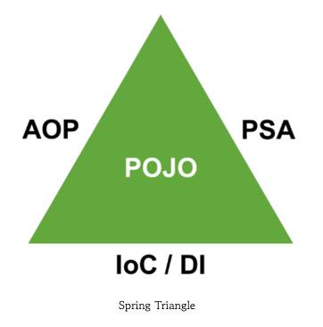
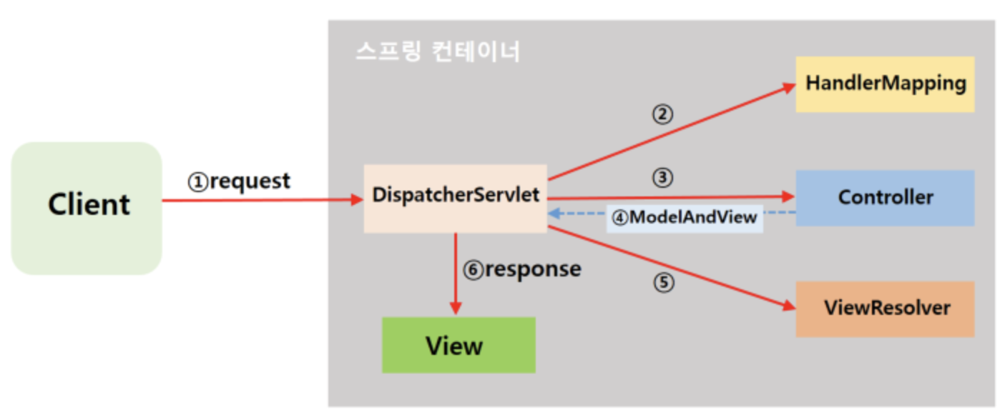
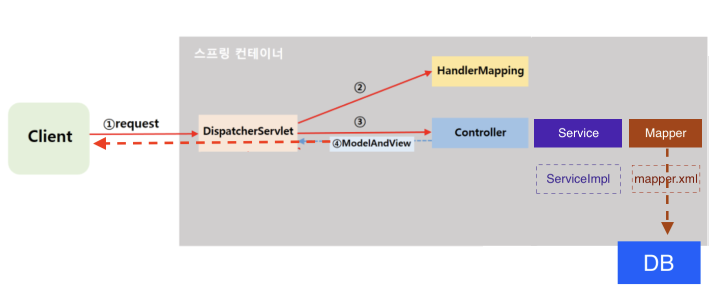
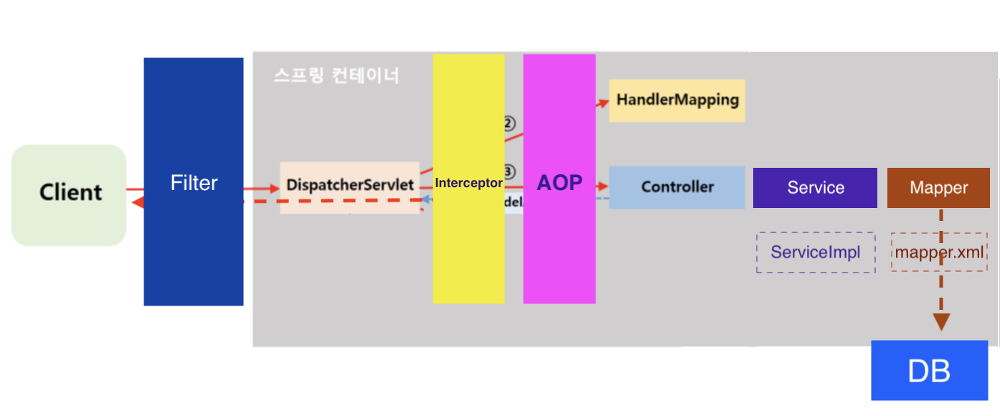

# Spring Boot 복습

​                    

## 0. 스프링의 삼각형

* 기술과 직접적으로 연관된 부분들이 있다.
  * AOP, IoC(Inversion Of Control)/DI(Dependency Injection), POJO(Plain Old Java Object)



​                  

## 1. 동작 원리

> Spring으로 요청(request)를 받는다고 하면 담당하는 Controller가 바로 신호를 받는 것으로 오해할 수 있다.
> 하지만 모든 url 요청은 `Dispatcher Servlet`이 담당한다.

* 인텔리제이 서버 시작 모습


​                   

### 1) Legacy: Spring MVC 동작

* [프론트 컨트롤러 패턴](https://github.com/devyoseph/TIL/blob/master/Servlet&JSP/design_pattern.md): Servlet에는 치명적인 단점이 존재한다. Servlet 코드를 수정하면 서버를 재시동해야 변경된 코드가 적용되었다. 이를 위해 단 하나의 Servlet만 허용하고 들어온 요청을 HandlerMapping이 분석해주면 @Annotation으로 매핑되어있는 Controller를 찾아 신호를 보내는 것이다.
* Servlet을 써야만 하는 이유? = 빠르다(컴파일)



​                    

### 2) Spring Boot + SPA

> 페이지 이동에 대한 관여가 없어졌고 A 주소에서 데이터를 받고 다시 A 주소로 데이터를 넘겨주는 일을 일반적으로 한다.
> 소셜 로그인의 경우 A에서 데이터를 받기 -  B로 데이터를 주기 - B에서 데이터 받기 - A로 데이터 넘겨주기 등 방식 사용

* 프론트 컨트롤러 패턴
* 페이지 이동
  * 이전: 백엔드에서 페이지 이동을 담당
  * SPA 환경: Vue의 경우 `Redirect`를 이용한 직접적인 페이지 이동이 막혀있기도 하다. 프론트에서 페이지 이동을 관리한다.



* 데이터 이동
  * DTO 사용

​               

## 2) Filter, Interceptor, AOP

* [자세한 설명글](https://github.com/devyoseph/TIL/blob/master/Spring2/spring_interceptor3.md)은 구글링하면 잘 나온다.

* 그림으로 먼저 이해한다.

  

​                 

### - 표 정리

|                            | Filter                                                       | Interceptor                                                  | AOP                                                          |
| -------------------------- | ------------------------------------------------------------ | ------------------------------------------------------------ | ------------------------------------------------------------ |
| 관여                       | Servlet 전                                                   | Servlet 후                                                   | 모든 메서드에 **proxy 패턴**의 형태                          |
| 주소 등록                  | xml, Annotation                                              | xml                                                          | xml, Annotation, 파라미터, 자식관계 등                       |
| 활용 객체                  | Servlet Request/Response                                     | HttpServlet Request/Response                                 | JoinPoint, ProceedingJoinPoint                               |
| 스프링 자원 사용 가능 여부 | X                                                            | O                                                            | O                                                            |
| 실제 사용                  | 인코딩 변환, XSS 방어 등 요청                                | 로그인 체크, 권한 체크, 프로그램 실행시간                    | 로깅, 트랜잭션, 에러 처리 등 비즈니스단 메소드 조정          |
| 메서드                     | **init():** 필터 인스턴스 초기화<br />**doFilter():** 전/후 처리<br />**destroy():** 필터 인스턴스 종료 | **preHandler():** 컨트롤러 메소드가 실행되기 전<br />**postHanler():** 컨트롤러 메소드 실행직 후 view 페이지 렌더링 되기 전<br />**afterCompletion():** view 페이지가 렌더링 되고 난 후 | **@Before:** 대상 메소드의 수행 전<br />**@After:** 대상 메소드의 수행 후<br />**@After-returning:** 대상 메소드의 정상적인 수행 후<br />**@After-throwing:** 예외발생 후<br />**@Around:** 대상 메소드의 수행 전, 후 |

​                  

## 3) 코드 부분

​              

### [1] application.properties

```bash
# Server 세팅 부분
server.servlet.context-path=/vue
server.port=9999

# DB 설정 부분
spring.datasource.driver-class-name=com.mysql.cj.jdbc.Driver
spring.datasource.url=jdbc:mysql://localhost:3306/[스키마 이름]?useUniCode=yes&characterEncoding=UTF-8&serverTimezone=Asia/Seoul
spring.datasource.username=root
spring.datasource.password=비밀번호입력

# logger 부분
logging.level.root=WARN
logging.level.com.project.vue.mappers=TRACE

# MyBatis 부분: DB와의 연결을 위한 작업

# xml에서 객체를 지정할 때 패키지 이름까지 모든 주소를 써주어야한다. 하지만 미리 alias를 등록해 이름만으로 주소를 대신한다.
mybatis.type-aliases-package=com.project.vue.dto

# @Mappper와 연동될 xml형식의 SQL문의 위치를 알려준다.
mybatis.mapper-locations=classpath:mappers/**/*.xml

#Failed to start bean 'documentationPluginsBootstrapper'; error
spring.mvc.pathmatch.matching-strategy = ANT_PATH_MATCHER
```

​               

### [2] Controller

* 최대한 통신 관련 코드만 적는다.

  * 가독성: 간단한 로직이라도 현재 Controller와 연결된 Service에 적도록 한다.
  * 할 수 있다면 통신해서 얻을 수 있는 자원들을 일단 가져오고 모아서 Service에서 한 번에 처리

* HTTP에서 넘어오는 값들을 분석하는 역할

  * Header
    * 형식(JSON, xxx-)
    * GET/POST/DELETE/PUT/OPTION
    * URL: parameter가 존재
      * `?`: Parameter -> `@RequestParam`
        * 누가 봐도 검색용일 때
        * 보여도 상관없는 정보일 때
      * `/`: Path -> `@PathVariable`
        * 그래도 이 방식을 요즘 많이 사용
  * Body
    * `@ResponseBody`자동화:  `@RestController`를 사용하면 자동으로 Json 형식으로 프론트엔드에 던져준다.
    * 하지만 받아줄 때는 `@RequestBody`를 해주어야한다.

  ​                  

  ### ResponseEntity

  * `ResponseEntity<?>`를 이용해 최종 리턴값 형식을 보류할 수 있다.
  * 하지만 Map을 사용하는 이유?
    * 표현 방식의 다양화

  ​                  

  ### [3] Service

  * Service vs ServiceImpl
  * 로직을 적는 부분
  * mapper와 연결

  ​                

  ### [4] Mapper

  ​              

  

  

  