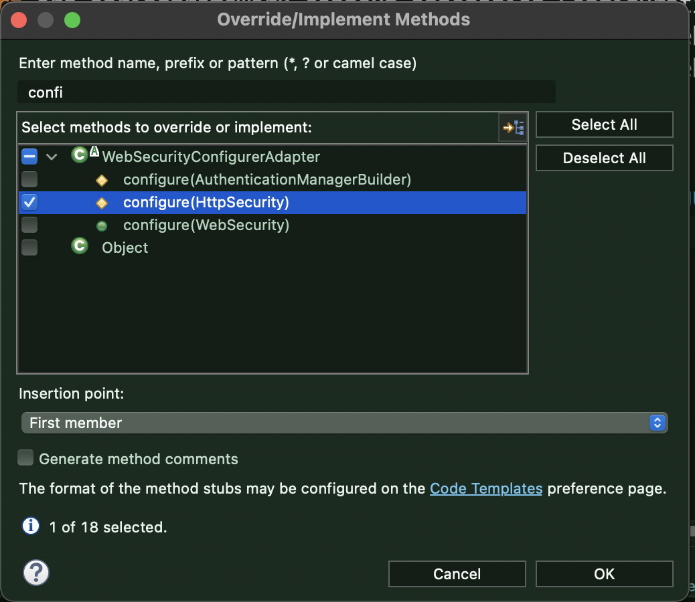
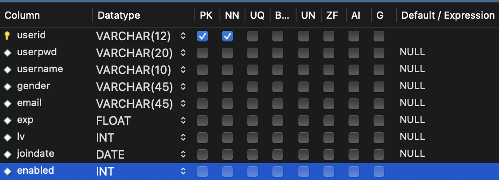

# Spring Security

>강좌 참고: https://www.youtube.com/watch?v=0JHIME7uGOk
>
>가이드 문서: https://spring.io/guides/gs/securing-web/
>
>DB 연결: https://www.baeldung.com/spring-security-jdbc-authentication

가이드를 참고해 Dependency를 추가한다.

> 스프링 부트와 Legacy 적용 방법이 다르다

​                

### Spring Boot

* maven

```xml
<dependency>
  <groupId>org.springframework.boot</groupId>
  <artifactId>spring-boot-starter-security</artifactId>
</dependency>
<dependency>
  <groupId>org.springframework.security</groupId>
  <artifactId>spring-security-test</artifactId>
  <scope>test</scope>
</dependency>
```

* gradle

```
implementation 'org.springframework.boot:spring-boot-starter-security'
implementation 'org.springframework.security:spring-security-test'
```

​                

### Spring MVC

> properties에 버전을 기록하고 관련 dependency들을 모두 불러온다.

*  maven

```xml
<properties>
 <spring.security.version>3.2.10.RELEASE</spring.security.version>
</properties>
```

```xml
<!-- Spring Security -->
<dependency>
 <groupId>org.springframework.security</groupId>
 <artifactId>spring-security-core</artifactId>
 <version>${spring.security.version}</version>
</dependency>
<dependency>
 <groupId>org.springframework.security</groupId>
 <artifactId>spring-security-config</artifactId>
 <version>${spring.security.version}</version>
</dependency>
<dependency>
 <groupId>org.springframework.security</groupId>
 <artifactId>spring-security-web</artifactId>
 <version>${spring.security.version}</version>
</dependency>
<dependency>
 <groupId>org.springframework.security</groupId>
 <artifactId>spring-security-taglibs</artifactId>
 <version>${spring.security.version}</version>
</dependency>
```

​                   

### 0. 필수 지식

> ### < 용어 > 
>
> Authentication: 로그인 등 인증
> Authorization: 인증 이후 권한을 부여
>
> ​            
>
> ### < 메서드의 순서 >
>
> * Authentication(인증) 관련 메서드 -> Authorization(권한 부여) 관련 메서드 순으로 이뤄진다.
>
>   ​            

### 1. 설정 파일

> 위에 추가한 라이브러리를 적용하기 위해서는 설정파일이 필요하다.
>
> * Spring Boot가 아니라면 component-scan을 등록한다.
>
> ```xml
> <context:component-scan base-package="com.meedawn.flower.model, com.meedawn.flower.aop, com.meedawn.flower.config"/>
> ```
>
> 1. `WebSecurityConfigurerAdapter` 객체를 상속한다.
> 2. `@EnableWebSecurity` Annotation을 등록한다.

#### 1. 기본틀

```java
import org.springframework.context.annotation.Configuration;
import org.springframework.security.config.annotation.web.configuration.EnableWebSecurity;
import org.springframework.security.config.annotation.web.configuration.WebSecurityConfigurerAdapter;

@Configuration
@EnableWebSecurity
public class WebSecurityConfig extends WebSecurityConfigurerAdapter{

}
```

​            

#### 2. 로그인에 필요한 메서드 오버라이딩

> 단축키를 통해 메서드들을 검색하고 필요한 메서드들을 오버라이딩한다.



1. `configure(HttpSecurity)`메서드를 오버라이드한다.

> 자세한 내용은 [여기](https://www.baeldung.com/spring-security-jdbc-authentication)의 2.3. Verifying the Configuration 참고

* 인증을 위한 filter(chain)들 적용/등록하는 부분이다. 

​                         

2. `configureGlobal(AuthenticationManagerBuilder)` 메서드 또한 오버라이딩한다.

> 자세한 내용은 [여기](https://www.baeldung.com/spring-security-jdbc-authentication)의 4.3. Customizing the Search Queries 참고

* DataSource를 가져와 직접적으로 연결하는 메서드이다.
* 이를 사용하기 위해서 DataSource를 자동주입해야한다.

```java
@Autowired
	public void configureGlobal(AuthenticationManagerBuilder auth) 
	  throws Exception {
	    auth.jdbcAuthentication()
	      .dataSource(dataSource)
	      .usersByUsernameQuery("select email,password,enabled " //Authentication 메서드
	        + "from bael_users "
	        + "where email = ?")
	      .authoritiesByUsernameQuery("select email,authority " //Authorization 메서드
	        + "from authorities "
	        + "where email = ?");
	}
```

​                 

3. DataSource를 자동주입

```java
@Autowired
private DataSource dataSource;
```

​             

4. `PasswordEncoder` 메서드 오버라이딩

> 2.2. Configuring JDBC Authentication 참고

* 비밀번호를 안전하게 Encoding 해주는 역할

```java
import org.springframework.security.crypto.password.PasswordEncoder;//늘 주의한다
@Bean
public PasswordEncoder passwordEncoder() {
    return new BCryptPasswordEncoder();
}
```

* 이를 다시 `configureGlobal`메서드에 등록

```java
@Autowired
	public void configureGlobal(AuthenticationManagerBuilder auth) 
	  throws Exception {
	    auth.jdbcAuthentication()
	      .dataSource(dataSource)
	      .passwordEncoder(passwordEncoder()) //이 부분 새로 추가
	      .usersByUsernameQuery("select email,password,enabled "
	        + "from bael_users "
	        + "where email = ?")
	      .authoritiesByUsernameQuery("select email,authority "
	        + "from authorities "
	        + "where email = ?");
	}
	
	
	@Bean //아까 등록해준 객체
	public PasswordEncoder passwordEncoder() {
	    return new BCryptPasswordEncoder();
	}
}
```

* 회원가입 중인 아이디 상황을 고려해 MySQL member 테이블에 `enabled` 열 추가

  * NULL: 비인증 상태 / 0: 인증완료 / 1: 접속중

  

​        

* 전체코드

  ```java
  import javax.sql.DataSource;
  
  import org.springframework.beans.factory.annotation.Autowired;
  import org.springframework.context.annotation.Configuration;
  import org.springframework.security.config.annotation.authentication.builders.AuthenticationManagerBuilder;
  import org.springframework.security.config.annotation.web.builders.HttpSecurity;
  import org.springframework.security.config.annotation.web.configuration.EnableWebSecurity;
  import org.springframework.security.config.annotation.web.configuration.WebSecurityConfigurerAdapter;
  
  @Configuration
  @EnableWebSecurity
  public class WebSecurityConfig extends WebSecurityConfigurerAdapter{
  	
  	@Autowired
  	private DataSource dataSource;
  	
  	@Override
  	protected void configure(HttpSecurity http) throws Exception {
  		http.authorizeRequests()
  				.antMatchers("/").permitAll()
  				.and()
  			.formLogin()
  				.loginPage("/user/login")
  				.permitAll()
  				.and()
  			.logout()
  				.permitAll();
  
  	}
  	
  	@Autowired
  	public void configureGlobal(AuthenticationManagerBuilder auth) 
  	  throws Exception {
  	    auth.jdbcAuthentication()
  	      .dataSource(dataSource)
  	      .usersByUsernameQuery("select email,password,enabled "
  	        + "from bael_users "
  	        + "where email = ?")
  	      .authoritiesByUsernameQuery("select email,authority "
  	        + "from authorities "
  	        + "where email = ?");
  	}
  }
  ```

  ​           

### 2. 회원가입: 비밀번호를 암호화해서 저장

* 비밀번호를 가져와 암호화한 상태로 저장한다.

  > Service단계에서 MemberDto로 비밀번호를 수정해 집어넣는다.

```java
	@Override
	public int register(MemberDto member) throws Exception {
		String encodePassword = passwordEncoder.encode(member.getUserPwd());
		member.setUserPwd(encodePassword);
		return mapper.register(member);
	}
```

* 비밀번호의 길이는 60자이므로 이를 고려해 DB의 형식 Varchar(60)을 설정한다


