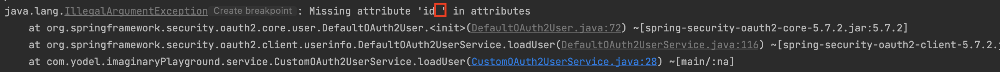
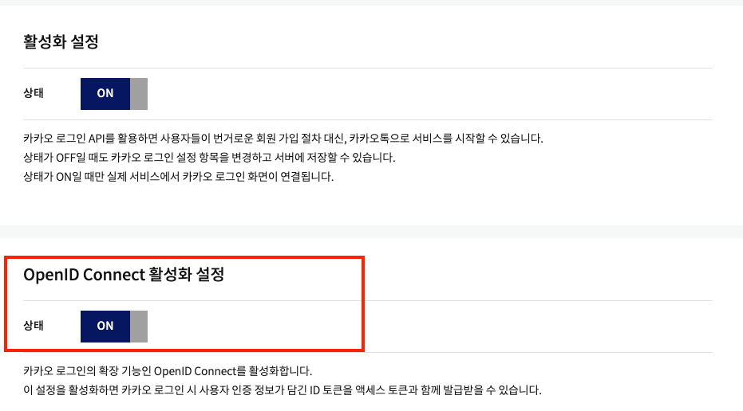
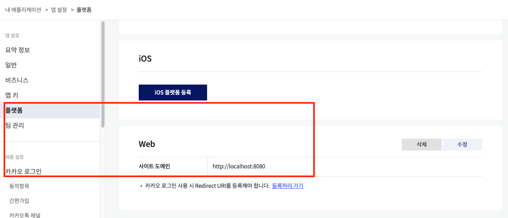

1. Gradle과 Java 버전 맞추기

   * https://milenote.tistory.com/63

2. Spring Security_properties

   1. properties 파일에는 띄어쓰기가 안되는 것을 명심한다. 계속 오류가 났는데 못 알아챌 수 있다.

      

      

   2. https://velog.io/@pjh612/Deprecated%EB%90%9C-WebSecurityConfigurerAdapter-%EC%96%B4%EB%96%BB%EA%B2%8C-%EB%8C%80%EC%B2%98%ED%95%98%EC%A7%80

   3. https://engkimbs.tistory.com/849

   4. https://sudo-minz.tistory.com/78

   5. 네이버, 카카오 등 스프링 시큐리티를 사용하면 redirect_uri가 정해져있다.

      ```
      http://localhost:8080/login/oauth2/code/naver
      http://localhost:8080/login/oauth2/code/kakao
      http://localhost:8080/login/oauth2/code/google
      ```

      * 즉 등록할 때에도 이 주소를 써준다.

   6. 플랫폼 등록을 잊어버리지 않는다.

      

       

2. OAuth2 Client

   ```
   	implementation 'org.springframework.boot:spring-boot-starter-oauth2-client'
   	implementation 'org.springframework.boot:spring-boot-starter-oauth2-resource-server'
   ```

3. Json Web Token(JWT)

```java
import lombok.Data;

@Data
public class UserDto {

    private int id;
    private String email;
    private String username;
    private String joinDate;    // Date 였는지 타입 확인
    private String provider;
    private String providerId;
    private String profileUrl;
    private String gender;
    private String type;

}
```

4. 