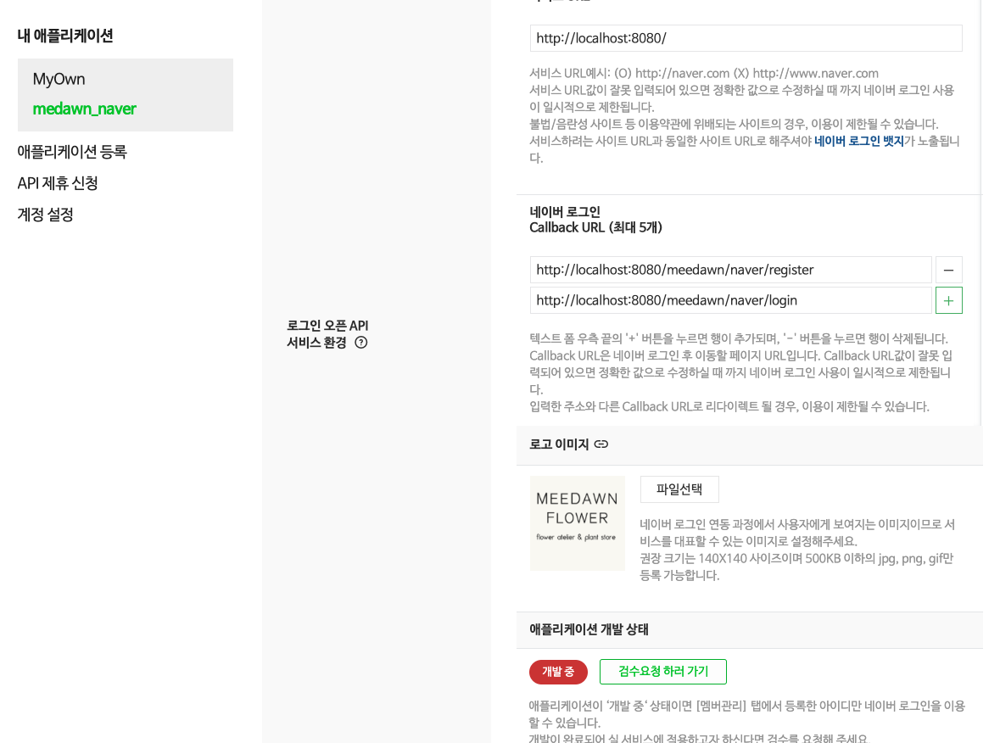
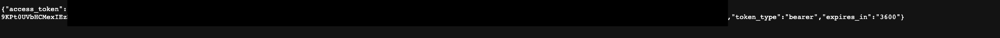
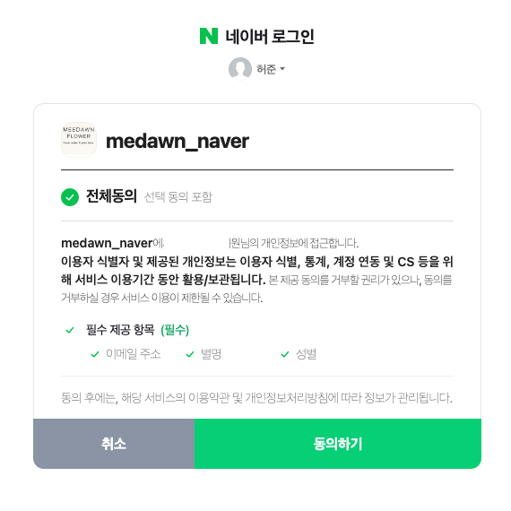
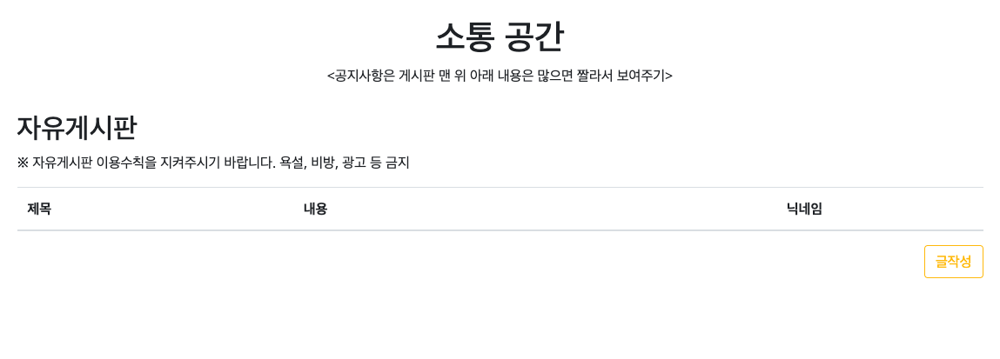
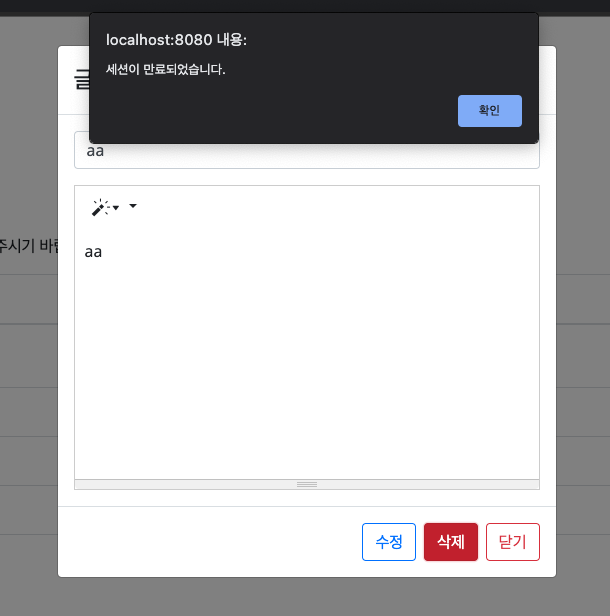

# MEEDAWN PROJECT

> 내용: Spring Legacy Project를 이용한 꽃 사업 관련 웹페이지 제작
> 기간: 2022.04.26(화) ~
>
> 4월 26일: 로그인, 로그아웃 기능(순수 비동기에서 동기방식 사용)
> 4월 27일: 회원가입 기능 및 회원 마이페이지 만들기(부트스트랩, 자바스크립트)
> 4월 28일: 회원 비밀번호 변경(비동기), 게시판 소스 준비(부트스트랩)
> 5월 11일: 게시판(비동기) CRUD
> 5월 13일: 유효성 검사
> 5월 15일: Spring Security 기초 공부
> 5월 16일: 네이버 세션 로그인
> 5월 17일: JWT 적용, 토큰 발행
> 5월 18일: 구글, 카카오 로그인 추가

​            

## 배운 내용 정리

* Web MVC Project 생성시 `webapp` 폴더 아래 `META-INF` 폴더가 자동 생성되지 않으므로 직접 생성 후 context.xml을 넣어준다.
* header 파일 분리를 위해 WEB-INF 아래 include 폴더를 생성하고 EL문법 include로 연결한다.
* Mapper와 Service 결국 주입은 필수이다.
* RestController 라고 해도 RequestBody는 써주어야한다.
* @Valid 유효성 검사 오류시 작동하는 BindingResult에서는 logger가 발동하지 않는다.(따로 처리)
* 다음 프로젝트부터는 생성자 주입 `@RequiredArgsConstructor`을 사용한다.

​                             

### 1. 로그인 관련 

* form의 action 속성을 공백으로 비워둔다.

* form 태그 안에 submit 버튼으로 제출하지 않는다.

* JS에서 할 수 있는 검사를 모두 진행한 후 jQuery로 attr을 추가해 action의 값을 넣어줌과 동시에 .submit()으로 전송한다.

* **[ 만약 session에 로그인 정보가 저장되어있다면 프론트엔드 구성은 어떻게 해야하는가? ]**

  > \- 방법 1
  >
  > EL 태그의 `<c:if test="">`를 활용해 로그인 정보가 있는지 확인한다음 자바스크립트 함수를 발동시켜서 태그를 끼워넣거나 뺴는 식으로 구성한다.
  >
  > \- 방법 2
  >
  > 순수 EL 태그를 믿고 부분 리로드하는 방식을 알아본다. 하지만 애초에 Single page므로 힘들 것이라고 보았다.
  >
  > : 문제가 발생하는 이유
  > 로그인에는 어느 때나 상관없지만 로그아웃 했을 때까지 고려해 메서드를 만들어야하므로 코드가 좀 길어진다.
  >
  > \- 방법 3 (결국 자바스크립트)
  > 로그인과 로그아웃은 결국 토글 형식이므로 경우의 수를 모두 분기하고 추가 / 제거를 일원화한다.
  >
  > 1. 처음 접속시 로그인이 되어있을 때 function을 통해 로그인에 필요한 구성요소를 추가
  > 2. 로그인이 안되어있다면 필요한 구성요소 추가
  > 3. 로그아웃을 하면 로그인에서 로드했던 것들을 지워주고 로그아웃 때의 구성요소 추가
  > 4. 로그인을 하면 로그아웃에 로그했던 것들을 지워주고 로그인의 구성요소를 추가
  >
  > ​           
  >
  > **로그인 관련 태그들과 로그아웃 관련 태그들을 모두 분리하는 작업을 한다**
  >
  > * 작업을 하다 JS 코드를 끼워넣고 빼는 것을 반복하기 때문에 무분별하게 코드가 길어지는 현상이 발생한다.
  > * 포트폴리오의 방향성이 프론트엔드로 치우져지는 단점이 발생했다.
  > * 나아가 가독성, 편리한 작업을 위해 로그인/로그아웃시에는 비동기 방식을 사용하지 않기로 했다.
  > * SPA기 때문에 로그인을 실패할 때 로그인 화면으로 돌아가지 못하는 현상이 발생했다. 다시 비동기 방식으로 관리해야함을 깨닫고 먼저 ajax 통신으로 보내고 성공시 웹페이지 이동하는 방식을 채택했다.

​           

#### - Mapper

* 클래스가 아닌 interface로 만들어야함을 유의한다.

* xml file: 매핑을 위해 src/main/resources 폴더 아래 member.xml 파일을 생성하고 dtd 를 꼭 넣어준다.

  ```xml
  <?xml version="1.0" encoding="UTF-8" ?>
  <!DOCTYPE mapper PUBLIC "-//mybatis.org//DTD Mapper 3.0//EN" 
  	"http://mybatis.org/dtd/mybatis-3-mapper.dtd">
  ```

* 또한 mapper 폴더 전체를 non-web 담당인 root-context.xml 에서 <mybatis-spring 태그>를 이용해 연결해주어야 한다.

  ```xml
  <!-- jdbc 경로에서 이름들 바꿔줘야한다. -->
  	<bean id="dataSource" class="org.springframework.jndi.JndiObjectFactoryBean">
  		<property name="jndiName" value="java:comp/env/jdbc/site"></property>
  	</bean>
  	
  	<!-- 팩토리 디자인이라 위에서 pool 생성을 위해 만든 dataSource 넣어주고 model내 경로들을 모두 Alias화 시켜준다.
  		 xml 파일을 읽기 위해 경로를 적어주어야 한다. -->
  	<bean id="sqlSessionFactoryBean" class="org.mybatis.spring.SqlSessionFactoryBean">
  		<property name="dataSource" ref="dataSource" />
  		<property name="typeAliasesPackage" ref="com.meedawn.flower.model"/>
  		<property name="mapperLocations" ref="classpath:mapper/*.xml"/>
  	</bean>
  ```

* member.xml 의 select 속성에서 returnType이 아니라 resultType임을 잊지 말자

* 또한 namespace는 패키지뿐만 아니라 클래스 이름까지 넣어주어야한다.

  ```xml
  <mapper namespace="com.meedawn.flower.model.mapper.MemberMapper">
  ```

​          

#### - Controller

* ResponseEntity<?>를 사용해 던질때는 리턴시 new를 사용해서 생성하고 던져줌에 주의한다. 

**[ 비동기통신 ] **

* ajax 함수를 찾지 못할 수 있으므로 jquery의 옵션에서 slim이 들어가지 않도록 한다. 또한 부트스트랩에서 자동으로 넣어주는 jquery에는 slim이 들어가므로 주의한다.

* ajax에서 비동기 통신으로 받아주는 function 인자값은 곧 서버에서 던져준 리턴값이다.

  ```javascript
  /* 1: data를 JS에서 객체 형식으로 저장
  let data = { 
    						userId : $('#login-userId').val(),
    						userPwd: $('#login-userPwd').val()
    					}
  
  */
  
  /* 2: data를 애초에 파라미터 형식 문자열로 저장
      let data = "?userId=" + $('#login-userId').val() + "&userPwd" + $('#login-userPwd').val()
      
      * 파라미터 형식으로 보낼 때는 ajax의 contextType의 json을 부분을 없애고 Controller에서 Param으로 받아준다.
  */
  
  /* 3: data를 보내고자하는 form 의 id를 가져와서 $("#formName").serialize()로 포장
  		애초에 문자열로 파라미터를 넘겨주므로 Controller에서 받아줄 수 있다.
  		$.ajax({
    				url:'${root}/user/login',  
    				type:'POST',
    				contentType:'application/json; charset=utf-8',
  					data: $("#formName").serialize(),
  */
  
  
  function async_login(data){	
    			console.log(JSON.stringify(data));
    			$.ajax({
    				url:'${root}/user/login',  
    				type:'POST',
    				contentType:'application/json; charset=utf-8',
  				data: JSON.stringify(data),
    				dataType:'json',
    				success:function(users) { // function 인자 1개는 곧 서버에서 던져준 리턴값이다.
    					$(users).each(function(index, user) {
    						console.log(user);
    					})
    				},
  ```
  
* 비동기에서 던져준 Json 받기: json 파일로 던져주면 @RequestBody로 일단 받아준다음 parser를 이용해 풀어서 넣어야한다. json을 사용하는 일반적인 Dependency와는 달리 simple 내부에 JSON 파서가 존재한다.

  ```xml
  <!-- https://mvnrepository.com/artifact/com.googlecode.json-simple/json-simple -->
  <dependency>
      <groupId>com.googlecode.json-simple</groupId>
      <artifactId>json-simple</artifactId>
      <version>1.1</version>
  </dependency>
  ```

* 애초에 json 형식으로 백엔드에 보내기 때문에 파라미터형식으로 받아줄 수 없었다. 문자열 변환을 하지 않은 data 값을 @RequestBody로 받으면 url상 파라미터를 문자열로 받아야만한다.

  ​             

* **[ajax 비동기 로그인 JSON 정리]**

  ​               

  * 만약에 ajax의 data 형식으로 이렇게 보낸다면...?

  ```javascript
  $.ajax({
      url:'${root}/user/login',  
      type:'POST',
      contentType:'application/json; charset=utf-8',
      data: {
        			userId: id, //id는 문자열 변수로 사용자가 입력한 값
        			userPwd: pwd //id는 문자열 변수로 사용자가 입력한 값
      			},
      dataType:'json',
  ```

  *  Controller에서 받을 때는 Url 주소 형식의 String으로 받아진다.

  ```java
  public ResponseEntity<?> login(@RequestBody String data, Model model, HttpSession session) throws Exception {
  		//여기서 data의 출력형태: userId=id&userPwd=pwd 
  ```

  * 위와 같은 파라미터 URL 형식이면 파라미터 분리를 해줄 수 없으므로 애초에 Controller에 던져주기 전 data에서 바로 던지는 것이 아니라 객체(Object) 형식으로 data를 만든다음 `JSON.stringify(data)`로 json 형식의 문자열로 던져준다.

  ```javascript
  let data = { 
    						userId : $('#login-userId').val(),
    						userPwd: $('#login-userPwd').val()
    					}
  ```

  ```javascript
  function async_login(data){	
    			console.log(JSON.stringify(data));
    			$.ajax({
    				url:'${root}/user/login',  
    				type:'POST',
    				contentType:'application/json; charset=utf-8',
  				data: JSON.stringify(data),
    				dataType:'json',
    				error:function(xhr, status, error){
    					console.log("상태값 : " + xhr.status + "\tHttp 에러메시지 : " + xhr.responseText);
    				},
    				statusCode: {
    					204: function() {
    						alert("아이디와 비밀번호를 확인해주세요.");
    						return;
    					},
    					200: function(){
    						location.href = "${root}";
    						return;
    					},
    					500: function() {
    						alert("서버에러.");
    					},
    					404: function() {
    						alert("페이지없다.");
    					}
    				}
    				
    			});
    		}
  ```
  
  * Controller에서는 JSONParser를 이용해 JSONObject로 만들고 String으로 꺼내서 사용
  * 또한 mybatis에서 String 2개를 보내 바로 사용할 수 없기 때문에 map에 집어넣고 보내서 다시 받아준다.
  * 주의점: ajax에 있는 success를 사용하지 않는다
    * 비밀번호가 틀린 경우 또한 접속이 성공했다는 뜻인데 204로 나타내었다. 하지만 success는 204도 발동시키기 때문에 statusCode만으로 경우를 분기해서 사용해야한다. 모두 발동시키고 싶을 때 success 항목을 추가한다.
  

  ```java
  //data 에는 json 포맷의 문자열이 전달
  		JSONParser parser = new JSONParser();
  		JSONObject jsonObj = (JSONObject) parser.parse(data);
  		
  		logger.info(" 아이디: {} , 비밀번호 {}",(String) jsonObj.get("userId"), (String) jsonObj.get("userPwd"));
  		
  		//MyBatis xml의 parameterType="map"을 활용하기 위해 다시 맵 안에 넣고 집어넣어주었다.
  		Map<String, String> map = new HashMap<String, String>();
  		map.put("userId", (String) jsonObj.get("userId"));
  		map.put("userPwd", (String) jsonObj.get("userPwd"));
  		
  		MemberDto member = memberService.login(map);
  ```
  
  * member.xml(mybatis)
  
  ```xml
  <select id="login" parameterType="map" resultType="MemberDto"> <!--파라미터 타입=map -->
  		select username, userid, email
  		from ssafy_member
  		where userid = #{userId} and userpwd = #{userPwd}
  </select>
  ```
  
  ​                       
  
  * 아예 서버단(Controller)에서 통째로 던져주기: MVC 패턴에 살짝 벗어나서 받은 DTO를 통째로 리턴해주는 방법 존재.
  
    * 조건: Dto 내부의 변수값이 곧 리턴값이어야 한다.
    * DTO를 통째로 리턴하면 문자열로 이동되는데 자동으로 toString() 메소드가 적용된다.

    * 이것을 이용해 toString() 메서드의 리턴값을 JS의 객체모양으로 잘 꾸며준다(싱글쿼테이션이 안되므로 \를 활용).
  
    * 나아가, Dependency의 `jakarta.son`이 있다면(부트는 자동 설정) `@ResponseBody`를 메소드 이름에 붙여줘서 toString()으로 꾸며주지 않아도 자동으로 변형해서 보내준다. 즉 `@ResponseBody`와 `return dto` 만으로 json 문자열을 던져줄 수 있다. 
  
      ```java
      @PostMapping(value = "/send", headers = { "Content-type=application/json;charset=utf-8" })
      	public @ResponseBody SData home5(@RequestBody SData sdata, Model model) {
      		
      		logger.info("Post2 받은 정보 data: {} ",sdata);
      		sdata.setMsg("reaaaaa" + sdata.getMsg());
      
      		return sdata;
      	}
      ```
  
    ​                    
  
  * 지금까지의 과정: JS에서 JSON 객체를 문자열로 포장해서 HTTP body를 통해 전달했고 Controller가 문자열을 받아 다시 JSON 형태로 만들어 꺼내서 사용했다. 이 과정을 더 명확히 표현하기 위해 `@XXXMapping()` Annotation에 받아줄 때 header로. 명시해줄 수 있다.
  
    ```java
    @GetMapping(value = "/user", headers = { "Content-type=application/json" })
    ```
  
    ​                                
  
  * 결론: Dto 사용은 매우 유리하다. `@RequestBody`를 이용해 자동 매핑을 하기 위해서는 이름이 일치해야한다는 조건이 필요한데 Dto는 그 조건을 빠르게 충족할 수 있다. 

​                

​                     

### 2. 회원가입 관련

* 회원가입 또한 비동기로 만든다.

  > 프론트엔드단에서 최대한 검사를 수행한다음 걸러진 값으로 회원가입을 할 수 있지만 개인 프로젝트의 특성상 DB와 완전히 일치시키면서 회원가입 여부를 따지기 어려울 것 같았다. 이에 비동기 통신을 통해 DB에 들어가지 않았을 경우 회원가입을 하지 못했다고 알려주고 현재 페이지를 유지하도록 한다.

* statusCode를 200과 204로 나눈다.

  > 값 전달은 했으나 회원가입에 실패할 경우 204로 던져준다.
  >
  > 회원가입에 성공하면 200으로 던져주고 로그인 페이지로 이동하는 버튼을 클릭한다.

* JSON 형식으로 보낼 때 `JSON.stringify(data)`를 잊으면 안된다 

  ```javascript
  if(id_check){
    				let data = {
    							 "userId": $('#register-userId').val(),
    							 "userName": $('#register-userName').val(),
    							 "userPwd": $('#register-userPwd').val(),
    							 "email": $('#register-userEmail').val()
    						   }
    				//비동기로 회원가입 구현: 싱글페이지를 이용해 회원가입을 완료하면 로그인 페이지로 이동시키기 위해
    				$.ajax({
    					url: "${root}/user/register",
    					type: "POST",
    					dataType: 'json',
    					data: JSON.stringify(data), //문자열로 풀어서 주어야 @RequestBody로 받을 수 있다.
    					contentType:'application/json; charset=utf-8',
    					success:function(){
    						console.log("뭐임 성공임?");
    					},
  ```


​           

### 3. 게시판 API 사용

```
https://summernote.org/
```



​              

### 4. Naver Session Login

​              

#### - NaverController 정의

```java
package com.ys.happyhouse.controller;

import java.io.BufferedReader;
import java.io.IOException;
import java.io.InputStream;
import java.io.InputStreamReader;
import java.math.BigInteger;
import java.net.HttpURLConnection;
import java.net.MalformedURLException;
import java.net.URL;
import java.security.SecureRandom;
import java.util.HashMap;
import java.util.Map;

import javax.servlet.http.HttpServletRequest;
import javax.servlet.http.HttpServletResponse;
import javax.servlet.http.HttpSession;

import org.apache.ibatis.annotations.Mapper;
import org.json.simple.JSONObject;
import org.json.simple.parser.JSONParser;
import org.slf4j.Logger;
import org.slf4j.LoggerFactory;
import org.springframework.beans.factory.annotation.Autowired;
import org.springframework.http.HttpEntity;
import org.springframework.http.HttpHeaders;
import org.springframework.http.HttpMethod;
import org.springframework.http.HttpStatus;
import org.springframework.http.MediaType;
import org.springframework.http.ResponseEntity;
import org.springframework.stereotype.Controller;
import org.springframework.util.LinkedMultiValueMap;
import org.springframework.util.MultiValueMap;
import org.springframework.web.bind.annotation.GetMapping;
import org.springframework.web.bind.annotation.RequestBody;
import org.springframework.web.bind.annotation.RequestMapping;
import org.springframework.web.bind.annotation.RequestParam;
import org.springframework.web.bind.annotation.ResponseBody;
import org.springframework.web.client.RestTemplate;
import org.springframework.web.util.UriComponents;
import org.springframework.web.util.UriComponentsBuilder;

import com.ys.happyhouse.model.MemberDto;
import com.ys.happyhouse.model.service.JwtService;
import com.ys.happyhouse.model.service.MemberServiceImpl;

import lombok.RequiredArgsConstructor;

@Controller
@RequestMapping("/naver")
@RequiredArgsConstructor
public class NaverController {
	
	/* 네이버 토큰 관련 정보
	 * access_token은 발급 받은 후 12시간-24시간(정책에 따라 변동 가능)동안 유효합니다.
	 * refresh token은 한달간 유효하며, refresh token 만료가 1주일 이내로 남은 시점에서 사용자 토큰 갱신 요청을 하면\
	 * 갱신된 access token과 갱신된 refresh token이 함께 반환됩니다.
	 */
	
	private final MemberServiceImpl memberService;
	
	private final JwtService jwtService; //내부적으로 토큰을 발행
	
	private static final Logger logger = LoggerFactory.getLogger(NaverController.class);
	
	//모든 변수를 private final: 값이 변경되지 않고 숨김
	private final String NAVER_BASE_URL = "https://nid.naver.com/oauth2.0/authorize";
	private final String NAVER_GET_TOKEN_URL = "https://nid.naver.com/oauth2.0/token";
	private final String NAVER_PROFILE_URL = "https://openapi.naver.com/v1/nid/me";
	private final String NAVER_CLIENT_ID = "I6HyiFGFQqiSHkfzOQ67";
	private final String NAVER_CLIENT_SECRET = "sQJcLMyPpf";
	private final String REDIRECT_URI = "http://localhost:80/naver/callBack"; //경로 확인할 것
	
	@GetMapping("/") // 1. 회원가입 + 로그인 동시 확인 서비스
	public void register(HttpServletResponse response) {
		try {
			redirectAuthUri(response);
		} catch (IOException e) {
			e.printStackTrace();
		}
	}
	
	// 1 - 1. 인증 URI 생성기
	private void redirectAuthUri(HttpServletResponse httpServletResponse) throws IOException {
		
		final String state = new BigInteger(130, new SecureRandom()).toString();
		
		UriComponents uriComponents = UriComponentsBuilder.newInstance()
				.scheme("https")
				.host("nid.naver.com")
				.path("/oauth2.0/authorize")
				.queryParam("response_type", "code")
				.queryParam("client_id", NAVER_CLIENT_ID)
				.queryParam("redirect_uri", REDIRECT_URI)
				.queryParam("state", state)
				.build();
		
		httpServletResponse.sendRedirect(uriComponents.toString());
	}
	
	// 2. 콜백으로 토큰을 받는 메서드
	@GetMapping("/callBack")
	public ResponseEntity<?> callBack(@RequestParam("code") String code,
							@RequestParam("state") String state,
							HttpSession session) throws Exception {
		
		ResponseEntity<?> responseEntity = requestToken(code, state); // 2 - 1. 토큰 받기
		Object responseMessage = responseEntity.getBody();

		Map<String, String> map = (Map<String, String>) responseMessage;
		
		return getNaverProfile(map, session); // 2 - 2 토큰 값으로 유저 프로필 정보 받기
	}
	
	// 2 - 1. 유저 토큰 정보 요청
	private ResponseEntity<?> requestToken(String code, String state) {
		MultiValueMap<String, String> requestBody = new LinkedMultiValueMap<>();
		
		requestBody.add("grant_type", "authorization_code");
		requestBody.add("client_id", NAVER_CLIENT_ID);
		requestBody.add("client_secret", NAVER_CLIENT_SECRET);
		requestBody.add("code", code);
		requestBody.add("state", state);
		
		//내부적으로 비동기 통신
		return new RestTemplate().postForEntity(NAVER_GET_TOKEN_URL, requestBody, Map.class);
	}
	
	
	// 2 - 2. 프로필 정보 받아주기(네이버 공식 문서 예시): access_token, refresh_token, token_type, expires_in
	private ResponseEntity<?> getNaverProfile(Map<String, String> map, HttpSession session) throws Exception {
		String token = map.get("access_token");
        String header = "Bearer " + token; // 2 - 2 - 1. access token 받고 
        
        Map<String, String> requestHeaders = new HashMap<>();
        requestHeaders.put("Authorization", header);
        String responseBody = get(NAVER_PROFILE_URL, requestHeaders);
        
        JSONParser parser = new JSONParser();
		JSONObject jsonObj = (JSONObject) parser.parse(responseBody); // 데이터: resultcode, message, response
		JSONObject jsonObj2 =  (JSONObject) jsonObj.get("response"); // response: id, email
		
		int account_exist = memberService.platformIdCheck((String)jsonObj2.get("id")); //이미 아이디가 있는지 확인
        
		//platform_id 값이 존재하지 않는다면 부분 정보를 가지고 회원가입으로 이동
        if(account_exist == 0) {
        	logger.info("네이버 회원가입 진행: {}", jsonObj2.toString()); //userid를 비워서 보내기 때문에 프론트엔드단에서 회원가입으로 이동
        	
        	MemberDto member = new MemberDto();
        	member.setPlatform_id((String) jsonObj2.get("id"));
        	member.setPlatform("naver");
        	member.setEmail((String) jsonObj2.get("email"));
        	member.setRefresh_token((String) jsonObj2.get("refresh_token"));
        	
        	System.out.println("아이디, 닉네임 지정 페이지로 이동하기");
        	
        	return new ResponseEntity<MemberDto>(member, HttpStatus.PARTIAL_CONTENT); // 회원가입: PARTIAL_CONTENT
        }
		
		//만약 회원값이 존재한다면 정보를 로드해서 가져오기	
        logger.info("네이버 로그인 진행: {}", jsonObj2.toString());
        
        MemberDto member = memberService.platformLogin((String)jsonObj2.get("id"), "naver");
        
        if(member != null) { //로그인 성공시
        	String userToken = jwtService.createToken(member.getUserid()+"", (60*1000*15));
			logger.info("네이버 유저에게 내부 토큰 발행: {} ", userToken);
	
			session.setAttribute("token", userToken); //세션으로 토큰을 저장해준다.
			
			return new ResponseEntity<MemberDto>(member, HttpStatus.OK); // 로그인 성공: OK
        }
        
        //로그인 실패시
        return new ResponseEntity<Void>(HttpStatus.NOT_ACCEPTABLE); // 로그인 실패: NOT_ACCEPTABLE
	}

	 private static String get(String apiUrl, Map<String, String> requestHeaders){
	        HttpURLConnection con = connect(apiUrl);
	        try {
	            con.setRequestMethod("GET");
	            for(Map.Entry<String, String> header :requestHeaders.entrySet()) {
	                con.setRequestProperty(header.getKey(), header.getValue());
	            }


	            int responseCode = con.getResponseCode();
	            if (responseCode == HttpURLConnection.HTTP_OK) { // 정상 호출
	                return readBody(con.getInputStream());
	            } else { // 에러 발생
	                return readBody(con.getErrorStream());
	            }
	        } catch (IOException e) {
	            throw new RuntimeException("API 요청과 응답 실패", e);
	        } finally {
	            con.disconnect();
	        }
	 }
	 private static HttpURLConnection connect(String apiUrl){
	        try {
	            URL url = new URL(apiUrl);
	            return (HttpURLConnection)url.openConnection();
	        } catch (MalformedURLException e) {
	            throw new RuntimeException("API URL이 잘못되었습니다. : " + apiUrl, e);
	        } catch (IOException e) {
	            throw new RuntimeException("연결이 실패했습니다. : " + apiUrl, e);
	        }
	    }


    private static String readBody(InputStream body){
        InputStreamReader streamReader = new InputStreamReader(body);


        try (BufferedReader lineReader = new BufferedReader(streamReader)) {
            StringBuilder responseBody = new StringBuilder();


            String line;
            while ((line = lineReader.readLine()) != null) {
                responseBody.append(line);
            }


            return responseBody.toString();
        } catch (IOException e) {
            throw new RuntimeException("API 응답을 읽는데 실패했습니다.", e);
        }
    } 
}

```


* 네이버에 API KEY를 발급받고 인증한다.
* 사용자에게 KEY값을 보이지 않고 숨겨서 통신해 token을 받아온다.

​            

#### - 긴 URL 생성: UriComponents 활용

​             

#### - 토큰 값을 가져오기



​              

#### - 네이버 공식 JAVA 문서 사용해 프로필 정보 가져오기



​                 

#### - 이미 회원가입을 했다면 refresh_token으로 갱신 받아 로그인하기

```java
//이미 회원인데 refresh_token이 전달된 경우(만료된 경우): 갱신해주기
if(naverRigistered == 1 && changeRefreshToken) {
memberService.changeRefreshToken((String)jsonObj2.get("id"), map.get("refresh_token"));
}
```

​                 

#### * 문제 발생



```
네이버가 주는 매우 긴 아이디를 사이트내에서 사용할 수 없으므로 email 앞자리를 아이디로 사이트 내에서 임시로 사용할 수 있다. 하지만 javascript의 변수는 특수문자를 허용하지 않으므로 javascript 코드에 오류가 발생하면서 기능이 정지하는 현상이 발생했다.

해결: xx@naver.com에서 @ 앞의 문자열로 MyBatis .xml에서 id로 인식시켜서 가져온다.
```

```sql
select username, SUBSTRING_INDEX(email, '@', 1) as userid, email, exp, lv, platform
from member
where userid = #{userId} and email = #{email} and platform='naver'
```

​               

#### - session에 사이트 내부 토큰을 저장해 검증

```java
 @Override
public boolean preHandle(HttpServletRequest request, HttpServletResponse response, Object handler) throws Exception {
  //final String token = request.getHeader(HEADER_AUTH);
  final String token = (String) request.getSession().getAttribute("token");
  logger.info("JWT Interceptor Operate: {}", token);
  if(token != null && jwtService.isUsable(token)){
    return true;
  }else{
    System.out.println("토큰이 만료되어 세션정보를 초기화합니다.");
    response.sendRedirect(request.getContextPath()+"/user/sessionout");
    return false;
  }
}
```

​                

### 5. JWT 적용

* 기존 방식: 로그인의 정보를 session에 저장

  ```java
  return new ResponseEntity<MemberDto>(member, HttpStatus.OK); //찾은 경우 OK로 보낸다.
  ```

* JWT 사용: 로그인의 정보를 session에 저장하지 않고 대신 token 값을 session에 저장

  ```java
  //session.setAttribute("userInfo", member);
  String userToken = jwtService.createToken(member.getUserId()+"", (60 * 1000 * 60));
  logger.info("유저에게 토큰 발행: { } ", userToken);
  
  session.setAttribute("token", userToken); //세션으로 토큰을 저장해준다.
  return new ResponseEntity<Void>(HttpStatus.OK); //찾은 경우 OK로 보낸다.
  ```

​           

#### - Interceptor 설정

> 본래 java Config로 설정하는 것이 보통이나 legacy 프로젝트에 맞춰서 servlet.xml 내부에 bean으로 주입
>
> * 로그인 유지가 안되어있다면 사용할 수 없는 기능들을 분리해준다.

```xml
<!-- interceptor -->
	<beans:bean id="jwtInterceptor" class="com.meedawn.flower.interceptor.JwtInterceptor" />
	
	<interceptors>
		<interceptor>
			<mapping path="/user/resetpwd"/>
			<mapping path="/board/write"/>
			<mapping path="/board/edit"/>
			<mapping path="/board/delete"/>
			<beans:ref bean="jwtInterceptor"/>
		</interceptor>
	</interceptors>
```

​            

#### - interceptor 오류 해결

* 레거시에서는 PUT, DELETE 에 사용 제약이 존재한다.

  * 다음 필터 설정을 넣어주어야 한다.

  ```xml
  <filter>
      <filter-name>httpFilter</filter-name>
      <filter-class>
      	org.springframework.web.filter.HiddenHttpMethodFilter
      </filter-class>
  </filter>
  <filter-mapping>
      <filter-name>httpFilter</filter-name>
      <servlet-name>사용하는 servlet</servlet-name>
  </filter-mapping>
  ```

* 하지만 필터설정 이후에도 springframework 라이브러리와 출동발생

  > **내용**: REST Controller를 설정했고 DELETE, PUT을 사용했으나 Springframework 라이브러리와 충돌이 발생했다.
  >
  > ```
  > WARN : org.springframework.web.servlet.mvc.support.DefaultHandlerExceptionResolver - Resolved [org.springframework.web.HttpRequestMethodNotSupportedException: Request method 'DELETE' not supported]
  > ```

* 해결책

  * Springframework의 경우 application.properties 설정만 추가해주면 해결된다.

    ```
    spring.mvc.hiddenmethod.filter.enabled.true
    ```

​                          

#### - 미해결 문제: interceptor에서 토큰으로 session logout 이후 처리

> **해결 내용**: response에 상태코드를 보내고 ajax에서 location.href로 초기화면 이동을 수행한다.

* token 기간이 만료된 경우 session.invalidate() 는 작동하지만 화면요소에 반영되지 않는 문제가 생겼다.

  ```java
   @Override
  public boolean preHandle(HttpServletRequest request, HttpServletResponse response, Object handler) throws Exception {
    final String token = request.getHeader(HEADER_AUTH);
    logger.info("JWT Interceptor Operate: {}", token);
    if(token != null && jwtService.isUsable(token)){
      return true;
    }else{
      System.out.println("토큰이 만료되어 세션정보를 초기화합니다.");
      response.sendRedirect(request.getContextPath()+"/user/sessionout");
      //토큰 만료시 sessionout url로 이동
      return false;
    }
  }
  ```

* sessionout URL

  * 새로고침하면 화면에 반영되지만 redirect 이후에도 화면 변화가 없는 문제 발생

  ```java
  @GetMapping("/sessionout") //세션만료와 로그아웃을 구분한다.
  	public String sessionout(HttpSession session, Model model) {
  		session.invalidate();
  		model.addAttribute("session", "invalidated");
  		System.out.println("세션 종료 메서드");
  		return "redirect:/";
  	}
  ```

  ​               

* **해결**

  * 인터셉터에서도 response를 사용해 status를 보낼 수 있지만 보통 redirect를 사용하므로 그 내역이 초기화된다.

  * 이에 세션만료되어 이동하는 컨트롤러 url에 response에 HttpStatus 상태를 저장한다.

  * 세션을 삭제하기 때문에 redirect가 아닌 페이지 이름으로 이동해 상태를 보낸다.

    ```java
    
    	@GetMapping("/sessionout") //세션만료와 로그아웃을 구분한다.
    	public String sessionout(HttpSession session, HttpServletResponse response,Model model) {
    		session.invalidate();
    		response.setStatus(304);
    		System.out.println("세션 종료 메서드");
    		return "index";
    	}
    ```

    

  * 304에 대한 ajax 반응처리를 해주고 새로고침해준다.

    ```js
    304: function() {
        						alert("세션이 만료되었습니다.");
        						location.href="${root}/"
      							return false;
      						},
    ```

* 설정 주의

  * 적용확인을 위해 토큰 시간을 매우 짧게 설정했으므로 이후 변경하도록 한다.

    ```java
    String userToken = jwtService.createToken(member.getUserId()+"", (100));
    ```

    ​               

### 6. 구글 세션 로그인 구현

