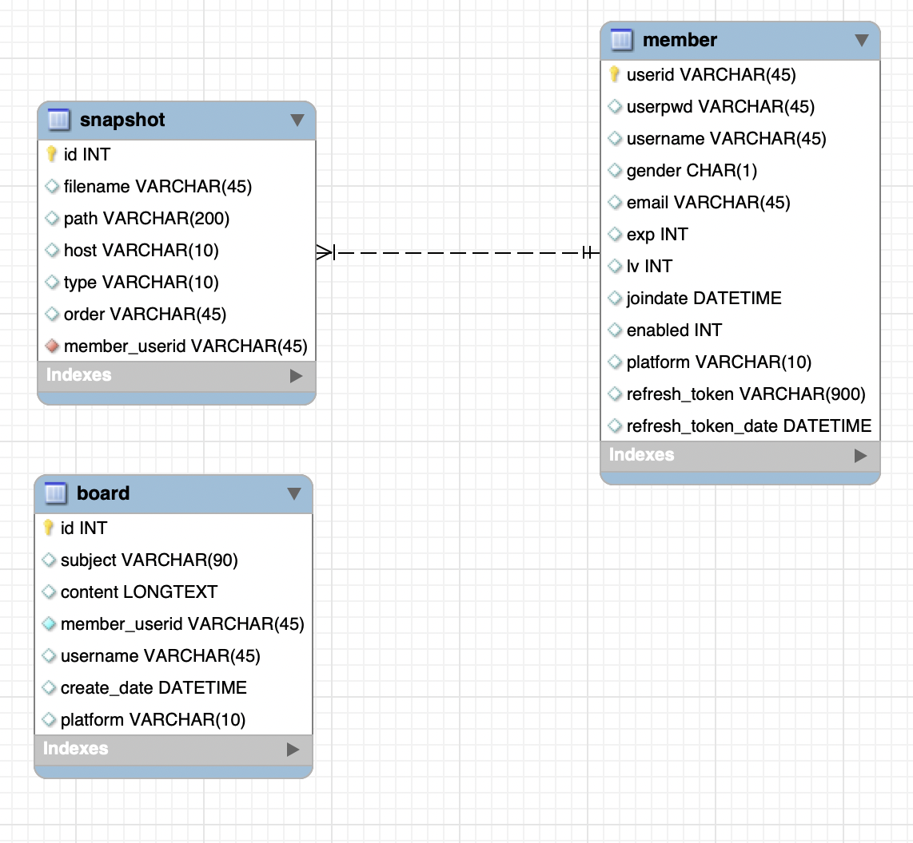
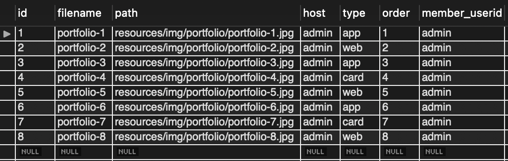
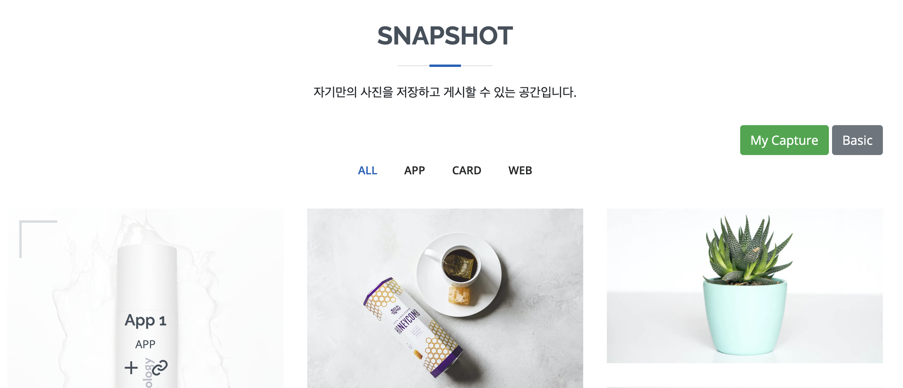
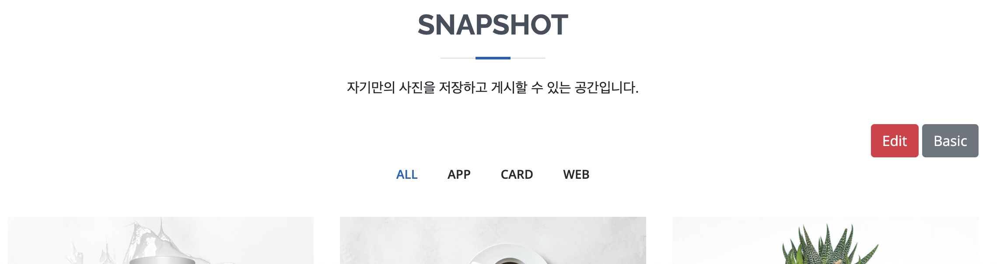
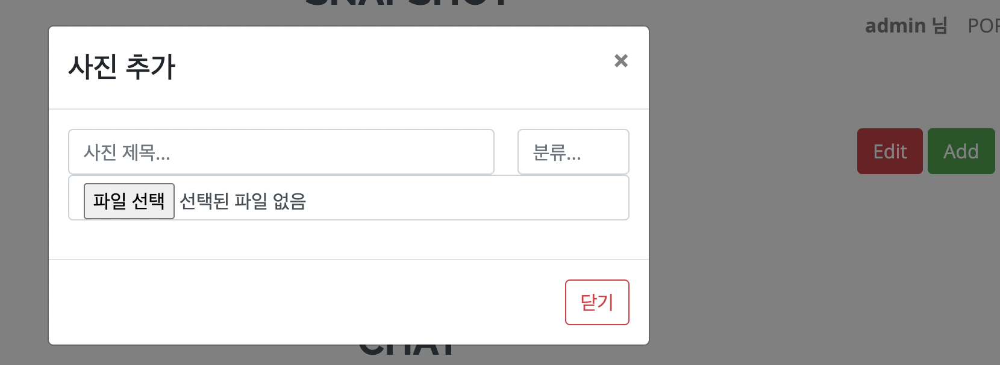
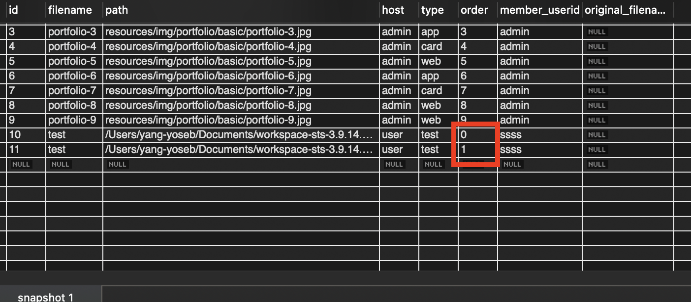
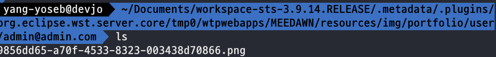

# 파일 업로드 & 삭제

​                     

### 0. 구현

* Basic 버튼을 클릭하면 사이트에서 제공하는 기본 이미지 목록을 불러올 수 있다.
* MyCapture 버튼을 누르면 내가 저장한 이미지 목록들을 볼 수 있다.(최대 10개 제한)
  * MyCapture 버튼을 누르면 편집 버튼이 활성화 된다.

​                     

#### - ERD를 통한 DB 구조 변경



* 파일 목록을 관리하기 위한 테이블을 생성한다(=snapshot).

  * `filename`: 파일의 이름
  * `path`: 파일 저장 경로
  * `host`: 주체, `admin` 또는 `user` 또는 `deleted`(논리 삭제)
  * `type`: 분류 타입 - `app`, `web`, `card`
  * `order`: 배치순서

* `Basic`에 해당하는 기본 자료 등록

  ```sql
  INSERT INTO `meedawn`.`snapshot`
  (`id`, `filename`, `path`, `host`, `type`, `order`, `member_userid`)
  VALUES
  (1, 'portfolio-1', 'resources/img/portfolio/portfolio-1.jpg', 'admin', 'app', 1, 'admin');
  ```

* 기본 자료 예시

  

​                 

#### - maven

* 의존관계를 추가한다.(pom.xml)

  ```xml
  <!-- https://mvnrepository.com/artifact/commons-fileupload/commons-fileupload -->
  <dependency>
      <groupId>commons-fileupload</groupId>
      <artifactId>commons-fileupload</artifactId>
      <version>1.3.3</version>
  </dependency>
  ```

* 세팅을 추가한다.(servlet-context.xml)

  ```xml
  <beans:bean id="multipartResolver" class="org.springframework.web.multipart.commons.CommonsMultipartResolver">
  	<beans:property name="defaultEncoding" value="UTF-8"/>
    <beans:property name="maxUploadSize" value="52428800"/> <!--50MB-->
    <beans:property name="maxInMemorySize" value="1048576"/> <!--1MB-->
  </beans:bean>
  ```

  

​                 

## 파일 업로드(File Upload With JSON)

> SPA 환경에서 JSON형식으로 유저 데이터와 파일을 같이 올려보낸다.
> 하지만 원칙적으로 JSON에 파일을 같이 포함시킬 수 없다.
> 이 방법을 사용하기 위해서는 순수 JSON이 아닌 Form 형식으로 올려보내야한다.

​                                

### 1. 버튼 만들기



```html
<div class="text-right">
					<button type="button" class="btn btn-success" id="my-capture-btn">My Capture</button>
					<button type="button" class="btn btn-secondary" id="basic-capture-btn">Basic</button>
				</div>
```

​                 

* My Capture 버튼을 누르면 **Edit** 버튼 활성화 & Basic 버튼을 누르면 초기 버튼 설정

  

  ```js
  /******************
      		Snapshot
   ******************/
      	 
  $('#my-capture-btn').on("click", function(){
     $('#my-capture-edit-btn').show();
     $('#my-capture-btn').hide();
  });
      	
      	
  $('#basic-capture-btn').on("click", function(){
     $('#my-capture-edit-btn').hide();
     $('#my-capture-btn').show();
  });
  ```

​                        

### 2. 모달창 만들기

* file 업로드를 위한 `input` 태그추가

  ```html
  <!-- The Modal: 나의 사진 삭제 모달 -->
  		<form class="modal" id="myModal4" enctype="multipart/form-data">
  		 
  		  <div class="modal-dialog">
  		    <div class="modal-content">
  		
  		      <!-- Modal Header -->
  		      <div class="modal-header">
  		        <h4 class="modal-title">사진 추가</h4>
  		        <button type="button" class="close" data-dismiss="modal">&times;</button>
  		      </div>
  		
  		      <!-- Modal body -->
  		      <div class="modal-body container">
  		       	<div class="form-group">
  		       		<input type="text" class="form-control float-left" placeholder="사진 제목..." id="snapshot-add-title" name="snapshot-add-title" style="width: 76%;">
  		       		<input type="text" class="form-control float-right" placeholder="분류..." id="snapshot-add-type" name="snapshot-add-type" style="width: 20%;">
  					<input type="file" class="form-control" name="snapshot-file-upload" id="snapshot-file-upload">
  				</div>
  		      </div>
  		
  		      <!-- Modal footer -->
  		      
  		      <div class="modal-footer">
  		        <button type="button" class="btn btn-outline-success"  id="snapshot-modal-register" name="snapshot-modal-register">등록</button>
  		        <button type="button" class="btn btn-outline-danger"  id="snapshot-modal-close2" data-dismiss="modal">닫기</button>
  		      </div>
  			  
  		    </div>
  		  </div>
  		</form>
  ```

  



* Add 버튼을 누르면 사진을 등록할 수 있다.

​                 

### 3. JavaScript

* `FormData`형식으로 보낸다

  * 파일의 값을 가져올 때 배열을 통해 가져와야한다.

  ```js
  let formData = new FormData();
  
  formData.append('file', $('#snapshot-file-upload')[0].files[0]); //파일을 넣고
  formData.append('key', new Blob([ JSON.stringify(data) ], {type : "application/json"})); //data를 다시 넣어줌
  ```

* Ajax 통신할 때 다음과 같은 설정을 해준다.

  ```js
  processData: false, // false: formData를 string으로 변환하지 않음
  contentType:false, // false: content-type 헤더가 multipart/form-data로 전송되게 함
  data: formData, //data 형식을 FormData로 보낸다
  ```

* 전체 코드

  ```js
   $('#snapshot-modal-register').on("click", function(){
      		 //파일과 JSON을 묶어 보내기
      		 let data = {
      						filename: $('#snapshot-add-title').val(),
      						type: $('#snapshot-add-type').val()
      		 			};
      		
      		 let formData = new FormData();
      		 
      		 formData.append('file', $('#snapshot-file-upload')[0].files[0]); //파일을 넣고
      		 formData.append('key', new Blob([ JSON.stringify(data) ], {type : "application/json"})); //data를 다시 넣어줌
      		 
      		 $.ajax({
      				url: "${root}/snapshot/register",
      				type: "POST",
      				processData: false,
              contentType:false,
              data: formData,
      				statusCode:{
        					200: function(result){
                    $('#snapshot-add-title').val("");
        						$('#snapshot-add-type').val("");
        						$('#snapshot-file-upload').val("");
        						alert("파일 업로드 성공");
        					},
      						429: function() { 
        					},
        					500: function() {
        						alert("서버에러.");
        					},
        					404: function() {
        						alert("페이지없다.");
        					}
      				}
      			});
      			
   });
  ```

​                        

### 2. DTO 생성

```java
package com.meedawn.flower.model;

public class SnapshotDto {
	private String filename;
	private String path;
	private String host;
	private String type;
	private int order;
	private String member_userid;
	private String original_filename;
	
	public String getOriginal_filename() {
		return original_filename;
	}
	public void setOriginal_filename(String original_filename) {
		this.original_filename = original_filename;
	}
	public String getFilename() {
		return filename;
	}
	public void setFilename(String filename) {
		this.filename = filename;
	}
	public String getPath() {
		return path;
	}
	public void setPath(String path) {
		this.path = path;
	}
	public String getHost() {
		return host;
	}
	public void setHost(String host) {
		this.host = host;
	}
	public String getType() {
		return type;
	}
	public void setType(String type) {
		this.type = type;
	}
	public int getOrder() {
		return order;
	}
	public void setOrder(int order) {
		this.order = order;
	}
	public String getMember_userid() {
		return member_userid;
	}
	public void setMember_userid(String member_userid) {
		this.member_userid = member_userid;
	}
	
	@Override
	public String toString() {
		return "SnapshotDto [filename=" + filename + ", path=" + path + ", host=" + host + ", type=" + type + ", order="
				+ order + ", member_userid=" + member_userid + ", original_filename=" + original_filename + "]";
	}
	
}
```

​              

### 3. MyBatis 사용을 위한 snapshot.xml 생성

* 유저가 파일을 등록할 때 날짜 또는 순서를 기록하도록 한다.

  * 날짜를 기록하지 않고 배치 순서를 기록했다.(=`order`).

  ```xml
  <?xml version="1.0" encoding="UTF-8"?>
  <!DOCTYPE mapper PUBLIC "-//mybatis.org//DTD Mapper 3.0//EN" 
  	"http://mybatis.org/dtd/mybatis-3-mapper.dtd">
  	
  <mapper namespace="com.meedawn.flower.model.mapper.SnapshotMapper">
  	
  	<select id="getBasic" resultType="SnapshotDto">
  		SELECT
  		    `snapshot`.`filename`,
  		    `snapshot`.`path`,
  		    `snapshot`.`host`,
  		    `snapshot`.`type`,
  		    `snapshot`.`order`,
  		    `snapshot`.`member_userid`
  		FROM `meedawn`.`snapshot`
  		WHERE member_userid = 'admin'
  	</select>
  	
  	<insert id="register" parameterType="SnapshotDto">
  		<selectKey keyProperty="order" resultType="int" order="BEFORE">
  			select IF(
  			(SELECT MAX(`order`) from meedawn.snapshot WHERE member_userid=#{member_userid}) IS NULL,
  			 0,
  			MAX(`order`)+1
  			)
  			from meedawn.snapshot
  			WHERE member_userid=#{member_userid}
  		</selectKey>
  	
  	
  		INSERT INTO `meedawn`.`snapshot`
  			(
  			`filename`,
  			`path`,
  			`host`,
  			`type`,
  			`order`,
  			`member_userid`
  			)
  			
  			VALUES
  			
  			(
  			#{filename},
  			#{path},
  			#{host},
  			#{type},
  			#{order},
  			#{member_userid}
  			)
  	</insert>
  </mapper>
  ```

​                    

### 4. Controller 생성

```java
package com.meedawn.flower.controller;

import java.io.File;
import java.util.ArrayList;
import java.util.UUID;

import javax.servlet.ServletContext;
import javax.servlet.http.HttpSession;

import org.slf4j.Logger;
import org.slf4j.LoggerFactory;
import org.springframework.beans.factory.annotation.Autowired;
import org.springframework.http.HttpStatus;
import org.springframework.http.ResponseEntity;
import org.springframework.web.bind.annotation.PostMapping;
import org.springframework.web.bind.annotation.RequestMapping;
import org.springframework.web.bind.annotation.RequestPart;
import org.springframework.web.bind.annotation.RestController;
import org.springframework.web.multipart.MultipartFile;

import com.meedawn.flower.model.MemberDto;
import com.meedawn.flower.model.SnapshotDto;
import com.meedawn.flower.model.service.MemberService;
import com.meedawn.flower.model.service.SnapshotService;

@RestController
@RequestMapping("/snapshot")
public class SnapshotController {
	private static final Logger logger = LoggerFactory.getLogger(SnapshotController.class);
	
	@Autowired
	private SnapshotService snapshotService;
	
	@Autowired
	private MemberService memberService;
	
	@Autowired
	private ServletContext servletContext;
	
	@PostMapping("/basic")
	public ResponseEntity<?> getBasic() throws Exception{
		System.out.println("Snapshot : Basic 요청");
		ArrayList<SnapshotDto> list = snapshotService.getBasic();
		if(list == null) {
			return new ResponseEntity<Void>(HttpStatus.NO_CONTENT); //없으면 204
		}
		return new ResponseEntity<ArrayList<SnapshotDto>>(list, HttpStatus.OK);
	}
	
	//제목, 내용 = GuestBookDto로 들어감, 파일 = file로 받는다.
	@PostMapping(value = "/register")
	public ResponseEntity<?> register(@RequestPart(value = "key") SnapshotDto snapshotDto, @RequestPart(value = "file", required = false) MultipartFile file,
			HttpSession session) throws Exception {
		
		MemberDto memberDto = (MemberDto) session.getAttribute("userInfo");
		System.out.println(memberDto.toString());
		
		if(memberDto.getPlatform().equals("site")) {
			snapshotDto.setMember_userid(memberDto.getUserId());
		}else { //플랫폼이 소셜로그인이라면 따로 가져와야한다.
			snapshotDto.setMember_userid(memberService.getSocialId(memberDto.getUserId(), memberDto.getPlatform()));
		}
		System.out.println("유저 : "+snapshotDto.getMember_userid()+" "+snapshotDto.toString());
		
//		FileUpload 관련 설정.
	
		if (!file.isEmpty()) { // 빈 파일이 아닌 경우, upload하는 실제 경로를 얻어오기
			String realPath = servletContext.getRealPath("/") + "/resources/img/portfolio/user"; 

     
			
			//저장할 폴더명에 이메일을 붙인다. 
			String path = realPath + File.separator + memberDto.getEmail();
				
	      
			System.out.println("저장 폴더 : {} "+ path);
				
			File folder = new File(path);
				//폴더 만든적이 없다면 폴더 만들기
			if (!folder.exists()) folder.mkdirs();
				
			
			String originalFileName = file.getOriginalFilename();
			String saveFileName = UUID.randomUUID().toString()
							+ originalFileName.substring(originalFileName.lastIndexOf('.'));
					
			snapshotDto.setOriginal_filename(saveFileName);
					
			logger.debug("원본 파일 이름 : {}, 실제 저장 파일 이름 : {}", file.getOriginalFilename(), saveFileName);
			
			file.transferTo(new File(folder, saveFileName)); //중요!!
			
			//DB상 경로 등록
			snapshotDto.setPath(path);
			
			if(memberDto.getUserId().equals("admin")) {
				snapshotDto.setHost("admin");
			}else {
				snapshotDto.setHost("user");
			}
			
			snapshotService.register(snapshotDto);
		}
		
		return new ResponseEntity<Void>(HttpStatus.OK);
	}
}
```

​               

### 결과

* 데이터베이스 기록

  * 유저가 등록한 사진의 순서+1 로 새로 등록

  

* 실제 파일 추적

  * realPath를 따라 실제 파일이 업로드 되었는지 확인

  

