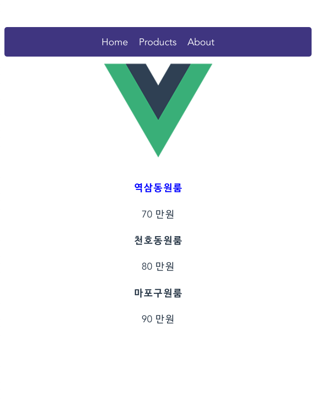
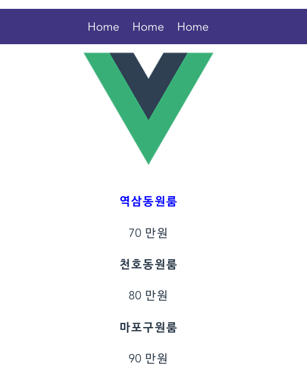

# 반복문

> 뷰에서 반복문 이용이 가능하다

### v-for

* 반복적인 요소들이 출현 = 반복문으로 element를 구성

  ```vue
  <style> /*적용할 CSS*/
  .menu{
    background-color: darkslateblue;
    padding: 15px;
    border-radius: 5px;
  }
  
  .menu a{
    color: white;
    padding:10px;
  }
  </style>
  ```

  



* v-for 사용 전

  ```vue
  <template>
  
    <div class="menu">
      <a>Home</a>
      <a>Products</a>
      <a>About</a>
    </div>
  </template>
  ```

* v-for 사용 후

> v-for = "작명 in 숫자" :key="작명"    구문을 이용할 때

```vue
  <div class="menu">
    <a v-for="작명 in 3" :key="작명">Home</a>
  </div>
```



* v-for와 리스트 적용

  >v-for="자식 in 부모" :key="" 이용

```vue
  <div class="menu">
    <a v-for="m in menu" :key="m">{{m}}</a>
  </div>
```

> 이전 것들 모두 반복문 적용

```vue
  <div v-for="i in 3" :key="i">
    <h4>{{products[i-1]}}</h4>
    <p>{{price[i-1]}} 만원</p>
  </div>
```

