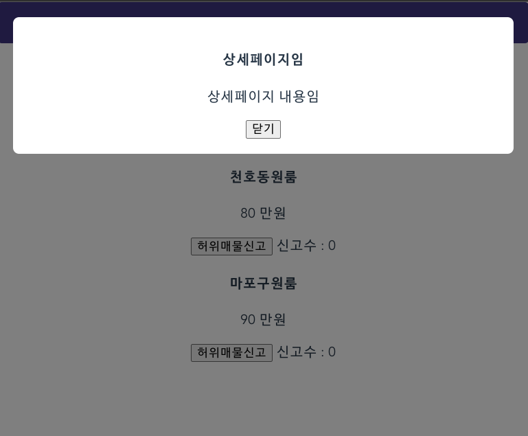

# 모달창 만들기

* html

```vue
<template>
  <div class="black-bg">
    <div class="white-bg">
      <h4>상세페이지임</h4>
      <p>상세페이지 내용임</p>
    </div>
  </div>
</template>
```

* css

```css

<style>
body{
  margin: 0;
}
div{
  box-sizing: border-box;
}
.black-bg{
  width: 100%; height: 100%;
  background-color: rgba(0,0,0,0.5);
  position: fixed;
  padding: 20px;
}
.white-bg{
  width: 100%;
  background-color: white;
  border-radius: 8px;
  padding: 20px;
}
</style>
```

​        

​        

### 동적인 UI 만들기

1. UI의 현재 상태를 데이터로 저장
2. 데이터에 따라 UI가 어떻게 보일지 작성

​        

### v-if

* 참일 때만 해당 요소를 보인다

```vue
  <div class="black-bg" v-if="modalOpen">
    <div class="white-bg">
      <h4>상세페이지임</h4>
      <p>상세페이지 내용임</p>
      <button @click="modalOpen=false">닫기</button>
    </div>
  </div>
```

```vue
<h4 @click="modalOpen=true">{{products[i-1]}}</h4>
```

* 이름을 누르면 변수를 이용해 모달 변수가 true로 바뀌고 숨겨져있던 div태그가 보인다.

