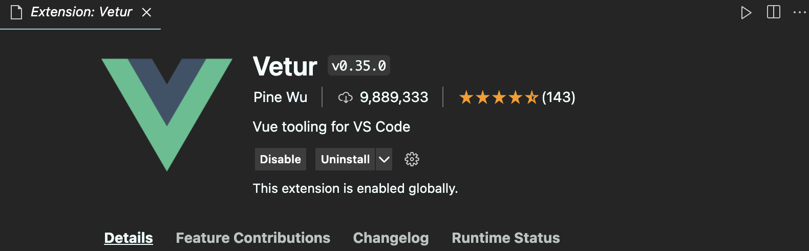
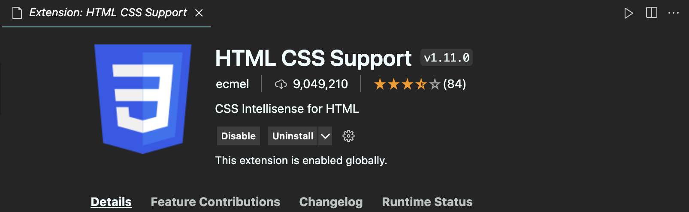
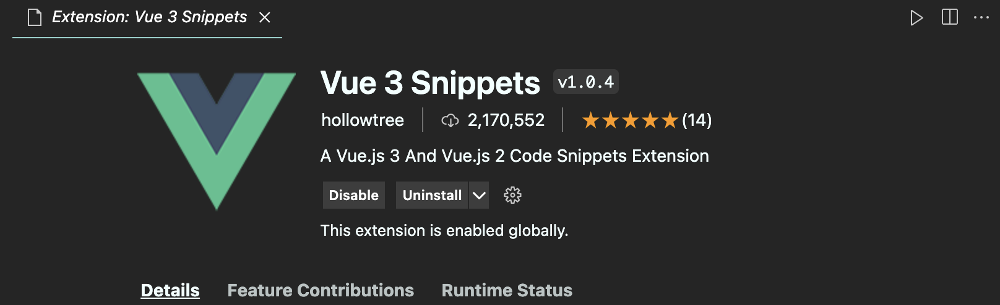
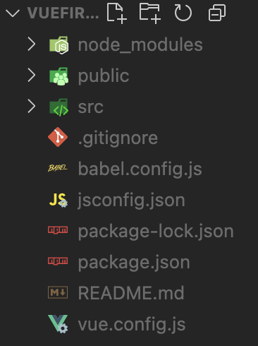
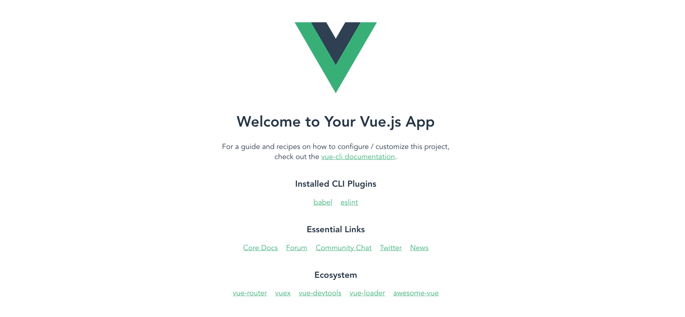

# Vue 설치 및 세팅

​          

## 터미널 설치

```bash
npm install -g @vue/cli # npm Error 발생시 앞에 sudo를 붙인다
```

​         

## VsCode Extensions







​        

## 프로젝트 생성

* 프로젝트 디렉토리에서

```vue
vue create 프로젝트명
```

* 뭐 선택하라고 나오면 Vue3로 선택

​        

## 시작

깃허브 커밋용 디렉토리가 아닌 해당 프로젝트를 직접 VsCode로 오픈해야한다.



* 최상위 디렉토리가 바로 생성된 프로젝트명으로 되어있어야 한다.
* `node_modules`: 프로젝트에 쓰는 라이브러리들

​       

## 작성

* src  - `App.vue`에서 작성할 수 있다.

  * `src`: 실제로 작성한 소스코드를 담는 곳
  * `package.json`: 적용된 모든 버전을 기록

* 미리보기

  ```bash
  npm run serve
  ```

  

* ctrl + click으로 바로 열기 가능

* HelloWorld를 모두 지우고 시작

  ```vue
  <template>
    
    
  </template>
  
  <script>
  
  export default {
    name: 'App',
    components: {
      
    }
  }
  </script>
  
  <style>
  #app {
    font-family: Avenir, Helvetica, Arial, sans-serif;
    -webkit-font-smoothing: antialiased;
    -moz-osx-font-smoothing: grayscale;
    text-align: center;
    color: #2c3e50;
    margin-top: 60px;
  }
  </style>
  ```

​         

## 변환

* `vue`파일을 인식할 수 있는 `html`, `css`, `javascript`로 변환하는 과정이 필요하다.