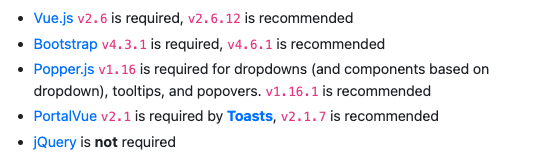

# Vue Bootstrap

> https://bootstrap-vue.org/docs
> https://bootstrap-vue.org/docs/reference/starter-templates
>
> 
>
> ```html
> <link type="text/css" rel="stylesheet" href="https://unpkg.com/bootstrap-vue@latest/dist/bootstrap-vue.css" />
>  <link rel="stylesheet" href="https://cdn.jsdelivr.net/npm/bootstrap@4.5.3/dist/css/bootstrap.min.css"
>      integrity="sha384-TX8t27EcRE3e/ihU7zmQxVncDAy5uIKz4rEkgIXeMed4M0jlfIDPvg6uqKI2xXr2" crossorigin="anonymous">
> ```
>
> * 부트스트랩 버전이 너무 높을 때 충돌이 나는 경우도 존재한다.(팝업창 등 충돌, 이에 4.x대 사용)
>
>   ​          
>
> **부트스트랩 활용**
>
> https://vuejsexamples.com/tag/bootstrap/
>
> https://madewithvuejs.com/bootstrap-vue
>
> https://www.creative-tim.com/templates/vuejs-free

​              

### 프로젝트 생성

> 부트스트랩까지 설치후 Ctrl+C로 접속 종료 후 Vscode를 재시작해준다.

* Manually 하게 세팅한다.

```bash
vue create bv-test
```

* 부트스트랩을 `@vue/cli` 환경에서 설치해준다.

```bash
# With npm: 내부적으로 Popper도 같이 설치된다.
npm install vue bootstrap bootstrap-vue
```

​                       

### 설정 변경

> 5.x대 버전에서 bootstrap 충돌이 발생할 수 있으므로 버전을 낮춰 안정화해준다.

* Package.json

```json
"dependencies": {
    "bootstrap": "^4.5.3",
    "bootstrap-vue": "^2.22.0",
    "core-js": "^3.8.3",
    "vue": "^2.6.14",
    "vue-router": "^3.5.1"
  },
```

​                   

### 추가

* 보통 app.js 나 main.js 에 추가한다.

```js
import Vue from 'vue'
import { BootstrapVue, IconsPlugin } from 'bootstrap-vue'

// Import Bootstrap and BootstrapVue CSS files (order is important)
import 'bootstrap/dist/css/bootstrap.css'
import 'bootstrap-vue/dist/bootstrap-vue.css'

// Make BootstrapVue available throughout your project
Vue.use(BootstrapVue)
// Optionally install the BootstrapVue icon components plugin
Vue.use(IconsPlugin)
```


