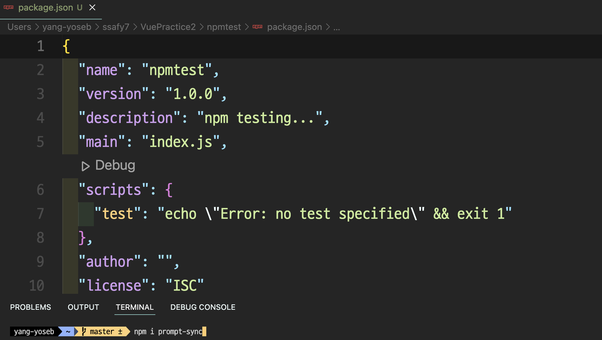
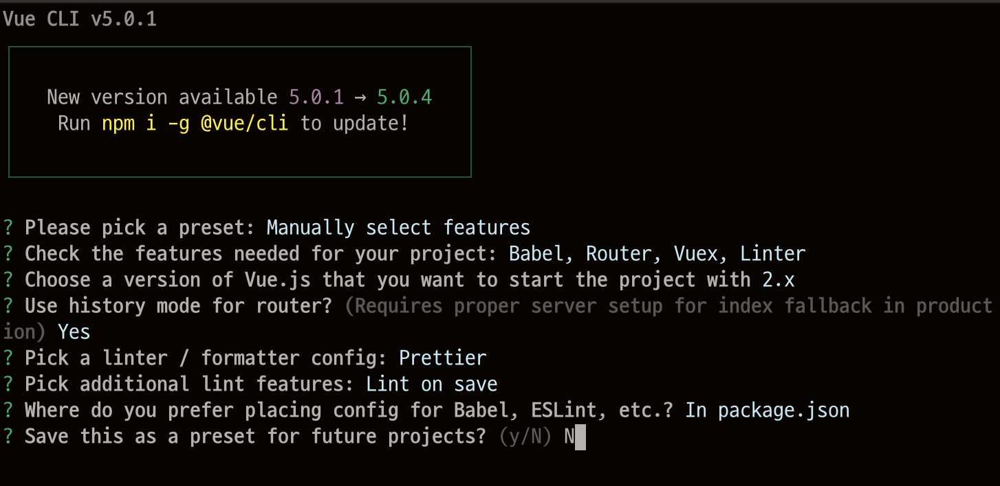

# Vue/cli

>**@vue/cli 실행 환경 구축**
>
>* NodeJS 설치 - LTS 버전(NPM 같이 설치)
>
>  ```
>  https://nodejs.org/ko/
>  ```
>
>  ```bash
>  node -v
>  node --version
>  npm -v
>  ```
>
>* NPM: Node Package Manager
>
>  * Command에서 써드파티 모듈을 설치하고 관리하는 툴
>  * 모듈(패키지) 검색: https://www.npmjs.com/
>
>  ```bash
>  npm init # 새로운 프로젝트나 패키지를 만들 때 사용 (package.json이 생성)
>  npm install package # 생성되는 위치에서만 사용 가능한 패키지로 설치
>  npm install -g package # 글로벌 패키지 추가, 모든 프로젝트에서 사용 가능한 패키지로 설치
>  ```
>
>  * 모듈 설치(prompt-sync): https://www.npmjs.com/에서 검색
>
>    * 모듈 설치하기 (prompt-sync): 해당 폴더에서 `npm init`으로 설정 파일 생성 후 그것을 열어서 설치
>
>      ```bash
>      npm i prompt-sync
>      ```
>
>      
>
>  * 패키지 생성: vue-work/package.json 파일 생성 확인
>
>  * 모듈 동작 확인: VSCode에서 vue-work 폴더 열기
>
>    * module-test.js 파일 생성 후 코드 작성
>
>      ```js
>      var prm = require('prompt-sync')();
>      var name = prm('name : ');
>      console.log(`당신의 이름은 ${name}입니다.`);
>      ```
>
>    * 파일 실행
>
>      ```bash
>      node module-test
>      ```
>
>  * cli 환경에서 JS 언어를 사용할 수 있다.
>
>    * 시작
>
>      ```bash
>      node # node를 켜준다음 JS 코드들 입력하면 사용 가능
>      ```
>
>    * 종료
>
>      ```bash
>      .exit # 빠져나올 수 있다.
>      ```
>
>* NPM을 이용한 @vue/cli 설치
>
>  ​               


​                       

### @vue/cli 설치

```bash
https://cli.vuejs.org/
https://www.npmjs.com/ # 에서 @vue/cli 검색
```

```bash
npm install -g @vue/cli # vue를 사용하면 global에서 사용한다는 뜻
vue -V or vue --version
```

* CLI - Command Line Interface
* Vue.js 개발을 위한 시스템으로 Vue.js에서 공식으로 제공하는 CLI
* 개발의 필수는 아니지만 개발의 편리성을 위해 필수처럼 사용
* Vue 프로젝트를 빠르게 구성할 수 있는 스캐폴딩을 제공
* Vue와 관련된 오픈 소스들의 대부분이 CLI를 통해 구성이 가능하도록 구현되어 있음

​                   

### @vue/cli 프로젝트 생성



* 생성

  ```bash
  vue create <project-name>
  ```

* 생성 중 중지: ctrl + c

* 실행: num run serve

* Manually select features: 기본 설치(bable, aslant만 포함)를 진행할지 플러그인을 선택할지

* 라우터 선책 모드(history) - n일 경우 hashbang모드(#).

* Pick additional init features: 저장시 init 검사만할 지

* Save preset as mypreset: 같은 설정을 다음에서 사용하기 위해 별도의 환경 설정을 만들도록 설정 가능

​                  

#### @vue/cli 프로젝트 생성 후 별도 플러그인 설치

* vue add `<plugin-name>`
  * ex) vue add router

​                

#### axios 추가

> package.json 파일의 dependencies 확인

* npm install axios

​              

### 생성된 프로젝트로 이동 후 실행

```bash
npm run serve
```

​                 

​                      

## @vue/cli 프로젝트 구조

​              

### @vue/cli로 생성된 프로젝트 구조

* 각종 node module이 다운로드 되어있다.

>**@vue/cli 3.X 이상 버전**
>
>* 플러그인 방식으로 기능 추가
>* Webpack 설정 파일 내부 처리
>* UI를 통한 프로젝트 관리
>* 프로젝트 생성시 모듈을 같이 다운로드

​                        

​                       

## SFC

> Single File Component

* 확장자가 `.vue`인 파일
* `.vue` = template + script + style
  * 여러 확장자를 사용할 수 있도록 내부에 `webpack`을 사용
  * ES6를 ES5로 변환해주는 `babel`도 사용
* 구문 강조가 가능
* 컴포넌트에만 CSS의 범위를 제한할 수 있음
* 전처리기를 사용해 기능의 확장이 가능

​              

#### `<template>`

* 기본 언어: html
* 각 `*.vue`파일은 한번에 최대 하나의 `<template>` 블록을 포함할 수 있다.
* 내용은 문자열로 추출되어 컴파일 된 Vue Component의 template 옵션으로 사용

​                    

#### `<script>`

* 기본 언어: js
* 각 `*.vue`파일은 한번에 최대 하나의 `<script>` 블록을 포함할 수 있다.
* ES2015(ES6)를 지원하여 import와 export를 사용할 수 있음.

​                  

#### `<style>`

* 각 `*.vue` 파일은 여러 개의 `<style>` 태그를 지원
* scoped 속성을 이용하여 현재 컴포넌트에서만 사용 가능한 css를 지정 가능

