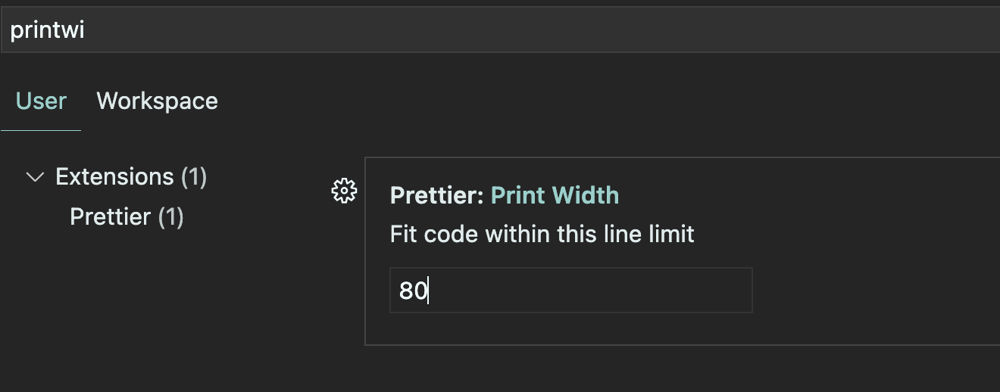

# Vue cli 사용

> `.vue`파일에서 자동완성을 킨 다음 (cmd+i) default 입력: 틀 만들어줌
>
> * package.json과 lock.json의 관계: [링크](https://velog.io/@songyouhyun/Package.json과-Package-lock.json의-차이)
>
> moment npm package 다운
>
> ```bash
> npm i axios
> npm i moment
> ```

​              

## 오류 잡기

​                       

### 1. package.json 설정

* 해당 내용 추가: 새로 만들어낸 형식(CRLF)이 기존 LF 형식이 매칭 안될 때 발생

```json
 "rules": {
      "prettier/prettier" : ["error", {"endOfLine": "auto"}]
    }
```

```json
  "scripts": {
    "serve": "vue-cli-service serve --port 80", //기본 포트번호를 80으로 설정할 수도 있다.
    "build": "vue-cli-service build",
    "lint": "vue-cli-service lint"
  },
```

​                 

### 2. PrintWidth 설정



​               

### 3.  Prettier format 

> 파일 우클릭 후 Format Document with 클릭 - Prettier 적용


​                

* 위 방법마저 안되면 서버 재시작

  ```
  ctrl + c
  ```

​              

### 4. 프리티어 잦은 오류 해결

1. 실행전 서버를 내립니다.
2. 아래 내용을 .eslintrc.js에 복붙합니다.

```json
module.exports = {
    root: true,
    env: {
        node: true,
    },
    extends: [
        "plugin:vue/essential",
        "eslint:recommended",
        "plugin:prettier/recommended",
    ],
    parserOptions: {
        parser: "@babel/eslint-parser",
    },
    rules: {
        "no-console": process.env.NODE_ENV === "production" ? "warn" : "off",
        "no-debugger": process.env.NODE_ENV === "production" ? "warn" : "off",
        "prettier/prettier": [
            "error",
            {
                endOfLine: "auto",
                useTabs: true,
            },
        ],
    },
};
```

3. npm run lint --fix 명령어를 프로젝트 터미널에서 실행합니다. (현재 설정으로 모든 파일을 자동 정렬해줍니다.)
4. 서버를 실행한 뒤 에러가 발생하는지 확인합니다.
5. ALT + SHIFT + F 의 설정을 prettier - code fommater로 변경 한 뒤, 단축키를 입력 시 제대로 정렬되는지 확인합니다. 

​              

​                 

## Vue 프로젝트 구조

​                     

### 경로 - `@`

* `/src`를 뜻함

```js
import HelloWorld from "@/components/HelloWorld.vue";
```

​                       

### 컴포넌트 위치 분리

> router에 직접 URL 경로로 연결되는 컴포넌트: `views` 폴더에 집어넣는다.
> 그 외 컴포넌트: `components` 폴더에 저장한다.

​                          

### 폴더 경로 import

* 폴더 내부 모든 파일을 가져오는 것이 

​               

### Axios 연결

* `/src`에 `api`폴더를 만들고 `http.js` 생성

```js
import axios from "axios";
export default axios.create({
    baseURL: "http://localhost:9999/vue",
    headers: {
        "Content-Type": "application/json"
    },
})
```

* 위처럼 axios 객체를 만들어서 던져준다.

​                 

### params 사용시

```vue
 <router-link
        :to="{ name: 'detail', params: { articleno: article.articleno } }"
        >{{ article.subject }}</router-link
 >
```

* router에 묶어서 보내는지 확인

```json
{
  path: "detail/:articleno",
  name: "detail",
  component: BoardDetail,
},
{
  path: "modify:articleno",
  name: "modify",
  component: BoardModify,
},
```

