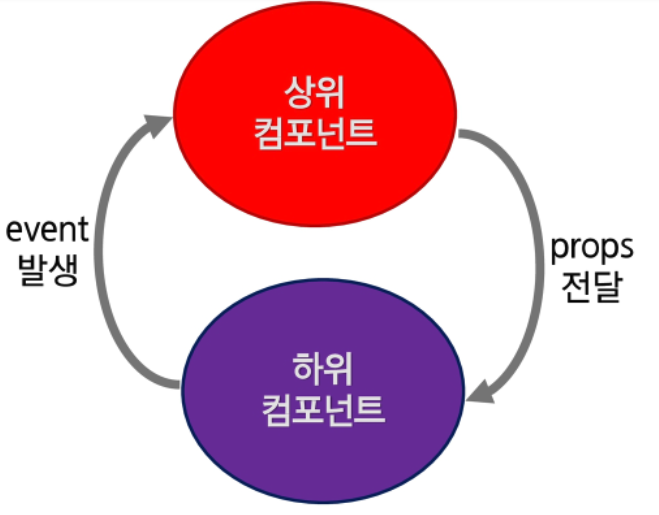

# Component

> * Vue 의 가장 강력한 기능 중 하나
> * HTML Element를 확장하여 재사용 가능한 코드를 캡슐화
> * Vue Component는 Vue Instance이기도 하기 때문에 모든 옵션 객체 사용
> * Life Cycle Hook 사용 가능
> * 전역 컴포넌트와 지역 컴포넌트


​                     

### 전역 컴포넌트 등록

* 전역 컴포넌트를 등록하려면, Vue.component(tagName, options)를 사용

* 권장하는 컴포넌트 이름: 케밥 표기법 (전부 소문자, - ) 이름표기법 참조, Style Guide(명명 규칙)

  ```
  my-component    //케밥 표기법
  ```

  ```
  MyComponentName // 파스칼 표기법
  ```

```vue
<body>
  <div id="app1">
    <my-global></my-global>
  </div>
  <div id="app2">

  </div>
  <script>
    // 전역 컴포넌트 설정
    Vue.component("MyGlobal", { //여기는 파스칼 표현법인데 위의 <my-global>로(케밥표현법) 인식이 된다.
      template: `<h2>전역 컴포넌트입니다.</h2>`,
    })


    new Vue({
      el: '#app1',
    });
    new Vue({
      el: '#app2',
    });
  </script>
</body>
```

​                 

### 지역 컴포넌트 등록

* 컴포넌트를 components 인스턴스 옵션으로 등록함으로써 다른 인스턴스/컴포넌트의 범위에서만 사용할 수 있는 컴포넌트를 만들 수 있다.

  ```vue
  <body>
    <div id="app1">
      <my-local></my-local>
      <my-local></my-local>
    </div>
    <div id="app2">
      <my-local></my-local>
      <my-local></my-local>
    </div>
    <script>
      new Vue({
        el: '#app1', //범위는 #app1 내부이기 때문에 위에서 4번을 써도 2개만 보인다.
        // 지역 컴포넌트 설정
        components: {
          MyLocal: {
            template: `<h2>지역 컴포넌트입니다.</h2>`
          } 
        }
      });
      new Vue({
        el: '#app2',
      });
    </script>
  </body>
  ```

  ​              

  ​      

#### - Component Template

> template 엔터를 누르면 div 태그도 같이 생긴다 = div 태그는 필수

```vue
<script>
    Vue.component('MyComp', {
      template: '#mycomp', //mycomp 라는 id를 사용하는 template를 사용
      data() {
        return {
          msg: 'hello component',
        };
      },
    });

</script>
```

* template 만들어서 불러오도록 하기

```vue
<body>
  <div id="app">
    <my-comp></my-comp>
  </div>
  <!-- template 설정 -->
  <template id="mycomp">
    <div>
      <h2>{{msg}}</h2>
    </div>
  </template>
  <script>
    Vue.component('MyComp', {
      template: '#mycomp',
      data() {
        return {
          msg: 'hello component',
        };
      },
    });

    new Vue({
      el: '#app',
    });
  </script>
</body>
```

* template 주의점: div는 2개가 안된다.(쓰기 위해선 If문 등을 통해 한 개만 나오도록)

```vue
<template id="CountView">
      <div>
        <span>{{ count }}</span>
        <button @click="count++">클릭</button>
      </div>
</template>
```

* template과 v-for 응용

```vue
<body>
  <div id="app">
    <child-comp v-for="(area, i) in areas" :key="i" :area="area" v-bind:msg="msg[parseInt(Math.random() * 5)]">
    </child-comp>
  </div>
  <template id="ChildComp">
    <div>
      <h2>SSAFY {{area}}지역 7기 {{msg}}</h2>
    </div>
  </template>
  <script>
    Vue.component('childComp', {
      props: {
        'area': String,
        'msg': {
          type: String, require: true
        }
      },
      template: '#ChildComp',
    });
    new Vue({
      el: '#app',
      data: {
        areas: ['부울경', '광주', '구미', '대전', '서울'],
        msg: ['굿^^', '최고!!', '실화냐?', '좋아요*', '짱!!'],
      },
    });
  </script>
</body>
```

​              

​                

#### - Component data 공유

> 전역변수가 아닌 지역변수로 설정해야 값이 공유되지 않는다.

```vue
<body>
  <h2>컴포넌트 데이터 공유 문제</h2>
  <div id="app">
    <count-view></count-view>
    <count-view></count-view>
    <count-view></count-view>
  </div>
  <template id="CountView">
    <div>
      <span>{{ count }}</span>
      <button @click="count++">클릭</button>
    </div>
  </template>
  <script>
    let num = {
      count: 0,
    };
    Vue.component('countView', {
      data() {
        return num;
      },
      template: '#CountView',
    });
    new Vue({
      el: '#app',
    });
  </script>
</body>
```

​                 

​                     

## Component간 통신

> * 단 방향 데이터 전달이다.(부모 > 자식)
> * 상위(부모) - 하위(자식) 컴포넌트 간의 data 전달 방법
> * 부모에서 자식: props라는 특별한 속성을 전달 (Pass Props)
> * 자식에서 부모: event로만 전달 가능 (Emit Event), 데이터 전달 불가



​                     

#### - 상위에서 하위 컴포넌트로 data 전달

* 하위 컴포넌트는 상위 컴포넌트의 값을 직접 참조 불가능
* data와 마찬가지로 props 속성의 값을 template에서 사용이 가능

​           

**props**

```vue
<body>
  <div id="app">
    <h2>props test</h2>
    <child-component pdata="안녕하세요 props 입니다."></child-component>
    <!-- 넘길 때 pdata에 넘겨주고 -->
  </div>
  <script>
    //하위 컴포넌트
    Vue.component("ChildComponent", {
      template: `<span>{{pdata}}</span>`, //여기서 넘겨준 pdata를 받아서 <child-component>에 던짐.
      props: { //pdata 의 타입과 required 지정
        pdata: {
          type: String,
          required: true,
        }
      }
    })
    new Vue({
      el: '#app',
    });
  </script>
</body>
```

​                  

​                

#### - 렌더링 과정

1. new Vue()로 상위 컴포넌트인 인스턴스를 하나 생성
2. Vue.component()를 이용하여 하위 컴포넌트인 child-component를 생성
3. `<div id="app">` 내부에 `<child-component>`가 있기 때문에 하위 컴포넌트가 된다. 처음 생성한 인스턴스 객체가 #app의 요소를 가지기 때문에 부모와 자식 관계가 성립한다.
4. 하위 컴포넌트에 props 속성을 정의한다 ['propsdata']
5. html에 컴포넌트 태그(child-component)를 추가한다.
6. 하위 컴포넌트에 v-bind 속성을 사용하면 상위 컴포넌트의 data의 key에 접근이 가능하다(message).
7. 상위 컴포넌트의 message 속성 값인 String 값이 하위 컴포넌트의 propsdata로 전달된다.
8. 하위 컴포넌트의 template 속성에 정의된 `<span>{{propsdata}}</span>`에게 전달된다.

