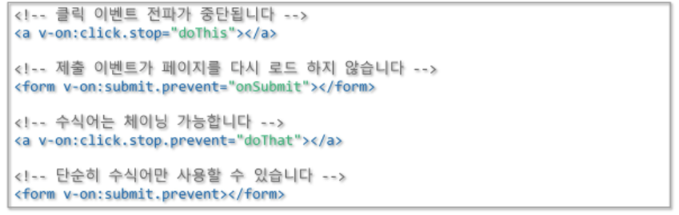

# Vue Event

> * DOM Event를 청취하기 위해 v-on directive 사용
> * inline event handling
> * method를 이용한 event handling

​            

### Vue event 청취: v-on

* v-on directive를 사용하여 DOM 이벤트를 듣고 트리거 될 때 JavaScript를 실행할 수 있다.

  ```vue
  <div id="app">
        <button v-on:click="counter += 1">클릭</button>
        <p>위 버튼을 클릭한 횟수는 {{counter}} 번 입니다.</p>
  </div>
  ```

* event 객체를 활용해 작동할 수도 있다.

  ```java
  methods: {
          greet: function (event) {
            alert('Hello ' + this.name + '!');
            console.dir(event.target);
            event.target.innerText = "눌러짐";
          },
        },
  ```

​            

#### - method event handler

* 이벤트 발생시 처리 로직을 v-on에 넣기 힘들다. 이 때문에 v-on에서는 이벤트 발생시 처리해야하는 method의 이름을 받아 처리.

​                 

#### - inline method handler

* 메소드 이름을 직접 바인딩 하는 대신 인라인 Javascript 구문에 메소드를 사용할 수 있다.
* 원본 DOM 이벤트에 액세스 해야 하는 경우 특별한 $event 변수를 사용해 메소드에 전달할 수 있다.

```vue
 <body>
    <div id="app">
      <form action="http://www.naver.com">
        <button v-on:click="greet1('SSAFY')">Greet</button>
        <button v-on:click="greet2($event, 'Ssafy')">Greet</button>
      </form>
    </div>
    <script>
      new Vue({
        el: '#app',
        methods: { 
          greet1: function (msg) { //form의 action에 의해 button이 이동해버린다.
            alert('Hello ' + msg + '!'); //왜냐하면 button에는 submit() 기능이 포함되어있기 때문에
            console.dir(event.target);
          },
          greet2: function (e, msg) { //이를 막기 위해 $event 객체를 넣어주고
            if (e) e.preventDefault(); //e.preventDefault()로 막아준다
            alert('Hello ' + msg + '!'); //혹은 input type="button"으로 원래 역할을 명시해준다.
            console.dir(e.target);
          },
        },
      });
    </script>
  </body>
```

​                


#### - 이벤트 수식어 (Event Modifier)



* method 내에서 작업할 수도 있지만 method는 DOM의 이벤트를 처리하는 것보다 data 처리를 위한 로직만 작업하는 것이 좋다.
* 이 문제를 해결하기 위해, Vue는 v-on 이벤트에 이벤트 수식어를 제공한다.
* 수식어는 점으로 표현된 접미사이다.

​          

#### - 키 수식어 (Key Modifier)

* Vue는 키 이벤트를 수신할 때, v-on에 대한 키 수식어를 추가할 수 있다.

  ```vue
  <!-- only call `vm.submit()` when th `key` is `Enter` -->
  <input v-on:keyup.enter="submit">
  ```

* Key code

  ```
  .enter(.13)
  .tab
  .delete // "Delete 와 Backspace 키 모두 캡쳐"
  .esc
  .space
  .up
  .down
  .left
  .right
  ```

  ​            

#### - ref, $refs

* 뷰에서는 $refs 속성을 이용해 DOM에 접근할 수 있다.
* 단, 뷰의 가장 중요한 목적 중 하나는 개발자가 DOM을 다루지 않게 하는 것으므로, 되도록 ref를 사용하는 것을 피하는 것이 좋다.

​                 

​                   

### Class binding

> * element의 class와 style을 변경
> * v-bind:class는 조건에 따라 class를 적용할 수 있다. 

* 예제1

```vue
<style>
    .active {
      background: rgb(106, 148, 238);
      color: white;
    }

    div {
      width: 200px;
      height: 200px;
      border: 1px solid #444;
    }
  </style>
<body>
<div id="app">
    <div v-bind:class="{ active: isActive }">VueCSS적용</div>
    <button v-on:click="toggle">VueCSS</button>
</div>
  <script type="text/javascript">
    new Vue({
      el: '#app',
      data: {
        isActive: false,
      },
      methods: {
        toggle: function () {
          this.isActive = !this.isActive;
        },
      },
    });
  </script>
</body>
```

* 예제2

```vue
<!DOCTYPE html>
<html lang="en">
  <head>
    <meta charset="UTF-8" />
    <meta name="viewport" content="width=device-width, initial-scale=1.0" />
    <title>Vue.js</title>
    <script src="https://cdn.jsdelivr.net/npm/vue/dist/vue.js"></script>
    <style type="text/css">
      .completed {
        text-decoration: line-through;
        font-style: italic;
      }
    </style>
  </head>
  <body>
    <div id="app">
      <ul>
        <li :class="{completed: todo.done}" :style="myStyle" v-for="todo in todos">
          {{todo.msg}}
          <button @click="complete(todo)" class="btn">완료</button>
        </li>
      </ul>
    </div>
    <script>
      new Vue({
        el: '#app',
        data: {
          todos: [
            {
              msg: '5시간 잠자기',
              done: false,
            },
            {
              msg: '알고리즘 1시간 공부하기',
              done: false,
            },
            {
              msg: 'Vue 1시간 공부하기',
              done: false,
            },
          ],
          myStyle: {
            fontSize: '20px',
          },
        },
        methods: {
          complete: function (todo) {
            if(!todo.done){
              todo.msg = todo.msg + '완료';
              todo.done = !todo.done;
              event.target.innerText = "취소";
            } else{
              todo.msg = todo.msg.substr(0, todo.msg.indexOf("완료"));
              todo.done = !todo.done;
              event.target.innerText = "완료";
            }
            
          },
        },
      });
    </script>
  </body>
</html>
```

​                

​                     

#### - 폼 입력 바인딩 (Form Input Bindings)

* v-model directive를 사용하여 폼 input과 textarea element에 양방향 데이터 바인딩을 생성할 수 있다.
  * text와 textarea 태그는 value 속성과 input 이벤트를 사용한다.
  * 체크박스들과 라디오버튼들은 checked 속성과 change 이벤트를 사용한다.
  * Select 태그는 value를 prop으로, change를 이벤트로 사용한다.

```vue
<body>
  <div id="app">
    <div>
      아이디 :
      <input v-model.trim="id" placeholder="아이디를 입력하세요" />
      <!-- v-model은 기본적으로 모든 key stroke가 발생할 때마다 값을 업데이트 시킨다.
           .lazy 수식어를 추가하여 change 이벤트 이후에 동기화 할 수 있습니다. -->
      <input v-model.lazy="id" placeholder="아이디를 입력하세요" />
    </div>
    <div>
      메세지 :
      <textarea v-model="message" placeholder="내용을 입력하세요"></textarea>
    </div>
    <p>{{ id }} 님에게 보내는 메세지 : {{ message }}</p>
  </div>
  <script>
    new Vue({
      el: '#app',
      data: {
        id: '',
        message: '',
      },
    });
  </script>
</body>
```

* .lazy: v-model에서 값이 바뀌고 input 태그를 빠져나오면 적용

​            

#### form - checkbox

```vue
<body>
  <div id="app">
    <div>당신이 가고 싶은 지역을 선택하시오</div>
    <input type="checkbox" id="buk" value="부울경" v-model="checkedAreas" />
    <label for="buk">부울경</label>
    <input type="checkbox" id="gwangju" value="광주" v-model="checkedAreas" />
    <label for="gwangju">광주</label>
    <input type="checkbox" id="gumi" value="구미" v-model="checkedAreas" />
    <label for="gumi">구미</label>
    <input type="checkbox" id="daejeon" value="대전" v-model="checkedAreas" />
    <label for="daejeon">대전</label>
    <input type="checkbox" id="seoul" value="서울" v-model="checkedAreas" />
    <label for="seoul">서울</label>
    <br />
    <span>체크한 이름: {{ checkedAreas }}</span>
  </div>
  <script>
    new Vue({
      el: '#app',
      data: {
        checkedAreas: [],
      },
    });
  </script>
</body>
```

```vue
<body>
  <div id="app">
    <div>
      <p>
        이메일 수신
        <input type="checkbox" id="emailYN" v-model="email" />
        <label for="emailYN">{{ email }}</label>
      </p>
    </div>
    <div>
      <p>
        SMS 수신
        <input type="checkbox" id="smsYN" v-model="sms" true-value="Y" false-value="N" />
        <label for="smsYN">{{ sms }}</label>
      </p>
    </div>
  </div>
  <script>
    new Vue({
      el: '#app',
      data: {
        email: false,
        sms: 'Y',
      },
    });
  </script>
</body>
```

​               

#### form - radio

```vue
<body>
  <div id="app">
    <div>수업을 듣는 지역을 선택하시오</div>
    <div>
      <input type="radio" id="buk" value="부울경" v-model="ckArea" />
      <label for="buk">부울경</label>
      <input type="radio" id="gwangju" value="광주" v-model="ckArea" />
      <label for="gwangju">광주</label>
      <input type="radio" id="gumi" value="구미" v-model="ckArea" />
      <label for="gumi">구미</label>
      <input type="radio" id="daejeon" value="대전" v-model="ckArea" />
      <label for="daejeon">대전</label>
      <input type="radio" id="seoul" value="서울" v-model="ckArea" />
      <label for="seoul">서울</label>
    </div>
    <span>선택한 지역 : {{ ckArea }}</span>
  </div>
  <script>
    new Vue({
      el: '#app',
      data: {
        ckArea: '광주',
      },
    });
  </script>
</body>
```

​                  

#### form - select

> * Select box일 경우 선택된 항목의 value 속성의 값을 관리
> * `v-model` 표현식의 초기 값이 어떤 옵션에도 없으면 `<select>` element는 "선택없음" 상태로 렌더링

```vue
<body>
  <div id="app">
    <div>
      
      <!-- 평범한 select box -->
      <select>
        <option value="1">1</option>
        <option value="2" selected>2</option>
        <option value="3">3</option>
      </select>
      
      <p>수업을 듣는 지역을 선택하시오</p>
      <select v-model="selectedArea">
        <option v-for="option in options" v-bind:value="option.value">{{ option.text }}</option>
      </select>
    </div>
    <span>선택한 지역 : {{ selectedArea }}</span>
  </div>
  <script>
    new Vue({
      el: '#app',
      data: {
        selectedArea: '',
        options: [
          { text: '서울', value: 'seoul' },
          { text: '광주', value: 'gwangju' },
          { text: '대전', value: 'daejeon' },
          { text: '구미', value: 'gumi' },
          { text: '부울경', value: 'buk' },
        ],
      },
      created() {
        param = 'gwangju';
        this.selectedArea = param;
      },
    });
  </script>
</body>
```


