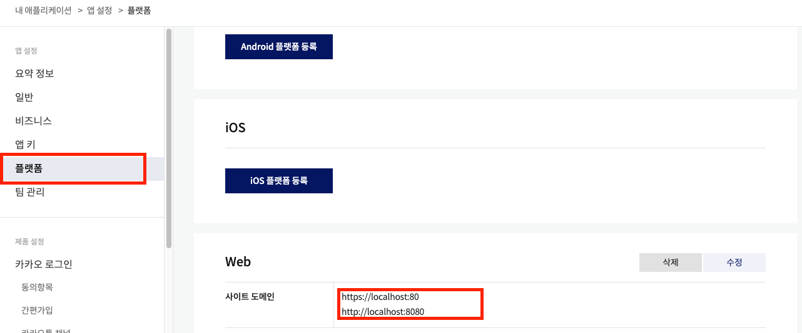
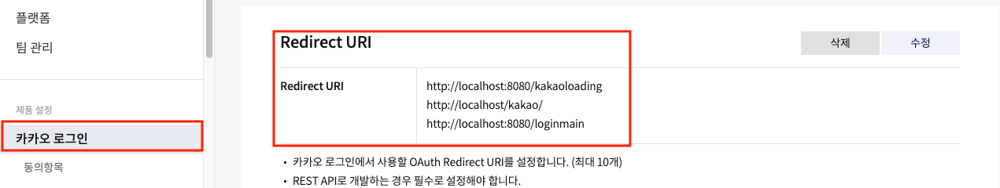
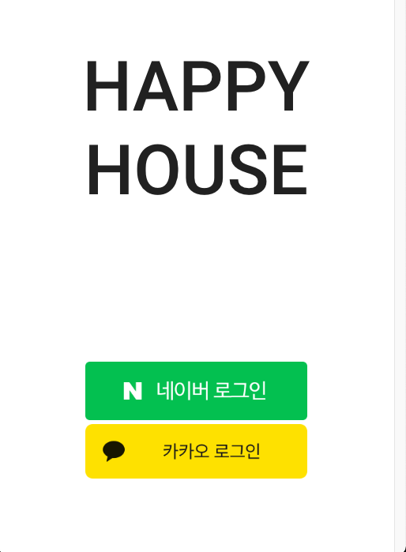
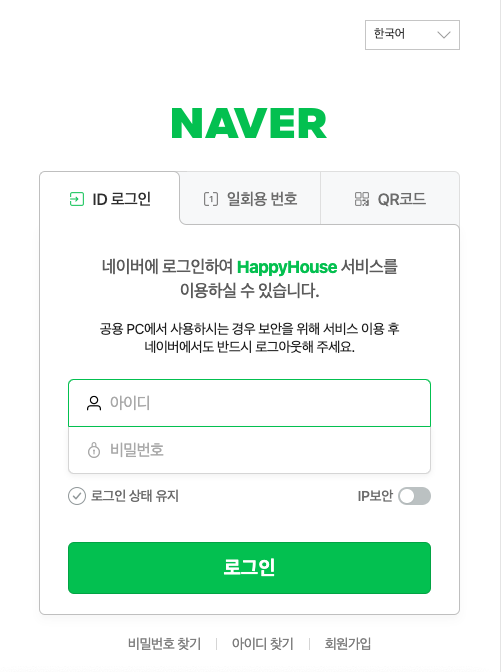
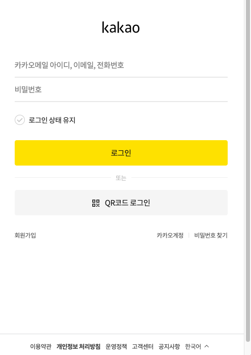
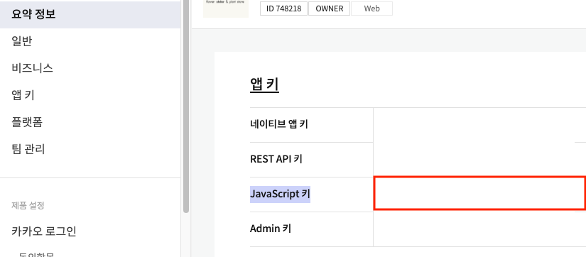
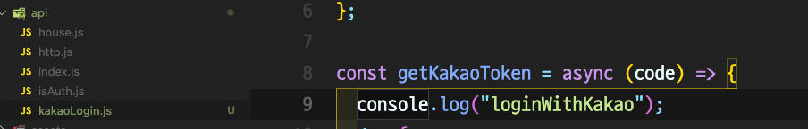

# Vue.js 카카오 소셜 로그인

> 1. 카카오 API를 활용하기 위해선 https://developers.kakao.com/ 에서 로그인을 진행한다.
>
> 2. **내 애플리케이션** 메뉴로 들어간다.
>
> 3. **+ 애플리케이션 추가하기** 버튼을 클릭 후 API 사용을 위한 WEB 정보를 입력한다.
>
> 4. 등록 이후 애플리케이션 목록에서 들어간다.
>
> 5. **플랫폼**에서 프론트엔드 서버와 백엔드 서버를 등록한다.
>
>    
>
> 6. **카카오 로그인**의 **Redirect URI** 또한 설정이 완료되어있어야 데이터를 받을 수 있다.
>
>    
>
>    ​                    

## 구현 화면



* Naver 로그인 클릭 시

  

* Kakao 로그인 클릭

  

​                   

​                     

## 소셜 로그인 구현의 문제점

​                       

### 1. Vue.js는 서버(Spring 등)에서 보내는 redirect 신호에 반응하지 않는다.

> 이를 극복하기 위한 방법으로 RESTful 한 방식,  서버에서 문자열(JSON) 등을 통해 주소를 알려주고 Vue에서 그 문자열을 받아 `location.href = ""`로 이동하는 것을 생각할 수 있다. 하지만 다음과 같은 소셜 로그인의 특징으로 인해 이 방법은 사용하기 어렵다.
>
> * 소셜 로그인을 위해서 사용자는 먼저 **로그인 페이지로 이동**한다.
> * 로그인을 성공적으로 마치면 kakao 서버에서 개발자가 설정한 주소(redirectUri)로 JSON 데이터를 보내준다.(callback)
> * 서버에서는 JSON 데이터를 바로 받아줄 수 있지만 모든 작업을 처리하고 보내는 redirect 신호에 Vue는 반응하지 않기 때문에 서버로 보낸다면 페이지 이동을 진행할 수 없다.
> * 프론트엔드에서는 이미 페이지를 이동하기 때문에 개발자의 통제를 벗어나 있다. 즉 두 방법 모두 사용하기 어렵다.

​                 

### 2. Vue.js에서 기업이 만든 SDK 파일을 사용한다.

> 위와 같은 이유로 기업에서 만들어 놓은 SDK를 사용해야한다.
> Vue.js에서 kakao에서 보내주는 access_token을 받는 작업(**callback 부분**)까지 완료해야 위의 문제를 넘어갈 수 있다.
> 하지만 이러한 강제성 때문에 또 다시 다음과 같은 문제점이 발생한다.
>
> * Vue.js(프론트단)에서 access_token, refresh_token과 같은 중요 정보가 저장된다.
>
> 서버로 보내기 위한 refresh_token 또한 노출되기 때문에 보안이 취약해진다.
>
> ​             
>
> 또 다른 문제가 있다. kakao 로그인 방식은 크게 두 가지로 나눌 수 있다.
>
> 1. 새 창에서 kakao 로그인
> 2. 현재 페이지에서 kakao 로그인
>
> 새 창에서 로그인하는 경우 데이터를 비교적 간단하게 받아올 수 있다(**솔루션 1번**).
> 하지만 **Vue.js로 웹앱을 만든다면 현재 페이지에서 로그인**하도록 만들어야 한다.
> 이 때 백엔드를 이용해 자동 회원가입/로그인까지 구현한다면 복잡도가 더 증가한다.

​                   

### 3. Kakao에서 제공하는 식별 id_token이 매우 길다

* 약 700자의 길이: 네이버가 제공하는 식별 id의 길이(약 50자)보다 길어 데이터베이스의 정보를 불어올 때 조회를 잘 하지 못한다.
* 식별용으로 주는 id의 활용도가 떨어진다.
* 소셜 로그인 이후 email 등 다른 식별자로 회원정보를 불어온다.

​                     

## Kakao 소셜 로그인 구현

> 곧 바로 access_token이나 유저 정보를 받기 위해서는 새로운 창에서 소셜 로그인을 진행해야한다.
> 현재 페이지에서 이동하고 싶다면 이동한 페이지에서 access_token을 다시 요청해야한다.

​            

### 0. 기본 설정

#### 1) SDK 연결하기

* Vue 내부 `public/index.html`에 `script`파일을 복사해 붙여넣는다.

  ```html
  <!--카카오 소셜 로그인-->
  <script src="https://developers.kakao.com/sdk/js/kakao.js"></script>
  ```

* Vue 내부 `src/main.js`에 다음을 붙여넣는다.

  * init을 여러 번 호출하면 에러가 발생하므로 `main.js`에서 한 번만 초기화해주는 것이다.

  

  ```js
  window.Kakao.init("== 요약정보: JavaScript 키 ==");
  ```

​                  

#### 2) SDK 사용을 위한 js 파일 작성

* 파일 경로: `src/api/kakaoLogin.js` 경로로 js 파일을 만들어 다음과 같이 작성했다.

  * 출처: https://velog.io/@2taesung/Vue.js-kakaologin
  * 비동기 통신을 원활하게 적용하기 위해 js파일로 분리

  ```js
  import axios from "axios";
  
  const kakaoHeader = {
    Authorization: "== Admin 키 입력 ==",
    "Content-type": "application/x-www-form-urlencoded;charset=utf-8",
  };
  
  //access_token, refresh_token, id_token 정보를 받아주는 메서드
  const getKakaoToken = async (code) => {
    console.log("loginWithKakao");
    try {
      const data = {
        grant_type: "authorization_code",
        client_id: "== REST API 키 ==",
        redirect_uri: "데이터를 받아줄 redirect 경로",
        code: code,
      };
      const queryString = Object.keys(data)
        .map((k) => encodeURIComponent(k) + "=" + encodeURIComponent(data[k]))
        .join("&");
  
      const result = await axios.post(
        `https://kauth.kakao.com/oauth/token`,
        queryString,
        { headers: kakaoHeader },
      );
  
      // console.log("카카오 토큰", queryString);
      console.log(result);
      return result;
    } catch (e) {
      return e;
    }
  };
  
  export { getKakaoToken };
  
  ```

  

​                    

### 1. 새 창에서 소셜 로그인을 진행 후 데이터 수집

> 새로운 창이 열리지만 매우 단순하게 access_token 을 받아낼 수 있다.

* 난이도: ⭐️⭐️

* 사용자는 모달창에서 로그인을 하고 kakao에서 보내주는 데이터는 현재 페이지로 바로 받아줄 수 있다.

* 버튼에 아래 `kakaoLogin()` 메서드를 연결해준다.

  ```js
  <div @click="kakaoLogin">카카오 연동</div>
  ```

* 메서드 정의

  ```js
  methods: {
      kakaoLogin() {
        window.Kakao.Auth.login({
          scope: "account_email, gender",
          success: this.GetMe,
        });
      },
      GetMe(authObj) {
        console.log(authObj); //access_token, refresh_token 반환
        window.Kakao.API.request({
          url: "/v2/user/me",
          success: (res) => {
            const kakao_account = res.kakao_account;
            const userInfo = {
              email: kakao_account.email,
            };
  
            console.log("유저정보 : ", userInfo); // 유저 정보 반환
            this.$bvModal.hide("bv-modal-example");
          },
          fail: (error) => {
            this.$router.push("/errorPage");
            console.log(error);
          },
        });
      },
    },
  ```

  ​                  

### 2.  현재 창에서 소셜 로그인 진행하기

> 현재 페이지에서 로그인하지만 이동한 후 kakao에서 보내주는 code값을 다시 보내서
> callback으로 access_token을 받아주는 작업이 필요하다.

* 난이도: ⭐️⭐️⭐️ **/** ⭐️⭐️⭐️⭐️

* 현재 창에서 로그인을 진행하는 대신 통신을 나눠서 access_token을 받아내야 한다.

* 현재 창에서 소셜 로그인 창으로 이동하기

  * `redirectUri`에 로그인을 완료한 후 이동할 페이지를 지정한다.

  ```js
  methods: {
      kakaoLogin() {
        const params = {
          redirectUri: "http://localhost:8080/kakaoloading",
        };
        window.Kakao.Auth.authorize(params);
      },
    },
  ```

* 이동한 페이지에서 js 파일의 메서드를 사용한다.

* * kakaoLogin.js에 작성해놓은 메서드를 사용

  

* 이동한 페이지에서 created() 로 `kakaoLogin.js`에 작성한 메서드를 이용해 데이터를 불러온다.

  * 데이터 불러온 것을 마치자마자 서버로 access_token과 refresh_token, id_token을 보내어 DB에 데이터를 저장하고 자동 회원가입/로그인을 진행한다.
  * 데이터 불러온 것을 알려주기위해 vue의 `watch`를 활용한다.

  ```js
  <template>
    <div>
      <b-icon
        icon="star-fill"
        animation="fade"
        color="yellow"
        font-scale="4"
        x-large
      ></b-icon>
    </div>
  </template>
  
  <script>
  import http from "@/api/http";
  import { mapMutations } from "vuex";
  import { getKakaoToken } from "@/api/kakaoLogin.js";
  
  export default {
    name: "KakaoLoadingView",
    methods: {
      ...mapMutations(["SET_USER_INFO"]),
    },
    created() { // 로드 되자마자 js 파일의 메서드로 access_token값을 가져온다.
      const code = this.$route.query.code;
      let data = async () => {
        const result = await getKakaoToken(code);
        this.id_token = result.data.id_token;
        this.access_token = result.data.access_token;
        this.refresh_token = result.data.refresh_token; //data 내부에 저장
        return result;
      };
      data();
    },
    data() { // created()에서 불러온 값들이 저장되어 값이 변경된다.
      return {
        id_token: "",
        refresh_token: "",
        access_token: "",
      };
    },
    watch: {
      //watch를 통해 data() 내부의 값들이 바뀌면 다시 비동기 통신을 진행한다.
      refresh_token: function () {
        http
          .post(
            `/kakao/`, // 값을 보내줄 서버 주소
            JSON.stringify({
              id: this.id_token,
              refresh_token: this.refresh_token,
              access_token: this.access_token,
            }),
          )
          .then((data) => {
            const obj = JSON.parse(data.request.response);
            let message = obj.message;
            if (message === "LOGIN") {
              //회원가입 화면으로 이동
              sessionStorage.setItem("access_token", obj.access_token);
  
              //로그인시 최초 정보 저장
              let tmp = {
                platform: obj.userInfo.platform,
                email: obj.userInfo.email,
                userid: obj.userInfo.userid,
                username: obj.userInfo.username,
                joindate: obj.userInfo.joindate.slice(0, 10),
              };
  
              this.SET_USER_INFO(tmp);
              this.$router.push({ name: "home" });
            } else if (message === "REGISTER") {
              console.log("리프레시: ", this.refresh_token);
              this.$router.push({
                name: "register",
                params: {
                  platform_id: obj.userInfo.platform_id,
                  platform: obj.userInfo.platform,
                  email: obj.userInfo.email,
                  refresh_token: this.refresh_token,
                },
              });
            } else {
              console.log("회원가입 실패");
            }
          })
          .catch((error) => {
            console.log(error);
          });
      },
    },
  };
  </script>
  
  ```

  

