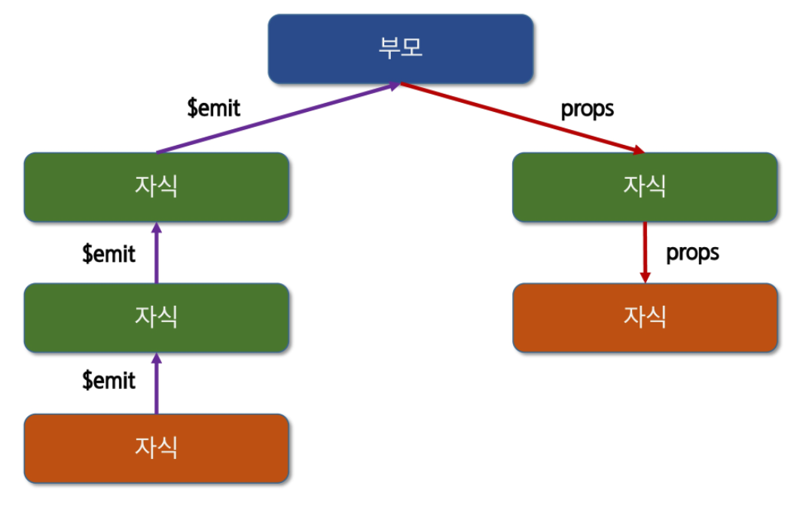
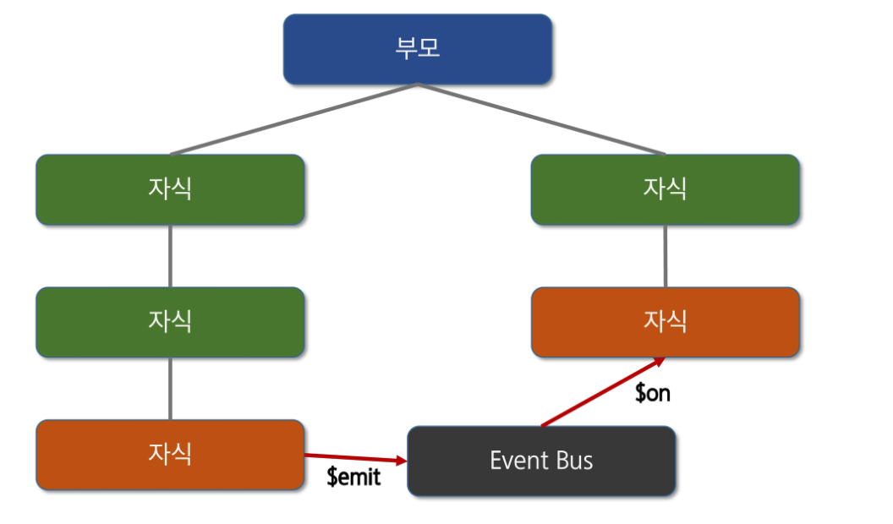
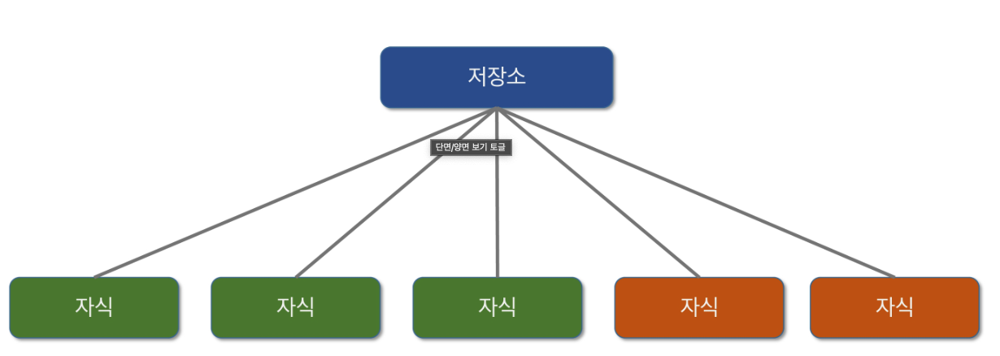
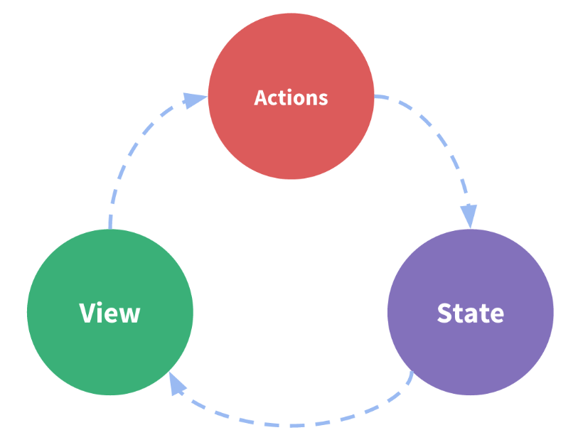
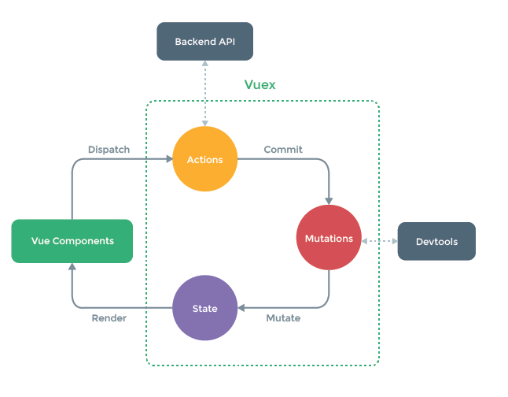
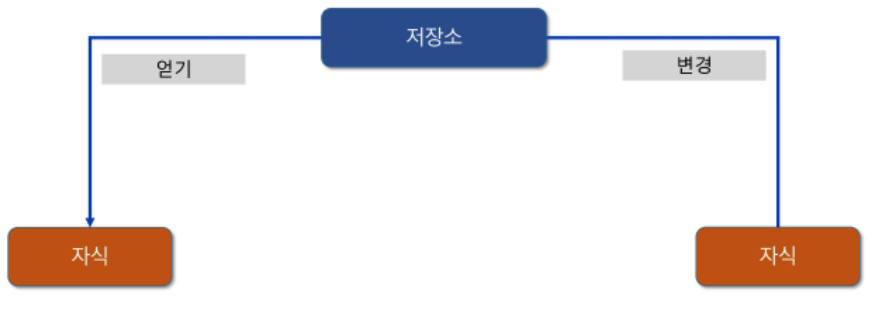

# Vuex

> * Vue.js application에 대한 **상태관리패턴 + 라이브러리**
> * application 모든 component들의 중앙 저장소 역할(데이터 관리).
> * 상위(부모) 하위(자식)의 단계가 많이 복잡해 진다면 데이터의 전달하는 부분이 매우 복잡해짐
> * application이 여러 구성 요소로 구성되고 더 커지는 경우 데이터를 공유하는 문제가 발생
>
> ​                  
>
> **기존 vue 단방향 통신의 문제점**
>
> * 프로젝트가 복잡해질수록 데이터가 방대해져 관리가 힘들다.
>
> ​                    

​                   

## Veux 설치

* CDN

  ```
  <script src="https://unpkg.com/vuex"></script>
  ```

* npm

  ```bash
  npm install vuex --save               
  ```

​               

### vuex 설정

* module 시스템과 함께 사용시 Vue.use()를 통해 Vuex 설정

  ```js
  import Vue from 'vue';
  import Vuex from 'vuex';
  
  Vue.use(Vuex); // Vue Instance에 Vuex를 설정
  ```

​                   

### vue 사용하기

> **store 디렉토리 내부에 store.js 파일 생성**
>
> ```js
> import Vue from 'vue';
> import Vuex from 'vuex';
> 
> Vue.use(Vuex); // Vue Instance에 Vuex를 설정
> 
> export default new Vuex.Store({
>   state: {
>     count: 0,
>   },
> })
> ```
>
> ​                       
>
> **import**
>
> ```js
> import Vue from 'vue';
> import App from '.App.vue';
> import store from './store/store';
> 
> Vue.config.productionTip = false;
> 
> new Vue({
>   render: (h) => h(App),
>   store,
> }).mount('#app');
> ```
>
> ​                       

​                

## Vuex 원리

​                

### 1. 부모-자식 컴포넌트간의 data 전달



​                     

### 2. 동위 컴포넌트간의 data 전달



​            

### 3. vuex



​                 

### 4. 상태 관리 패턴

* **상태**: 앱을 작동하는 원본 소스. (=data)
* **뷰**: 상태의 선언적 매핑. (=template)
* **액션**: 뷰에서 사용자 입력에 대해 반응적으로 상태를 바꾸는 방 (=method)



```js
new Vue({
	//상태
  data(){
    return{
			count: 0
    }
  },
  //뷰
  template:`
  	<div>{{count}}</div>
  `,
  //액션
  methods:{
    increment(){
			this.count++
    }
  }
})
```

​             

### 5. vuex 핵심 컨셉



​                            


## vuex 저장소

* State: 단일 상태 트리 사용. application마다 하나의 저장소를 관리(data)
* Getters: Vue Instance의 Computed와 같은 역할. State를 기반으로 계산(computed)
* Mutations: State의 상태를 변경하는 유일한 방법(동기 methods)
* Actions: 상태를 변이 시키는 대신 액션으로 변이에 대한 커밋 처리(비동기 methods)

​                

### 1. 저장소(Store) - state

* 저장소에서 data 속성의 역할

* application에서 공유해야할 data 관리

  * Vuex 이전은 state를 찾기 위해 각 컴포넌트를 직접 확인
  * Vuex를 활용하면 Vex Store의 컴포넌트에서 사용하는 state를 한 눈에 파악 가능
  * Mutations에 정의된 method에 의해서만 변경
  * State 변경시 해당 state를 공유하는 모든 컴포넌트의 DOM 자동 렌더링
    * 각 컴포넌트는 dispatch()를 사용해 Actions 내부 method 호출

* State에 접근하는 방식

  ```js
  this.$store.state.date_name
  ```

  

​                 

### 2. Acions

* 컴포넌트의 dispatch() method에 의해 호출
* BackEnd API와 통신해 Data Fetching등 작업 수행: 동기적 작업 뿐 아니라 비동기 작업 포함
  * ex) setTimeout()
* 항상 context가 인자로 넘어옴
  * commit: mutations을 호출해 state의 값을 변경함을 권장(state 관리측면)

​             

### 3. Mutations

* Actions에서 commit() method에 의해 호출

  ```js
  this.$store.commit('method', 10);
  ```

* Actions에서는 비동기적 작업을 Mutations에서는 동기적인 작업만 함

  * 비동기적 작업이 있을 경우 state의 변화 시점이 명확하지 않을 수 있기 때문에

* Mutations에 정의하는 method의 첫번째 인자에는 state가 넘어옴

​               

### 4. Getters

* Computed와 유사(**종속적**)
* State를 변경하지 않고 활용하여 계산 수행
* Getters 자체가 state 자체를 변경하지는 않음

​             

#### - mapGetters

```bash
npm install --save core-js
```

```json
Updated file babel.config.js:

	presets: [
			[
				'@vue/app',
				{
					useBuitlns: 'entry',
				},
			]
	]
```

* getters를 조금 더 간단하게 호출

  * 정의

    ```json
    getters: {
    	countMsg(state){
    		return ...;
    	}
    }
    ```

  * 사용

    ```vue
    <h2>{{ $store.getters.msg1 }}</h2>
    ```

  ​                

* 주의: Babel 관련 에러 발생시 해결 ...mapGetters 관련 es6 spread operation 관련 에러 발생

  

  