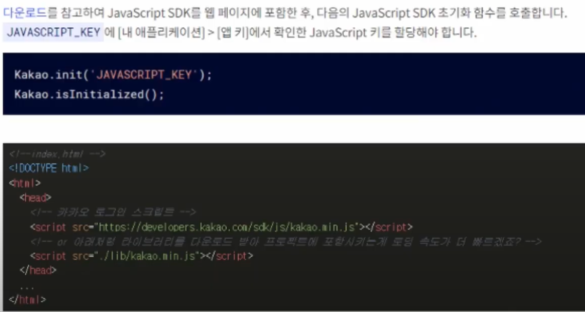
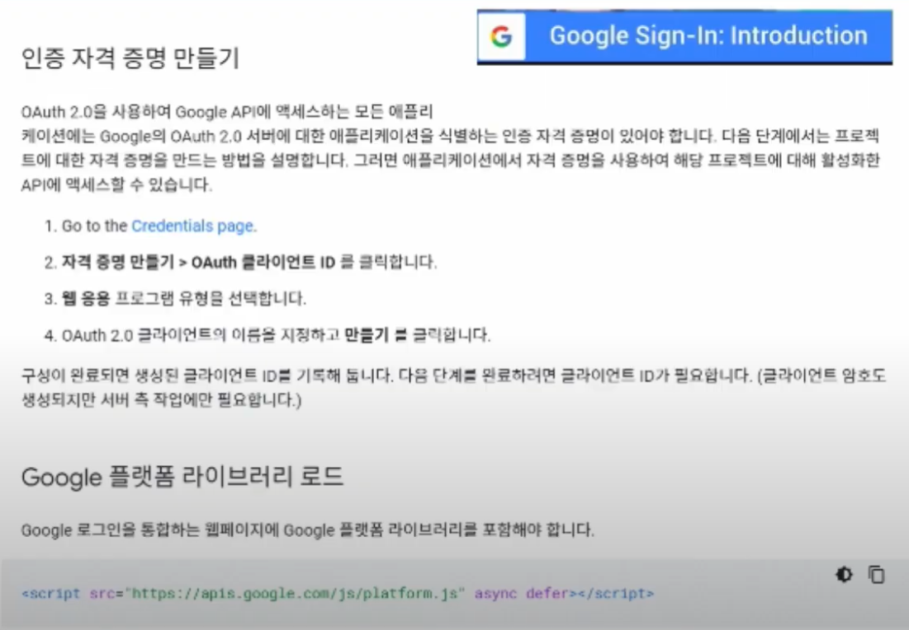
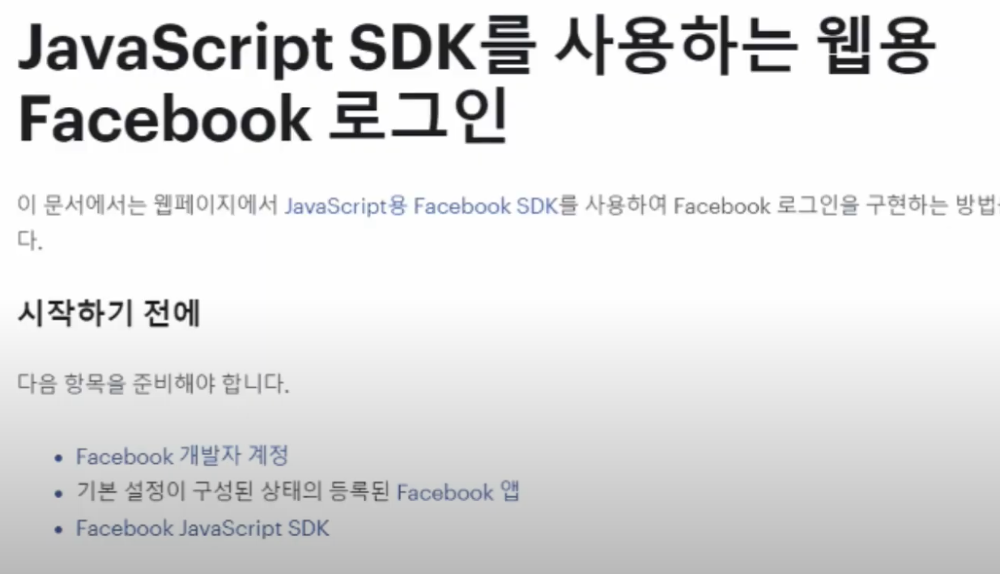
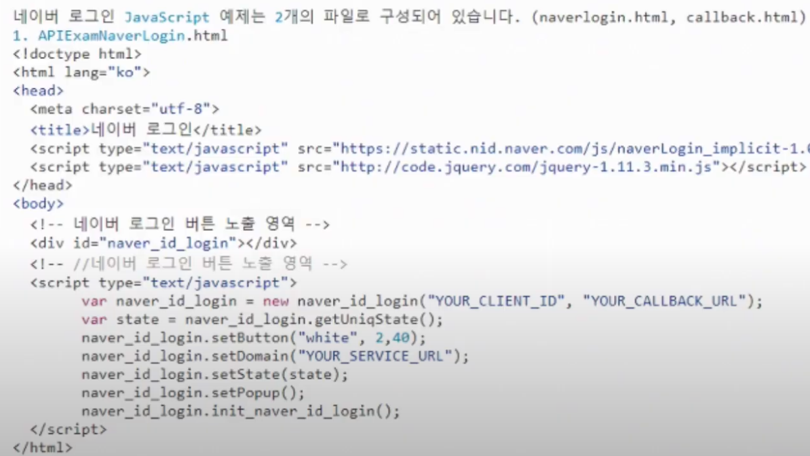

# Vue로 Front-End 개발 시작해보기

​               

## Vue3

1. 가상돔 최적화
2. 트리쉐이킹
   * 최적화를 통해 bundle 크기를 대폭 줄임
3. Composition API

​                 

## 가장 공통적인 것

* 로그인 마스터 vs 기능 구현 

​                

## OAuth 아키텍처

* 보안: 백엔드단에서 처리하는 것이 좋다.

​             

### 1) 초기화

​               

## 2) 플랫폼 선택

​                  

### - Google

​                

### - FaceBook

​               

### - Naver

​                     

## 3) 백엔드 로직의 완성

* DB 구조 등 고려

