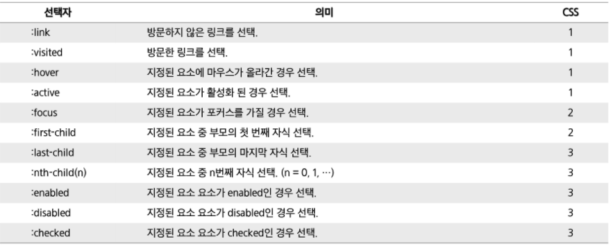

## 프론트 엔드 요약 정리

​       

### HTML

1. HTML 의 시작

   ```html
   <!DOCTYPE html>
   ```

2. HTML의 특수문자 `&`

| 특수문자 | 내용            |
| -------- | --------------- |
| `&nbsp;` | 공백            |
| `&lt;`   | Less than(<)    |
| `&gt;`   | Greater than(<) |
| `&amp;`  | &, Ampersand    |
| `&quot;` | "               |
| `&copy;` | &copy;          |
| `&reg;`  | &reg;           |

3. 포맷팅 요소

```html
<pre> 공백 줄바꿈 등 입력된 그대로 화면에 표시
<code> 컴퓨터 소스 코드
</code>
</pre>
```

4. 테이블

```html
[상위 요소부터 나열]
<table>
<thead> <tbody> <tfoot>
<tr>
<th> <td>
  
속성: colspan="2" rowspan = "2"
  주의점: 1. span을 쓰고난 행 이후 적용될 자리에 데이터를 비워놔야한다.(아래 코드 참고)
  			2. tr, th 같은 최하위 요소에 사용한다
```

```html
<table>
  <tr>
    <th colspan="3">1</th>
    <!--뒤에 2개를 쓰지 않는다-->
  </tr>
  <tr>
    <th rowspan="2">1</th>
    <th>1</th>
    <th>1</th>
  </tr>
  <tr>
    <th>1</th>
    <th>1</th>
  </tr>
</table>
```

5. Anchor 태그
   * href 사용
   * target 속성: `_self`, `_blank`, `_paent`, `_top`
6. **경로 정리**

| 태그   | 경로 속성   |
| ------ | ----------- |
| img    | src         |
| link   | href (+rel) |
| a      | href        |
| iframe | src         |
| script | src         |

7. **form 태그**

| 속성          | 설명                                                         |
| ------------- | ------------------------------------------------------------ |
| method        | 사용자가 입력한 내용을 서버 쪽 프로그램으로 어떻게 넘겨줄지 지정 |
| method="get"  | 주소 표시줄에 사용자가 입력한 내용 표시. 256~2048bytes의 데이터만 전송 |
| method="post" | HTTP 메세지의 Body에 담아서 전송하기 때문에 전송 내용 길이 제한X<br />사용자가 입력한 내용이 표시X |
| name          | form의 이름 지정                                             |
| action        | `<form>` 태그 안 내용을 처리해줄 서버상 프로그램 지정(URL)   |
| target        | `<action>` 태그에서 지정한 스크립트 파일을 현재 창이 아닌 다른 위치에 열도록 지정 |
| autocomplete  | 자동완성 기능, 기본값 on                                     |

7. input 태그 속성들

| type           | 설명                                                         |
| -------------- | ------------------------------------------------------------ |
| text           | 한 줄의 텍스트 입력, name/size/value/maxlength               |
| password       | 비밀번호, name/size/value/maxlength                          |
| search         | 검색 상자                                                    |
| tel            | 전화번호                                                     |
| url            | URL                                                          |
| email          | email                                                        |
| datetime       | 국제 표준시(UTC)                                             |
| datetime-local | 사용자 지역을 기준으로 날짜와 시간                           |
| date           | 사용자 지역을 기준으로 날짜(년/월/일), min/max/step/value(초기값) |
| month          | 사용자 지역을 기준으로 날짜(년/월)                           |
| week           | 사용자 지역을 기준으로 날짜(년/주)                           |
| time           | 사용자 지역을 기준으로 날짜(시,분,초,분할 초)                |
| number         | 숫자 조절표, min/max/step/value(초기값)                      |
| range          | 숫자 조절 막대, min/max/step/value(초기값)                   |
| color          | 색상 표                                                      |
| checkbox       | checkbox                                                     |
| radio          | radio box                                                    |
| file           | 파일 첨부 버튼                                               |
| submit         | 서버 전송 버튼                                               |
| image          | submit + image (submit인데 이미지로 그냥 대체할 수 있다고 생각) |
| reset          | 리셋 버튼                                                    |
| button         | 기능이 없는 버튼, value/onclick                              |
| hidden         | 사용자에게 보이지 않지만 서버로 넘겨지는 값                  |

| 속성                     | 설명                                                         |
| ------------------------ | ------------------------------------------------------------ |
| autofocus                | 페이지 로딩 후 마우스 커서 표시                              |
| placeholder=""           | 텍스트 입력시 적당한 힌트 표시                               |
| readonly                 | =true, 등으로 지정                                           |
| **required**             | submit 하기 전에 필수적으로 입력해야 하는 부분 체크          |
| min,max,step             |                                                              |
| size,minlength,maxlength |                                                              |
| Height,width             |                                                              |
| list                     | `<datalist>` 에 미리 정의해 놓은 옵션 값을`<input>` 안에 나열해 보여줌 |
| multiple                 | type이 `email`이나 `file` 등 두 개 이상일 때 두 개 이상 값을 입력 |

​       

## CSS

1. 적용 방식

   * 외부 시트

     ```html
     <link rel="stylesheet" href="./....">
     ```

   * 내부 시트: `<style>` 태그 내부에 넣기

   * 인라인 적용: 각 태그 `style=" ;"` 이용

2. **적용 순서**

   >1. 중요도(Important)는 항상 최우선
   >
   >   - `!important`
   >
   >   ```css
   >   h2 {
   >     color: red !important ;
   >   }
   >   ```
   >
   >2. 우선순위
   >
   >   1. 선택자: 아이디 선택자 > 클래스 선택자 > 요소 선택자
   >   2. 시트: 인라인 > 내부 > 외부
   >   3. **인라인 > id > class**, *속성, pseudo-class* **> 요소**, *pseudo-element* **> 전체** 선택자 > 가장 나중에 정의한 것
   >
   >3. CSS 파일 로딩 순서
   >
   >   - 가장 마지막이 우선순위가 높다.

3. **상속의 종류**
   - CSS는 상속을 통해 부모 요소의 속성을 자식에게 상속한다.
   - 속성중에는 상속이 되는 것과 되지 않는 것들이 있다.
   - 상속 되는 것 예시
     - **Text 관련 요소** (font, color, text-align), opacity, visibility 등
   - 상속되지 않는 것 예시
     - Box model 관련 요소 (width, height, margin, padding, border, box-sizing, display), posision 관련 요소 (position, top/right/bottom/left, z-index) 등

4. 크기

   >%, em: 부모를 기준으로 크기 설정
   >
   >```css
   >width: 1.5em;
   >```
   >
   >rem: 최상위 요소를 기준으로 크기 설정
   >
   >```css
   >width: 1.5rem;
   >```

5. **선택자**

   1. **병렬: **여러 개 요소 선택 (, 사용)

   ```css
   h1, h2, h3{ }
   ```

   2. **자손: **하위 요소 선택

   ```CSS
   E1 E2{} /*E1에 포함된 E2*/
   ```

   3. **자식**: 직속 하위 요소

   ```CSS
   E1>E2{}
   ```

   4. **인접 형제**: 바로 뒤에 위치하는 형제

   ```CSS
   E1+E2{}
   ```

   5. **일반 형제: **뒤에 위치하는 모든 형제

   ```CSS
   E1~E2{}
   ```

6. 가상 클래스 선택자(:)

   * 내가 만든 클래스는 아니지만 빠르게 요소들을 지정 가능하도록 클래스 임시 부여

   * `:first-child`, `:last-child`, `nth-child(n)`



7. 가상 엘리먼트 선택자 `::` 사용

   #### - Clearing Float

   1. float으로 띄운 이후 초기화를 가상엘리먼트로 적용한다.
   2. float 요소의 부모를 div 를 감싸준다.
   3. 부모에게 clearfix class 적용 후 css 코드

   ```css
   .clearfix::after { /* ::before 과 ::after 는 내부 content: ""; 항목이 필수 */
   	content: "";
   	display: block;
   	clear: both;
   }
   ```

8. **Position**

   * relative

     - 상대위치

     - **내 자리 유지**

     - 💡**자기 자신의 static 위치를 기준**으로 이동, 나머지 요소들은 normal flow 유지

     - 레이아웃에서 요소가 차지하는 공간은 static 일 때와 같음

   * absolute

     - 절대 위치

     - **내 자리 X**

     - 요소를 normal flow 에서 제거 후 레이아웃에 공간을 차지하지 않음
       - 💡normal flow에서 벗어남

     - 💡***static이 아닌\* 💡가장 가까이 있는 부모/조상 요소를 기준**으로 이동 (없는 경우 body)

   * fixed

     - 고정 위치

     - **내 자리 X**

     - 요소를 normal flow 에서 제거 후 레이아웃에 공간을 차지하지 않음

     - 부모 요소와 관계없이 💡**viewport 를 기준**으로 이동 (스크롤 시에도 항상 같은 곳에 위치함)

9. **flexbox**

   * Bootstrap Grid System 은 flexbox 로 제작됨

   >정리
   >
   >* row = Main axis = justify-content
   >* col = Cross axis = align-content / align-items

   - 행과 열 형태로 아이템을 배치하는 1차원 레이아웃 모델

   - 축

     - main axis

     - cross axis

     - 💡 flex-direction : row (기본값)

       

   - Flexbox 구성 요소

     - Flew Container (**부모 요소**)

       - flexbox 레이아웃을 형성하는 가장 기본적인 모델

       - Flex Item 들이 놓여있는 영역

       - display 속성을 flex 혹은 inline-flex 로 지정

         ```css
         .flex-container {
             display: flex;
         }
         ```

     - Flex Item (**자식 요소**)

       - 컨테이너에 속해 있는 컨텐츠
       - 💡자손영역에는 영향을 미치지 않고 오직 나의 자식 영역에만 영향을 미친다.

   > Q. 왜 Flexbox 를 사용해야 할까?
   >
   > float 혹은 position 을 통해서는
   >
   > ```
   > 1. 수직 정렬
   > 2. 아이템의 너비와 높이 혹은 간격을 동일하게 배치
   > ```
   >
   > 하는 것이 어렵다.

   #### flex 속성💡💡💡

   [배치 설정]

   - flex-direction

     - main axis 기준 방향 설정

       

   - flex-wrap

     - 아이템이 컨테이너를 벗어나는 경우 해당 영역 내에 배치되도록 설정

     - nowarp(기본 값) : 한 줄에 배치

     - wrap : 넘치면 그 다음줄로 배치

       

   - flex-flow 💡💡💡

     - flex-direction과 flex-wrap의 shorthand
     - `flex-flow: row wrap;`

   [공간 나누기]

   - 💡**justify-content** : Main axis 를 기준으로 공간 배분

     - flex-start (기본 값) : 아이템을 axis 시작점으로
     - flex-end : 아이템들을 axis 끝 쪽으로
     - center : 아이템들을 axis 중앙으로
     - space-between : 아이템 사이의 간격을 균일하게 분배
     - space-around : 아이템을 둘러싼 영역을 균일하게 분배 (가질 수 있는 영역을 반으로 나눠서 양쪽에)
     - space-evenly : 전체 영역에서 아이템 간 간격을 균일하게 분배

     

   - align-content : Cross axis 를 기준으로 공간 배분

   

   [정렬]

   - 💡**align-items** : 모든 아이템을 Cross axis 를 기준으로 정렬

     - 💡stretch (기본 값) : 컨테이너를 가득 채움
     - flex-start : 위
     - flex-end : 아래
     - center : 가운데
     - 💡baseline : 텍스트 baseline 에 기준선을 맞춤

     

   - align-self : 개별 아이템을 Cross axis 를 기준으로 정렬 (컨테이너가 아닌 개별 아이템에 적용하는 속성)

     

​         

​          

## Javascript

1. 자바스크립트의 상식들

   >1. 외부 import: `<script src="hello.js" type="text/javascript">`
   >
   >2. 변수형 조사: `typeof()` 연산자
   >
   >   ```javascript
   >    console.log(typeof a); //괄호를 열지 않아도 실행됨: 연산자
   >    console.log(typeof(a)); //괄호를 열지 않아도 실행됨
   >   ```
   >
   >3. 자바스크립트는 문자는 존재하지 않으며 문자열만 있다. 또한 실수형을 따로 구분하지는 않는다.
   >
   >   * string: 문자열, number: 숫자형(정수+실수)
   >
   >4. 객체는 **Key, Value**로 구성되어있다. = 이 두개를 묶어 **Property**라고 한다.
   >
   >   * Value에 함수를 넣을 수 있다. (함수는 일급 객체기 때문)
   >
   >5. 함수는 일급 객체이며 var과 같이 선언시 hoisting 된다.
   >
   >6. localStorage는 반드시 문자열로 저장된다.

2. **객체**

#### 	-생성

* `{ }` 로 정의

  ```javascript
  var student = {
    name: "홍길동",
    info: function(){
      console.log("객체 함수");
  	}, //obj 메서드
  };
  
  let student = { };
  ```

  #### -조회

  ```javascript
  console.log(student.age);
  console.log(student["age"]);
  console.log(student["user-name"]); //속성명에 연산자가 있으면 [ ]로 호출 
  ```

  ​      

  #### -변경/제거

  ```javascript
  student.age = 30; //값 변경, 만약 key가 없다면 값이 아예 추가된다.
  student['age'] = 30; //값 변경, 만약 key가 없다면 값이 아예 추가된다.
  
  delete student.age; //값 삭제
  ```


3. **함수**

   * 함수 선언문이 아닌 **함수 표현식**의 경우 **변수 호이스팅**이 일어나지 않음

   ```javascript
   var result = plus(5, 7); //함수를 찾아야함: 하지만 plus는 var로 정의 = TypeError
   console.log(result);
   
   var plus = function(num1, num2){ //함수 선언이 아닌 표현식이므로 호이스팅이 일어나지 않음
   	return num1 + num2;
   };
   ```

4. **콜백 함수**

   * setTimeout()의 예

   ```javascript
   setTimeout(function(){
   	console.log('3초 후 실행됩니다.');
   }, 3000);
   ```

   * setTimeInterval()의 예

   ```javascript
   setTimeout(sayHi(), 1000);
   ```

5. JS_DOM 그냥 읽어보기

6. 이벤트

   * 버블링 캡쳐링

7. localStorage, sessionStorage

   >[ 공통 메서드 ]
   >
   >* setItem(key, value): key-value 쌍으로 저장
   >
   >  ```javascript
   >  localStorage["Test"] = "Sample";
   >  ```
   >
   >* getItem(key): key에 해당하는 **value**를 리턴
   >
   >* removeItem(key): key에 해당하는 값 삭제
   >
   >* clear(): 모든 값 삭제
   >
   >* key(index): index에 해당하는 key
   >
   >* length: 저장된 항목의 개수
   >
   >​        
   >
   >[둘의 차이점]
   >
   >* SessionStorage과 차이점
   >  * localStorage: 세션이 끊겨도 사용 가능
   >  * sessionStorage: 같은 세션만 사용 가능, 다른 창 사용불가, 탭을 닫으면 제거, 새로고침에는 유지
   >* localsession은 세션이 끊기거나 동일한 세션이 아니더라도 사용 가능하다.