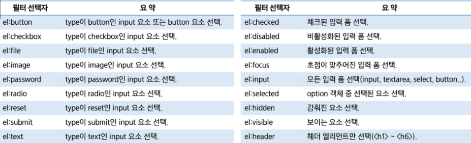
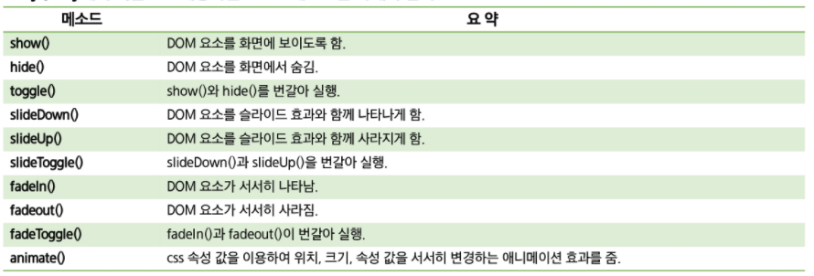
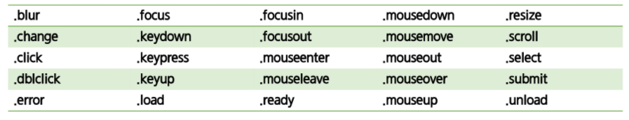
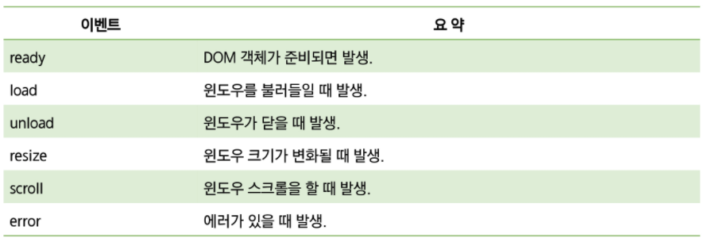

# jQuery

> john Rsig이 2006년 발표한 크로스 플랫폼을 지원하는 경량 javascript library
>
> HTML 문서의 탐색이나 조작, 이벤트 핸들링, 애니메이션, Ajax 등을 멀티 브라우저를 지원하는 API를 통해 간편하게 사용
>
> 현재는 React나 Framework 를 많이 사용한다.
>
> ​       
>
> **[ jQuery 특징 ]**
>
> * 크로스 플랫폼을 지원하기에 어떠한 브라우저에서도 동작
>   * 대체코드를 작성할 필요가 없다.
> * 개발 속도 향상: 네이티브 DOM API보다 직관적이고 편리
>   * 라이브러리 또한 가볍다
> * Event 처리, Ajax, Animation 효과를 쉽게 사용
> * 다양한 Effect 함수를 제공: 동적인 페이지 구현
>   * 메소드 체인을 제공해 반복적인 코딩을 줄여준다
>
> ​         
>
> **[ jQuery 설치 ]**
>
> * 다운로드 URL: https://jquery.com/download/
>
>   * npm 또는 yarn으로 다운 가능
>
>     ```bash
>     $ npm install jquery
>     ```
>
> * CDN을 이용해 라이브러리를 import 하는 식으로도 가능
>
>   ```html
>   <script src="https://ajax.googleapis.com/ajax/libs/jquery/3.5.1/jquery.min.js"></script>
>   <script src="http://ajax.aspnetcdn.com/ajax/jQuery/jquery-1.12.4.min.js"></script>
>   <script src="https://code.jquery.com/jquery-1.12.4.min.js"></script>
>   ```
>
>   ​        

​           

## 기본 구문

```javascript
$(selector).action(); //Selector 표현식 + Action 메소드 조합
```

* Selector를 사용해 DOM객체 탐색, 반환된 래퍼세트(WrapperSet)로 함수 수행

* jQuery로 DOM을 탐색하기 전에 웹 브라우저에 문서가 모두 로드되어 있어야 함

  ```javascript
  $(document).ready(function () {
    $('button').click(function () {
      $('#p1').css('background', 'orange');
    });
  });
  ```

  ```javascript
  //권장하는 방법
  $(function(){
  	//TODO...
  });
  ```

  ```javascript
  jQuery(function () {
      
  });
  ```

  

* **메소드 체인**

  ```javascript
  $(selector).func1().func2().func3();
  ```

​        

​         

## DOM 요소 선택

```javascript
$("h1").css("color","blue"); // $은 jquery 문법을 나타냄
```

* HTML 계층 구조 제일 위에는 document 노드가 있다
* **Selector 표현 방식**: `id`, `class`, `name` 또는 태그 이름을 이용해 DOM 요소 탐색
  * 브라우저가 표준 CSS를 구현하지 않아도 W3C 기준에 맞게 요소 탐색 = **래핑 한 객체 반환**
    * 이를 Wrapper Set 라고 함

​        

### 요소 선택자(Element Selector)

| selector 종류 | Selector 표현방법                                            |
| ------------- | ------------------------------------------------------------ |
| All           | `$("*")`                                                     |
| ID            | `$("#id")`                                                   |
| ElementName   | `$("elementName")`                                           |
| Class         | `$(".className")`<br />`$('tagname.className').css('color','blue');`<br />`$('.cn1.cn2').css('color','blue');` |
| Multi         | `$("selelctor1,selector2,selector3")`                        |

​         

### DOM 계층 구조 탐색

* HTML의 구조 그대로: 부모/자식/형제, 조상/후손

| selector 종류        | selector 표현방법          |
| -------------------- | -------------------------- |
| Child                | `$("parent > child")`      |
| Descendant           | `$("ancestor descendant")` |
| Next Adjacent (형제) | `$("previous + next")`     |
| Next Sibling         | `$("previous ~ sibling")`  |

​         

### 속성 선택자(Attribute Selector)

```javascript
$(document).ready(function(){
  $('h2[class=na]').on("click",function(){
    if($('h2[class=na]').css("color")=="rgb(255, 0, 0)"){
      $('h2[class=na]').css("color","black");
    }else{
      $('h2[class=na]').css("color","red");
    }
  })
})
```

* 대괄호 `[]`를 사용해 해당 속성을 포함해 검색

| 선택자 형식                  | 요약                                                      |
| ---------------------------- | --------------------------------------------------------- |
| `$("selector[attr]`")        | attr을 속성으로 가지는 객체                               |
| `$("selector[attr=value]`")  | attr을 속성으로 가지고 값이 value와 같은 객체             |
| `$("selector[attr!=value]`") | attr을 속성으로 가지고 값이 value와 같지 않은 객체        |
| `$("selector[attr~=value]`") | attr을 속성값이 value로 **공백과 함께 포함**하는 문서객체 |
| `$("selector[attr^=value]`") | attr을 속성값이 value로 **시작**하는 문서객체             |
| `$("selector[attr$=value]`") | attr을 속성값이 value로 **끝나는** 문서객체               |
| `$("selector[attr*=value]`") | attr을 속성값이 value로 **포함**하는 문서객체             |

​            

### 필터 선택자(Filter Selector)

* 콜론 `:` 사용



​          

### 위치기반 필터선택자

```javascript
$('h2:last').on("click",function(){
console.log("마지막");
})
```

| 필터 선택자    | 요약                           |
| -------------- | ------------------------------ |
| `:first`       | 첫 번째 요소 선택              |
| `:last`        | 마지막 요소 선택               |
| `:first-child` | 첫 번째 자식 요소              |
| `:last-child`  | 마지막 자식 요소               |
| `:only-child`  | **형제가 없는** 모든 요소 선택 |
| `:even`        | 짝수 번째                      |
| `:odd`         | 홀수 번째                      |

​        

### 함수기반 필터선택자

```javascript
$('h2:not("h2[id=ma]")').on("click",function(){
	console.log(23);
})
```

```javascript
// 안에 ""를 써도 되고 안써도 된다.
$('h2:not(h2[id=ma])').on("click",function(){
	console.log(23);
})
```

| 필터 선택자         | 요약                                                         |
| ------------------- | ------------------------------------------------------------ |
| `:not(selector[ ])` | 주어진 선택자와 일치하지 않는 요소 선택                      |
| `:contains(str)`    | 텍스트 str을 포함하는 요소 선택                              |
| `:nth-child(n)`     | n번째 자식 요소 선택                                         |
| `:eq(n)`            | n번째로 일치하는 요소 선택                                   |
| `:gt(n)`            | n번째(포함 X) 이후 요소 선택                                 |
| `:lt(n)`            | n번째 이전 요소 선택                                         |
| `:has(f)`           | 주어진 선택자와 일치하거나 하나 이상의 요소를 포함하는 요소 선택 |

​           

### 래퍼세트와 메소드

| 메소드                                                       | 반환 값       | 요약                                                         |
| ------------------------------------------------------------ | ------------- | ------------------------------------------------------------ |
| `size()`, .length                                            | 요소 개수     | 래퍼세트의 요소 개수 반환                                    |
| `get(index)`                                                 | DOM 요소      | 래터세트에서 인덱스 번호 위치하는 DOM 객체 반환              |
| `index(element)`                                             | 인덱스 번호   | 래퍼세트에서 해당 요소의 인덱스 번호 반환                    |
| `add(expr)`                                                  | 래퍼세트      | expr로 명시한 요소를 래퍼세트에 **추가**                     |
| `not(expr)`                                                  | 래퍼세트      | expr로 명시한 요소를 래터세트에서 **제거**                   |
| `each(function(index, element))`<br />`$.each(array, function(index, item) {});` | 이전 래퍼세트 | **래퍼세트 각 요소마다 function 수행**<br />단독 사용도 가능 |
| `filter(expr)`<br />.filter(function(index, selector){   내용    }) | 래퍼세트      | expr에 명시한 요소를 필터링                                  |
| `slice(begin, end)`                                          | 래퍼세트      | 현재 래퍼세트의 **일부분으로 래퍼세트를 생성해 반환**        |
| `end()`                                                      | 래퍼세트      | 이전래퍼세트 상태로 돌아감                                   |
| `is(selector)`                                               | boolean       | 비교해 true나 false 반환                                     |
| `find(selector)`                                             | 래퍼세트      | 래퍼세트 안에서 다시 걸러냄                                  |

* each에서 item은 element, index는 인덱스를 나타냄

  ```javascript
  			$("h2").each(function (index, item) {
  				// item 대신 this 사용 가능
  				$(item).addClass("high-light-" + index);
  			});
  ```

* filter()

  ```javascript
  $("h2").filter(":even").css({
  background: "black",
  color: "white"
  });
  ```

* end()

  ```javascript
  $("h2").css("background", "silver")
    .filter(":even").css("color", "white").end() //filter 적용 이전으로 이동해 다시 홀수 선택가능
    .filter(":odd").css("color", "red");
  });
  ```

* **위치기반 함수**(필터 선택자 X)

  ```javascript
  $("h2").first().css("background", "blue") //.first()
  .css("color", "white");
  $("h2").last().css("background", "black"); // .last()
  $("h2").eq(2).css("background", "silver"); //.eq(n)
  $("h2").eq(-1).css("color", "white"); //.eq(-n)
  ```

* is() - DOM요소 판별

  ```javascript
  $("input[type='checkBox']").each(function () { 
  if ($(this).is("[name='checkedFalse']") && $(this).is(":checked")) { 
  $(this).attr("checked", false); 
  } 
  });
  ```

* find() - 래퍼세트 내부에서 다시 검색해 반환

  ```javascript
  $("#findArea").find(".myClass") .css("background", "silver"); 
  ```

  

​         

### 계층 구조 탐색

| 메소드                 | 요약                                                         |
| ---------------------- | ------------------------------------------------------------ |
| `parent([selector])`   | 래퍼세트에 포함된 각 요소의 **부모**요소로 구성된 래퍼세트 반환 |
| `parents([selector])`  | 래퍼세트에 포함된 각 요소의 **조상**요소로 구성된 래퍼세트 반환 |
| `children([selector])` | 래퍼세트에 포함된 각 요소의 **자식**요소로 구성된 래퍼세트 반환 |
| `prev([selector])`     | 래퍼세트에 포함된 각 요소의 **바로 이전 형제**요소로 구성된 래퍼세트 반환 |
| `prevAll([selector])`  | 래퍼세트에 포함된 각 요소의 **이전 형제들 **요소로 구성된 래퍼세트 반환 |
| `next([selector])`     | 래퍼세트에 포함된 각 요소의 **바로 이후 형제**요소로 구성된 래퍼세트 반환 |
| `nextAll([selector])`  | 래퍼세트에 포함된 각 요소의 **이후 형제들 **요소로 구성된 래퍼세트 반환 |
| `siblings([selector])` | 래퍼세트에 포함된 각 요소를 제외한 **모든 형제들 **요소로 구성된 래퍼세트 반환 |

​          

​          

## DOM 객체

| DOM 특성 제어   | DOM 내부 제어 | DOM 추가/삭제 | DOM 객체 난입    |
| --------------- | ------------- | ------------- | ---------------- |
| `attr()`        | `html()`      | `$()`         | `append()`       |
| `removeAttr()`  | `text()`      | `remove()`    | `appendTo()`     |
| `addClass()`    |               | `empty()`     | `prepend()`      |
| `removeClass()` |               | `clone()`     | `prependTo()`    |
| `toggleClass()` |               |               | `after()`        |
| `css()`         |               |               | `insertAfter()`  |
|                 |               |               | `before()`       |
|                 |               |               | `insertBefore()` |


* attr(name) = 조회

* setAttribute: attr(name, value)

  ```javascript
  $('img').attr({ width: 100, height: 150 });
  ```

* createElement: `$()`
* empty(): 자식들을 한꺼번에 제거
* appendTo(Selector): 해당 셀렉터에 요소 추가

* toggleClass(className)

  * 혼자 사용하지 않고 이벤트 함수와 같이 사용한다.

  ```javascript
  //h1 요소를 클릭하면 col3 클래스로 지정/해제된다
  $("h1").click(function() {
  $(this).toggleClass("col3");
  })
  ```

* css()와 함수를 이용한 제어

  ```javascript
  var colors = ["silver", "lime"];
  $("h2").css("color", function (index) {
  return colors[index % 2];
  });
  ```

* html()과 text()는 내부 내용을 조회

  * html(value), text(value)는 내용 수정

* $();

  ```javascript
  //요소 생성
  $(document).ready(function() {
  		$("<h2>안녕하세요</h2>")
  		.css("color", "steelblue")
  		.appendTo("body");
  	});
  ```

* empty(), remove()

  ```javascript
  	$(document).ready(function() {
      
  		$("#btn1").click(function() {
  			$("#h2").remove(); //해당 요소 제거
  		});
  		$("#btn2").click(function() {
  			$("div").empty(); // 해당 요소 자손들 모두 제거
  		});
      
  	});
  ```

* .append(value)의 활용: 맨 뒤에 추가 = 움직이는 느낌

  ```javascript
  var student = {
    "no"	: "2012987",
    "name"	: "김싸피",
    "phone"	: "010-1234-9876",
    "email"	: "kimssafy@ssafy.com"
  };
  
  var newStudent = '<tr>';
    newStudent += '<td>' + student.no + '</td>';
    newStudent += '<td>' + student.name + '</td>';
    newStudent += '<td>' + student.phone + '</td>';
    newStudent += '<td>' + student.email + '</td>';
    newStudent += '</tr>';
  
  $("tbody").append(newStudent);
  ```

* setInterval( func , miliseconds) 활용

  ```javascript
  setInterval(function () {
  $("img").first().appendTo("body");
  // $("body").append($("img").first());
  }, 2000);
  ```

​       

​           

## Effect 메소드

```javascript
$(selector).method();
```

* 화면에서 보여주는 시각 효과를 구현
* 직접 애니메이션 효과를 만들 수 있다



### <예제>

* animate()

  ```javascript
  $(selector).animate(object,speed,callback);
  ```

  >**object의 종류**
  >
  >* opacity
  >* height
  >* width
  >* left
  >* right
  >* top
  >* bottom
  >* margin
  >* padding

```javascript
$(document).ready(function () {
  $("div").hover(function () {
    $(this).animate({ left: 500 }, 500);
  }, function () {
    $(this).animate({ left: 0 }, 100);
  })
});
```

```javascript
      $('div').click(function () {
        $(this).animate(
          {
            width: '+=50',
            height: '+=50',
          },
          'slow'
        );
      });
```

​           

​               

## jQuery Event

* click, mouseover 같은 표준 이벤트 타입명을 사용
* 이벤트 핸들러 할당, 해제할 수 있는 통합 메소드 제공

​         

### bind() 함수

* 자바스크립트와 비교점은 내가 원할 때 이벤트를 빠르게 연결할 수 있다는 것

```javascript
bind(EventType, data, listener) //이벤트타입명, 함수에서 사용할 데이터, 이벤트 발생시 실행되는 함수
```

* 선택된 DOM 객체의 이벤트에 지정한 핸들러를 연결

* **동적으로 생성한 DOM 객체에는 적용X**

  

​         

### unbind() 함수

* 자바스크립트와 비교점은 내가 원할 때 이벤트를 빠르게 해제할 수 있다는 점

```javascript
unbind(eventType, handler) //이벤트타입명, 함수명
```

```javascript
unbind(eventType)
```

* 확장 집합의 모든 엘리먼트에서 매개변수에 따라 이벤트 핸들러 삭제
* 매개변수가 없다면 모든 핸들러 제거

```javascript
	$(document).ready(function() {
		$("#bound").bind("click", function() { //bound버튼을 클릭하면
			$("#show").bind("click", function() { //show버튼에 이벤트를 부여합니다
				$("p").show(); //p태그를 보여주는 이벤트
			});
			$("#hide").bind("click", function() {
				$("p").hide(); //hide 버튼을 클릭하면 p태그가 사라지는 이벤트도 부여합니다.
			});
		});
		
		$("#unbound").bind("click", function() { //위 show와 hide버튼의 이벤트 연결을 끊습니다.
			$("#show,#hide").unbind("click");
		});
	});
```

​        

### on() 함수

```javascript
$(selector).on(eventType, delegate Selector, function(event) {});
```

* `bind()` 와 사용은 같지만 **동적으로 생성한 DOM에도 사용이 가능하다**.
  * 연결을 권장하는 방법이다.

````javascript
$(document).on("click", ".button.btn-remove", function () {
 //delegate 내부에 클래스명 등이 겹쳐서 들어간다 
});
````


​        

### off()

```javascript
$(selector).off();
$(selector).off(eventType);
$(selector).off(eventType, function(event) {});
```

* 선택된 DOM 객체 특정 이벤트 또는 모든 이벤트를 제거할 수 있다.

​           

### Simple Event 함수

```javascript
$(selector).on("click", function(){});
```

```javascript
$(selector).click(function(event) {});
```



​        

### Window Event



​         