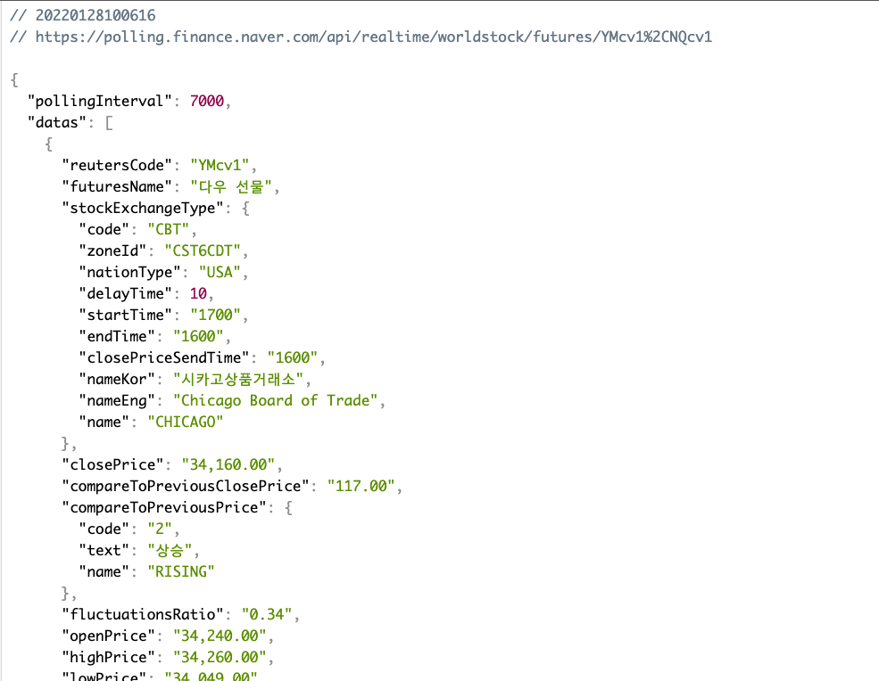

# 파이썬을 활용한 데이터 수집

## 웹 스크래핑(크롤링)

* 요청과 응답

  > 요청(정보를 원하는 사람): url
  >
  > 응답(정보를 주는 사람): 문서(HTML, XML, JSON)
  >
  > 파이썬을 통해 주소로 요청을 보내고 받아본다

     

### 1. Requests: HTTP 라이브러리

```bash
$ pip install requests
```

```python
# 웹 사이트의 정보를 가지고 오고 싶다
import requests

# 1. 주소
URL = 'https://finance.naver.com/sise/'

# 2. 요청
response = requests.get(URL)
print(response, type(response))
# <Response [200]> <class 'requests.models.Response'>: 200 = 성공적으로 가져옴
# 404 : 사용자 잘못, 500 : 개발자 잘못

response = requests.get(URL).text # 로 변경하면 데이터를 모두 가져온다
print(type(response)) # str
```

   

### 2. Beautifulsoup

```bash
$ pip install beautifulsoup4
```

```python
import requests
from bs4 import BeautifulSoup

# 1. 주소
URL = 'https://finance.naver.com/sise/'

# 2. 요청
response = requests.get(URL).text

data = BeautifulSoup(response,'html.parser')
#print(response, type(response))
kospi = data.select_one('#KOSPI_now')
print (kospi) # <span class="num num2" id="KOSPI_now">2,595.66</span>
print(kospi.text) # 2,595.04
```

   

### 3. JSON Viewer 설치

> https://chrome.google.com/webstore/detail/json-viewer/gbmdgpbipfallnflgajpaliibnhdgobh?hl=ko&hc_location=ufi



   

   

## API(Application Proramming Interface)

* 컴퓨터나 컴퓨터 사이의 연결
* 일종의 소프트웨어 인터페이스

   

### API 활용하는 법

* 요청하는 방식에 대한 이해
  * 인증 방식
  * URL 생성
    * 기본 주소
    * 원하는 기능에 대한 추가 경로
    * 요청 변수(필수와 선택)
* 응답 결과에 대한 이해
  * 응답 결과 타입(JSON)
  * 응답 결과 구조

   

### API 간단 실습

> https://agify.io/

\# A simple API for predicting the age of a person given their name

```
https://api.agify.io/?name=Joseph
```

```python
import requests

# 1. URL
URL = 'https://api.agify.io/?name=Joseph'

# 2. 요청
response = requests.get(URL).json()

# 3.JSON 파일이므로 메소드 활용
print(response)
# print(response.get('age')) 세부적인 접근
```

* 사전 만들기

  ```python
  import requests
  
  URL = 'https://api.agify.io'
  params = {
      'name': 'Joseph'
  }
  response = requests.get(URL, params=params).json()
  
  print(response.get('age'))
  ```


   

### TMDB

```python
https://www.themoviedb.org/?language=ko
```

```python
# 0. import
import requests
# 1. URL 및 요청변수 설정
# https://developers.themoviedb.org/3/movies/get-now-playing
BASE_URL = 'https://api.themoviedb.org/3'
path = '/movie/now_playing'
params = {
    'api_key': '8854669b886a6c07c12ea947bcc2311d',
    'region': 'KR',
    'language': 'ko',
}
# 2. 요청 보낸 결과 저장
response = requests.get(BASE_URL+path, params=params).json()
# 3. 조작
print(response)
```

```python
# 0. import
import requests
from pprint import pprint
# 1. URL 및 요청변수 설정
# https://developers.themoviedb.org/3/movies/get-now-playing
# https://api.themoviedb.org/3/movie/now_playing?api_key=8854669b886a6c07c12ea947bcc2311d&region=KR&language=ko
BASE_URL = 'https://api.themoviedb.org/3'
path = '/movie/now_playing'
params = {
    'api_key': '8854669b886a6c07c12ea947bcc2311d',
    'region': 'KR',
    'language': 'ko',
}
# 2. 요청 보낸 결과 저장
response = requests.get(BASE_URL+path, params=params)
print(response.status_code, response.url)
# 200 https://api.themoviedb.org/3/movie/now_playing?api_key=8854669b886a6c07c12ea947bcc2311d&region=KR&language=ko

data = response.json()
# 3. 조작
#pprint(response)
```

