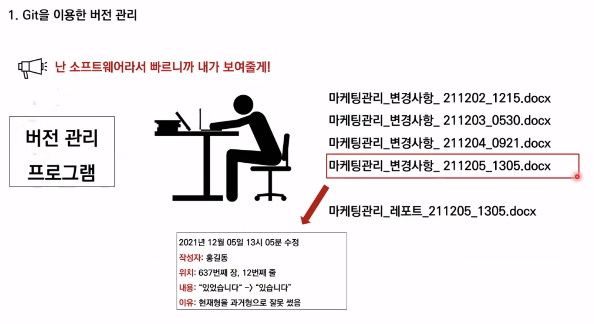

## Git

> git은 분산버전관리시스템(DVCS, Distributed Version Control System) 
>
> 소스코드의 버전을 관리하고 이력도 관리할 수 있다.


### Git을 이용한 버전 관리

버전: 컴퓨터 소프트웨어의 특정 상태

관리: 어떤 일의 사무, 시설이나 물건의 유지,개량

프로그램: 컴퓨터에서 실행될 때 특정 작업을 수행하는 일련의 명령어들의 모음


버전 관리 = 컴퓨터 소프트웨어의 특정 상태들을 관리하는 것?


> 맨 나중 파일과, 이전 변경사항만 남겨 용량을 효율적으로 사용한다




> 왜 수정을 해야했는지 이유만 적어준다면 Git이 모두 관리해준다.

#### Git은 분산 버전 관리 시스템이다

변경되는 이력을 서버 컴퓨터와 공유하는 컴퓨터들 모두에 분산해서 저장한다.


### Git

TIL 폴더에서 다음 명령문 입력

```bash
$ git init
```

이로써 **저장소가 초기화**되고 로컬 저장소가 생성된다.

###### 단계


실제 폴더 - 로컬 저장소 ( working directory - staging area - commit ) - 원격 저장소(git hub)
| Working directory                                      | Staging Area                                                 | Local Repository (commit)                    |
| ------------------------------------------------------ | ------------------------------------------------------------ | -------------------------------------------- |
| 실제적인 작업 공간. 변경점이 나타나면 이곳에 파일 등록 | commit 되기 전 임시로 파일이 보여지는 곳. 이곳에서 commit 되는지 파일을 확인한다. | git으로 관리되는 파일들의 버전이 기록되는 곳 |


> git add: working directory - staging area 단계 이동

> git commit: staging area - commit 단계 이동

> git push: 원격 저장소로 이동

###### untracked

* 처음으로 관리되는 대상
* WD에서 해당 단어를 확인할 수 있음

###### tracked

관리되고 있는 대상

* New file: git으로 관리되지 않았던 파일이 Staging Area에 등록되어 있을 때 생긴다
* Modified: git으로 관리되는데 수정된 파일이 Staging Area에 등록되었을 때

> 초록색(new): 처음 관리되고 있는 대상

```bash
$ git add startcamp
$ git add readme.md
```

```bash
$ git add .
//현재 폴더 내에 있는 병경/추가된 파일 모두 등록
```

아래 명령문을 통해 전체를 한번에 추가할 수 있다.

> git add를 실행하면 두 파일이 staging area로 이동한다.
> 위 명령어를 실행하면 두 파일이 staging area로 이동한다.

```bash
$ git config --global user.email josephdev123@naver.com

$ git config --global -l user.email josephdev123@naver.com

$ git config --global user.name devyoseph

$ git config --global --list

$ git commit -m "First Commit"
```

*INSERT가 뜨면 = Esc - wq 입력 - Enter

###### git 상태 확인
```
$ git status
```
```
$ git log
$ git log --oneline  //한 줄로 확인하기
$ git log -p //파일 변경 내용도 보여준다
$ git log -숫자 //숫자만큼만 보여준다

//commit 로그 확인하기
```
###### gitignore
> 주의 gitignore에 먼저 등록하고 add한다
> 관리하고 싶지 않은 파일도 git add .를 하면 전부 등록되기 떄문에 이를 제외하고자 사용한다.
> 일종의 블랙리스트 (Working Directory에 올라가지 않음)
* 민감한 bin 파일
* 개인 컴퓨터 설정파일(OS에서 활용되는 프로젝트 관련 없는 파일)
* IDE 환경설정파일(.idea/)
* 가상환경 폴더 및 파일(venv/)
> git ignore 파일을 생성(확장자는 필요없음)
> 1. gitignore_test 폴더를 만든다
> 2. 폴더 안에서 vscode(code로 열기) 실행
> 3. ctrl + ``` : 터미널 오픈
```
git restore --staged 파일명
```
###### push
```
$ git remote add origin URL
//메인 저장소인 경우 이름을 origin으로 등록
```
```
$ git remote TIL URL
//메인 저장소가 아닌 경우 
```
```
$ git push TIL
```

