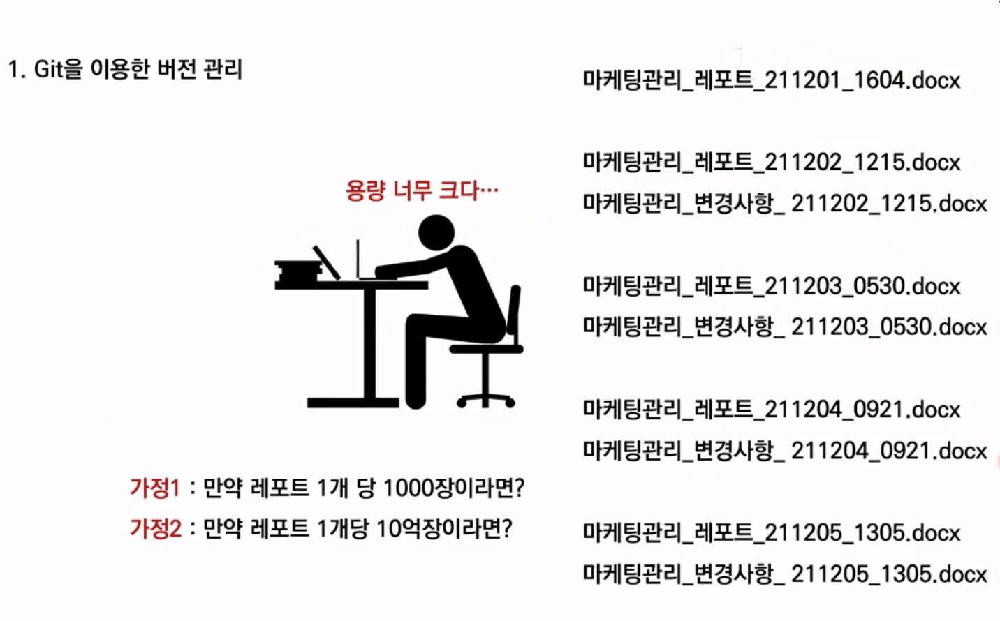
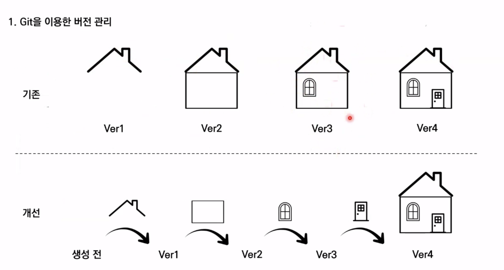

### Git을 이용한 버전 관리

버전: 컴퓨터 소프트웨어의 특정 상태

관리: 어떤 일의 사무, 시설이나 물건의 유지,개량

프로그램: 컴퓨터에서 실행될 때 특정 작업을 수행하는 일련의 명령어들의 모음


버전 관리 = 컴퓨터 소프트웨어의 특정 상태들을 관리하는 것?



> 맨 나중 파일과, 이전 변경사항만 남겨 용량을 효율적으로 사용한다




> 왜 수정을 해야했는지 이유만 적어준다면 Git이 모두 관리해준다.

#### Git은 분산 버전 관리 시스템이다

변경되는 이력을 서버 컴퓨터와 공유하는 컴퓨터들 모두에 분산해서 저장한다.


### Git

TIL 폴더에서 다음 명령문 입력

```bash
$ git init
```

이로써 로컬 저장소가 생성된다.

###### 단계

실제 폴더 - 로컬 저장소 ( working directory - staging area - commit ) - 원격 저장소(git hub)

> git add: working directory - staging area 단계 이동

> git commit: staging area - commit 단계 이동

> git push: 원격 저장소로 이동

###### untracked

처음으로 관리되는 대상

###### tracked

관리되고 있는 대상

> 초록색(new): 처음 관리되고 있는 대상

```bash
$ git add startcamp
$ git add readme.md
```

> 위 명령어를 실행하면 두 파일이 staging area로 이동한다.

```bash
$ git config --global user.email josephdev123@naver.com

$ git config --global -l user.email josephdev123@naver.com

$ git config --global user.name devyoseph

$ git config --global --list

$ git commit -m "First Commit"
```

*INSERT가 뜨면 = Esc - wq 입력 - Enter

###### git 상태 확인
```
$ git status
```
###### push
```
$ git remote TIL URL
```
```
$ git push TIL
```

