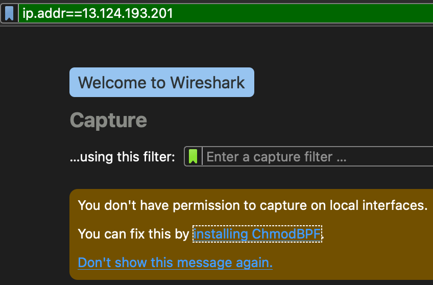

# CSR vs SSR

​                

### 1. MPA(SSR 방식)

> **SSR**: Web Server에서 View을 생성한다. Page가 전환될 때마다 Client가 server에 View 요청을 하고 server는 그것을 생성 후 client에게 보내준다. 때문에 View 전환 속도가 CSR에 비해 상대적으로 늦다. 그리고 Page 요청이 빈번해 질수록  CSR에 비해 부하가 커진다.

```
http://13.124.193.201:8500/a
```

```
http://13.124.193.201:8500/b
```

​               

### 2. SPA(CSR 방식)

> **CSR**: Browser(Client)에서 js에 의해 View(HTML)을 동적으로 생성한다. 때문에 page 전환이 SSR보다 상대적으로 빠르다. 대신 최초 접속 시, 모든 javascript와 static(HTML, image)를 가져와야 한다. 때문에 최초 접속시 로딩은 SSR에 비해 늦다.

```
http://13.124.193.201:8200/a
```

```
http://13.124.193.201:8200/b
```

​              

### 3. WireShark 설치

* 네트워크 패킷을 분석하여 SSR과 CSR의 차이를 구분할 수 있다.

  ```
  https://www.wireshark.org/#download
  ```

```
ip.addr==13.124.193.201
```



* ip 설정을 하고 권한설정을 위해 `installing ChmodBPF`를 다운 받는다.

* 이후 저 초록색 창에서 `Enter`를 누른다.

  ```
  http://13.124.193.201:8500/a
  ```

  ```
  http://13.124.193.201:8500/b
  ```

  ```
  http://13.124.193.201:8200/a
  ```

  ```
  http://13.124.193.201:8200/b
  ```

  